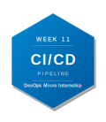
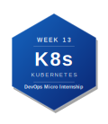

# DevOps Micro Internship with Agentic AI — My Journey

> 👋 **New here?** Read the [submission instructions](./onboarding) first — how to fork, fill in, and submit your assignments.
> Find all the required links & assignment guidelines from here [Required links](./dmi_cohort3_resources.md)

---

## About Me

| | |
|---|---|
| **Name** | Aanuoluwapo Tolu-Omodara |
| **LinkedIn** | https://www.linkedin.com/in/aanuoluwapo-mary-tolu-omodara-5582281a1?utm_source=share_via&utm_content=profile&utm_medium=member_android |
| **Location** | Lagos, Nigeria |
| **Background** | Banking Operations, Funds Transfer and Reconciliation |
| **Goal** | Transitioning from finance and operations into a tech career, gaining real, hands-on DevOps skills from the ground up. I want to use this programme to pivot confidently into tech and open new career possibilities beyond banking and operations. |

---

## About the Program

**DevOps Micro Internship with Agentic AI** is a 14-week mentor-led cohort program by [Pravin Mishra](https://www.linkedin.com/in/pravin-mishra-aws-trainer/) — Cloud, DevOps & AI consultant with 15+ years of experience, 5,000+ learners trained, and 20K+ LinkedIn followers.

This is not a course. It is an internship-style program — real deployments, real pipelines, real evidence reviewed by mentors every week.

- 🌐 Program Website: https://dmi.pravinmishra.com
- 💬 Discord Community: https://discord.pravinmishra.com
- 📺 YouTube: [Pravin Mishra](https://www.youtube.com/@awswithpravinmishra)
- 🔗 Instructor: [LinkedIn](https://www.linkedin.com/in/pravin-mishra-aws-trainer/)

---

## 🏆 Achievements

### Champion of the Week

<!-- If you were named Champion of the Week, add the badge below and link to your LinkedIn post -->

| Week | Award | Post |
|------|-------|------|
| <!-- e.g. Week 03 --> | <!-- 🏆 Champion of the Week --> | <!-- [LinkedIn Post](#) --> |

### Leaderboard

<!-- Add your cohort leaderboard rank here as you progress -->

> 🥇 Cohort 3 Rank: **#__** <!-- Update this each week -->

---

## My DevOps Stack

*Earn a badge each week. To unlock: remove the `<!--` and `-->` from the badge line below.*

*Share your stack:* `https://github.com/PricelessMercy1/devops-micro-internship-pravinmishra#my-devops-stack`

**Preview — what your full stack looks like:**

---

**Your stack 

Week 00 → Internet & Networking Basics

Week 01 → Success Mindset

Week 02 → Agentic AI with Claude Code

Week 03 → Linux & Bash for DevOps

<!-- Week 04 → Git & GitHub -->
<!--  -->

<!-- Week 05 → DevOps Lifecycle & Agile -->
<!--  -->

<!-- Week 06 → AWS Cloud -->
<!--  -->

<!-- Week 07 → Azure Cloud -->
<!--  -->

<!-- Week 08 → Terraform -->
<!--  -->

<!-- Week 09 → Ansible -->
<!--  -->

<!-- Week 10 → Azure DevOps CI/CD -->
<!--  -->

<!-- Week 11 → Docker -->
<!--  -->

<!-- Week 12 → Kubernetes -->
<!--  -->

<!-- Week 13 → Final Project / Capstone -->
<!--  -->

---

## Program Overview

| Phase | Weeks | Focus |
|-------|-------|-------|
| Foundation | 00 – 02 | Networking, Mindset, Agentic AI |
| Core DevOps | 03 – 05 | Linux & Bash, Git, DevOps Lifecycle |
| Cloud | 06 – 07 | AWS & Azure Real Deployments |
| Automation | 08 – 10 | Terraform, Ansible, CI/CD |
| Containers | 11 – 12 | Docker & Kubernetes |
| Capstone | 13 | Final Project |

---

## Weekly Progress

| Week | Topic | Status | Assignment | LinkedIn Post | Blog Post |
|------|-------|--------|------------|---------------|-----------|
| 00 | Internet & Networking Basics | ✅ Completed | ✅ Solved | https://www.linkedin.com/posts/aanuoluwapo-mary-tolu-omodara-5582281a1_devops-micro-internship-dmi-by-pravin-activity-7439306309772095488-jsnZ?utm_source=share&utm_medium=member_desktop&rcm=ACoAAC8ygxQBxWfO17Lhd_0x2mvEFqlpxYuWQTQ | https://www.linkedin.com/posts/aanuoluwapo-mary-tolu-omodara-5582281a1_devops-dmi-devopsmicrointernship-activity-7476660358540345344-3JJe?utm_source=share&utm_medium=member_desktop&rcm=ACoAAC8ygxQBxWfO17Lhd_0x2mvEFqlpxYuWQTQ |
| 01 | Success Mindset | ✅ Completed | ✅ Solved | https://www.linkedin.com/posts/aanuoluwapo-mary-tolu-omodara-5582281a1_insightsandaccountability-growth-learninganddevelopment-share-7478463590346448897-Tml6/?utm_source=share&utm_medium=member_desktop&rcm=ACoAAC8ygxQBxWfO17Lhd_0x2mvEFqlpxYuWQTQ | https://www.linkedin.com/posts/aanuoluwapo-mary-tolu-omodara-5582281a1_what-my-version-20-looks-like-by-the-time-share-7478453725913739267-4_KT/?utm_source=share&utm_medium=member_desktop&rcm=ACoAAC8ygxQBxWfO17Lhd_0x2mvEFqlpxYuWQTQ |
| 02 | Agentic AI with Claude Code | ✅ Completed | ✅ Solved | https://www.linkedin.com/posts/aanuoluwapo-mary-tolu-omodara-5582281a1_another-milestone-completed-in-my-devops-share-7482799937781673984-0O1z/?utm_source=share&utm_medium=member_desktop&rcm=ACoAAC8ygxQBxWfO17Lhd_0x2mvEFqlpxYuWQTQ |https://medium.com/@aanuoluwapomaryoluwadele/reflection-week-2-bb81d591656a|https://www.linkedin.com/posts/aanuoluwapo-mary-tolu-omodara-5582281a1_dmibypravinmishra-agenticai-claudecode-share-7483083206540468225-4NjN/?utm_source=share&utm_medium=member_desktop&rcm=ACoAAC8ygxQBxWfO17Lhd_0x2mvEFqlpxYuWQTQ|https://www.linkedin.com/posts/aanuoluwapo-mary-tolu-omodara-5582281a1_dmibypravinmishra-agenticai-claudecode-share-7482420415479492608-UdmT/?utm_source=share&utm_medium=member_desktop&rcm=ACoAAC8ygxQBxWfO17Lhd_0x2mvEFqlpxYuWQTQ|
| 03 | Linux & Bash for DevOps | ✅ Completed | ✅ Solved | https://www.linkedin.com/posts/aanuoluwapo-mary-tolu-omodara-5582281a1_dmibypravinmishra-agenticai-claudecode-activity-7484032604564856832-yZoZ?utm_source=share&utm_medium=member_desktop&rcm=ACoAAC8ygxQBxWfO17Lhd_0x2mvEFqlpxYuWQTQ | https://www.linkedin.com/posts/aanuoluwapo-mary-tolu-omodara-5582281a1_devops-linux-bash-share-7484243888073863169-NcI5/?utm_source=share&utm_medium=member_desktop&rcm=ACoAAC8ygxQBxWfO17Lhd_0x2mvEFqlpxYuWQTQ |https://www.linkedin.com/posts/aanuoluwapo-mary-tolu-omodara-5582281a1_devops-aws-linux-share-7484900917918609409-PkoT/?utm_source=share&utm_medium=member_desktop&rcm=ACoAAC8ygxQBxWfO17Lhd_0x2mvEFqlpxYuWQTQ|
| 04 | Git & GitHub | ⬜ Not Started | ⏳ Pending | — | — |
| 05 | DevOps Lifecycle & Agile | ⬜ Not Started | ⏳ Pending | — | — |
| 06 | AWS Cloud | ⬜ Not Started | ⏳ Pending | — | — |
| 07 | Azure Cloud | ⬜ Not Started | ⏳ Pending | — | — |
| 08 | Terraform | ⬜ Not Started | ⏳ Pending | — | — |
| 09 | Ansible | ⬜ Not Started | ⏳ Pending | — | — |
| 10 | Azure DevOps (CI/CD) | ⬜ Not Started | ⏳ Pending | — | — |
| 11 | Docker | ⬜ Not Started | ⏳ Pending | — | — |
| 12 | Kubernetes | ⬜ Not Started | ⏳ Pending | — | — |
| 13 | Final Project | ⬜ Not Started | ⏳ Pending | — | — |

**Status:** ⬜ Not Started &nbsp;|&nbsp; 🔄 In Progress &nbsp;|&nbsp; ✅ Completed 
**Assignment:** ⏳ Pending &nbsp;|&nbsp; ✅ Solved

---

## Certificate of Completion

*Awarded upon completing Week 13 — Final Project.*

---

## Connect

If you found this repo useful or want to follow my DevOps journey:

- ⭐ Star this repo
- 🔗 Connect with me on [www.linkedin.com/in/aanuoluwapo-mary-tolu-omodara-5582281a1](#)
- 🌐 Learn more about the program: https://dmi.pravinmishra.com
- 💬 Join the community: https://discord.pravinmishra.com
