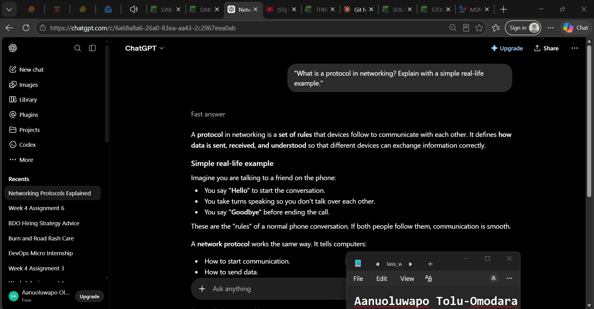
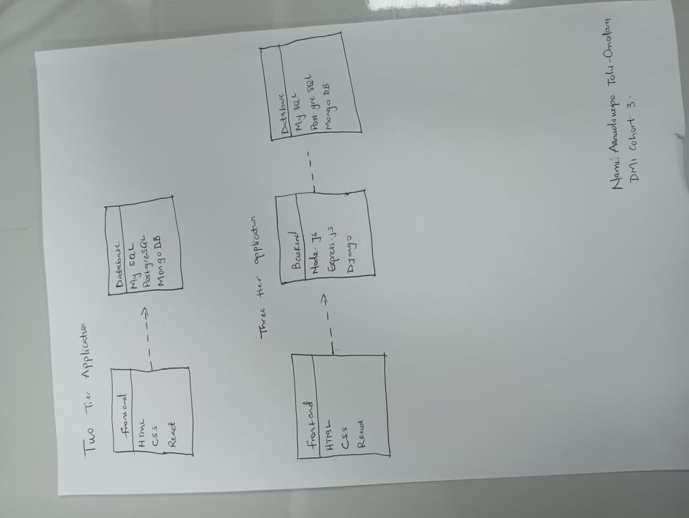
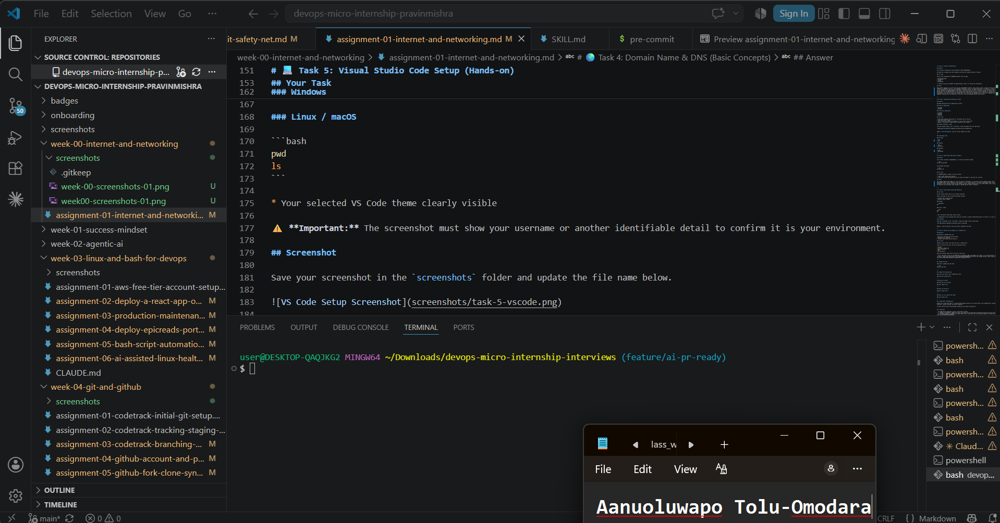

# Week 00 - Internet and Networking

Part of the DevOps Micro Internship (DMI) Cohort 3 with Agentic AI

---

# 🧑‍💻 Task 1: Using ChatGPT as Your Learning Assistant

## Scenario

You're new to DevOps and will frequently encounter technical questions. ChatGPT can be your learning companion.

## Your Task

Write a clear ChatGPT prompt to help you understand:

> "What is a protocol in networking? Explain with a simple real-life example."

Take a screenshot of your interaction showing:

* Your detailed prompt (with clear expectations)
* ChatGPT's simplified response with an example

## Screenshot

Save your screenshot in the `screenshots` folder and update the file name below.




Replace `task-1-chatgpt.png` with your actual screenshot file name.

---

## What I Learned (2–3 lines)

A networking protocol is a set of rules that allows computers and other devices to communicate with each other reliably and correctly.

---

# 🌐 Task 2: Internet and Networking

## Scenario

Your friend is launching an online bookstore named **EpicReads**.

He asked you to explain how users globally can access his website hosted in Finland.

## Your Task

Write a short explanation (**100–150 words**) that includes:

* Packet Switching
* IP Address
* TCP/IP
* HTTP/HTTPS

💡 **Tip:** You may use ChatGPT (as demonstrated in Task 1) to refine your explanation.

## Answer

When someone anywhere in the world visits the **EpicReads** website, their browser sends a request over the internet using the **HTTP** or **HTTPS** protocol, with **HTTPS** providing a secure, encrypted connection. The request is broken into smaller pieces called **packets** through **packet switching**, allowing the data to travel efficiently across different network paths. Each packet contains the **IP address** of the user's device and the web server in Finland, ensuring it reaches the correct destination. The **TCP/IP** protocol suite manages the communication by making sure the packets are delivered reliably, reassembled in the correct order, and checked for errors. Once all the packets arrive, the server responds with the requested webpage, allowing users from anywhere in the world to access EpicReads quickly and securely.


---

# 🏗️ Task 3: Application Architecture & Stack

## Scenario

EpicReads bookstore has two application versions:

### Two-Tier Application

* Frontend
* Database

### Three-Tier Application

* Frontend
* Backend
* Database

## Your Task

* Draw simple diagrams (hand-drawn or tool-based such as draw.io)
* Label each layer clearly
* List at least two common technologies or tools used for each layer
* Submit a screenshot or photo clearly showing your own drawing

## Diagram Screenshot / Photo

Save your diagram image in the `screenshots` folder and update the file name below.




Replace `task-3-diagram.png` with your actual diagram file name.

---

## Technologies Used

### Frontend

* HTML
* CSS

### Backend

* Node.js
* Express.js

### Database

* MySQL
* PostgreSQL

---

# 🌍 Task 4: Domain Name & DNS (Basic Concepts)

## Scenario

Your friend's bookstore **EpicReads** is currently accessible through:

```text
52.172.142.222:3000
```

He purchased the domain:

```text
epicreads.com
```

## Your Task

In **50–100 words**, explain in your own words:

1. What is DNS (Domain Name System)?
2. Which DNS record type should be used to connect the domain to the given IP, and why?

## Answer

The **Domain Name System (DNS)** is like the internet's phonebook. It translates easy-to-remember domain names, such as **epicreads.com**, into IP addresses that computers use to locate websites. To connect **epicreads.com** to the server at **52.172.142.222**, an **A record** should be used because it maps a domain name directly to an IPv4 address. This allows users to access the website using the domain name instead of remembering the numeric IP address.


---

# 💻 Task 5: Visual Studio Code Setup (Hands-on)

## Your Task

Install Visual Studio Code (if not already installed).

Take a screenshot of your VS Code environment showing:

* Terminal open inside VS Code
* Running a basic command:

### Windows

```powershell
dir
```

### Linux / macOS

```bash
pwd
ls
```

* Your selected VS Code theme clearly visible

⚠️ **Important:** The screenshot must show your username or another identifiable detail to confirm it is your environment.

## Screenshot

Save your screenshot in the `screenshots` folder and update the file name below.




Replace `task-5-vscode.png` with your actual screenshot file name.

---

# 🔗 Task 6: Publish Your Assignment as a LinkedIn Post

## Objective

Publishing on LinkedIn helps you:

* Build your professional online presence
* Reinforce your learning
* Document your DevOps journey publicly

## Your Task

Summarize your answers from Tasks 1–5 into a LinkedIn post.

Clearly structure your post into the following sections:

* ChatGPT
* Internet & Networking
* App Architecture
* DNS
* VS Code Setup

Add the following credit note at the end of your post:

> **P.S. This post is part of the DevOps Micro Internship (DMI) with Agentic AI — Cohort 3 — by Pravin Mishra. My graded progress is public: https://dmi.pravinmishra.com/s/YOUR-GITHUB-USERNAME.html · Start your DevOps journey: https://dmi.pravinmishra.com/?utm_source=student&utm_medium=ps-linkedin&utm_campaign=cohort3**

---

## LinkedIn Post URL

Paste your LinkedIn post URL here:

```text
https://www.linkedin.com/posts/aanuoluwapo-mary-tolu-omodara-5582281a1_devops-micro-internship-dmi-by-pravin-activity-7439306309772095488-jsnZ?utm_source=share&utm_medium=member_desktop&rcm=ACoAAC8ygxQBxWfO17Lhd_0x2mvEFqlpxYuWQTQ
```

---

## LinkedIn Post Backup Copy

Paste the full text of your LinkedIn post here:

Week 0 Done — My DevOps Journey Has Officially Begun!

I just completed my first assignment as part of the DevOps Micro Internship (DMI) Cohort 3, and honestly? My brain is fuller than it was a week ago. Here's a quick breakdown of what I covered:
ChatGPT & AI-Assisted Learning
I used ChatGPT to explore what DevOps actually means as a beginner and it clicked in a way that felt real. DevOps isn't just a buzzword; it's the bridge between development and operations, built on automation, cloud, CI/CD, and tools like Git, Docker, and Kubernetes. Starting with Linux and networking basics is the foundation.
Internet & Networking
I explored how a website hosted in Finland can serve a user in Lagos without missing a beat. The magic behind that? IP addressing, packet switching, TCP/IP, and HTTPS four technologies working together so seamlessly that most users never notice them. HTTPS especially stood out to me: it's what keeps your login details and payment info safe in transit.
Application Architecture
I compared two-tier and three-tier architectures for a bookstore web app (EpicReads). The key difference? In a three-tier setup, the backend acts as a gatekeeper between the frontend and the database protecting data, enforcing business rules, and making the system much easier to scale. For any real-world app, three-tier is the stronger foundation.
Domain Names & DNS
DNS is simply the internet's contact list. Instead of typing 52.172.142.222 into your browser, you type epicreads.com and DNS quietly handles the lookup. To point a domain to an IP address, you need an A record specifically, which maps the domain name directly to an IPv4 address.
VS Code Setup
Already had VS Code development environment running on my PC from my HTML/web development lessons, so this one felt right at home. It's the tool I'll be carrying into this internship, and knowing my way around it a little bit already feels like a small head start.

This week showed me that DevOps is big, but it's not intimidating once you break it down piece by piece. I'm taking it one concept at a time, and I'm genuinely excited about what's ahead.

P.S. This post is part of the FREE DevOps Micro Internship Cohort run by Pravin Mishra. You can start your DevOps journey for free from his YouTube Playlist 👉 https://lnkd.in/dV_NFqyK

---

# Reflection – Week 0

### What did you find easy?

I found the basic networking concepts easy to understand, especially protocols, packet switching, and the differences between two-tier and three-tier application architectures. Creating diagrams and using AI to refine my explanations also became straightforward.

---

### What was difficult?

The most challenging part was understanding how DNS records work and ensuring I explained technical concepts accurately in my own words. Capturing the required screenshots while following all the assignment instructions also required careful attention.

---

### What will you improve next week?

Next week, I want to become more comfortable using the command line, Git, and Visual Studio Code. I also plan to spend more time practicing the concepts so I can complete future assignments more confidently and efficiently.

---

## 📌 About DMI & CloudAdvisory

DevOps Micro Internship (DMI) is a project-based DevOps program run by Pravin Mishra (The CloudAdvisory) focused on real-world execution, systems thinking, and career readiness.

It helps learners build strong DevOps foundations with hands-on experience.


## 📌 Resources

- 🌐 **DMI Official Website:** https://dmi.pravinmishra.com?utm_source=github&utm_medium=readme  
- 🎓 **University:** https://university.pravinmishra.com?utm_source=github&utm_medium=readme  
- 💬 **Discord Community:** https://discord.pravinmishra.com?utm_source=github&utm_medium=readme  
- 📝 **Blog:** https://dmi.pravinmishra.com/blog?utm_source=github&utm_medium=readme  
- ▶️ **YouTube Playlist (DMI Cohort 3):** https://www.youtube.com/playlist?list=PLFeSNDtI4Cho  
- 🔗 **Pravin Mishra (LinkedIn):** https://www.linkedin.com/in/pravin-mishra-aws-trainer/  
- 🏢 **CloudAdvisory (LinkedIn):** https://www.linkedin.com/company/thecloudadvisory/

---

*This submission is part of DevOps Micro Internship (DMI) Cohort 3 — Agentic AI Track*