# Assignment 3 — Production Maintenance Drill (OPS Checklist)

Part of the DevOps Micro Internship (DMI) Cohort 3 with Agentic AI

---

## Purpose

In this assignment, you will treat your already deployed React application (on Ubuntu VM with Nginx) as a live production system. You will perform structured operational checks covering network validation, service health, log analysis, resource monitoring, configuration verification, and incident simulation with recovery — mirroring real on-call DevOps responsibilities.

---

# Task 1 — Server Access & Networking Validation

## Goal

Verify that the deployed React application is reachable from the browser and confirm basic network connectivity of the Ubuntu VM.

### Evidence

#### Screenshot 1 — Browser showing the React app with your Full Name visible on the UI

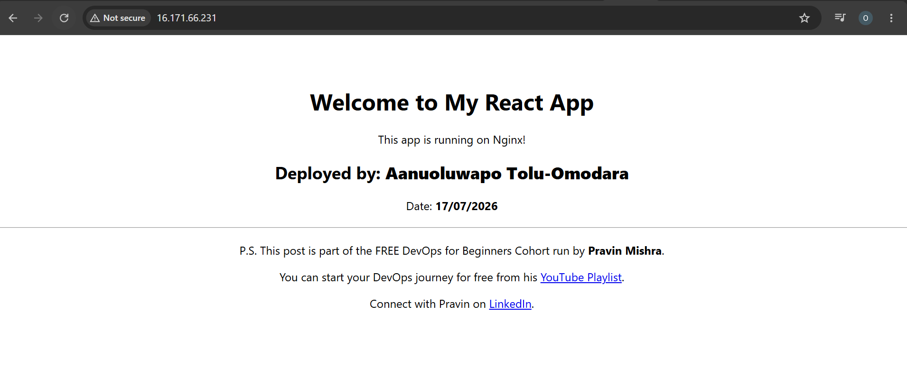

---

#### Screenshot 2 — Output of `ip a`

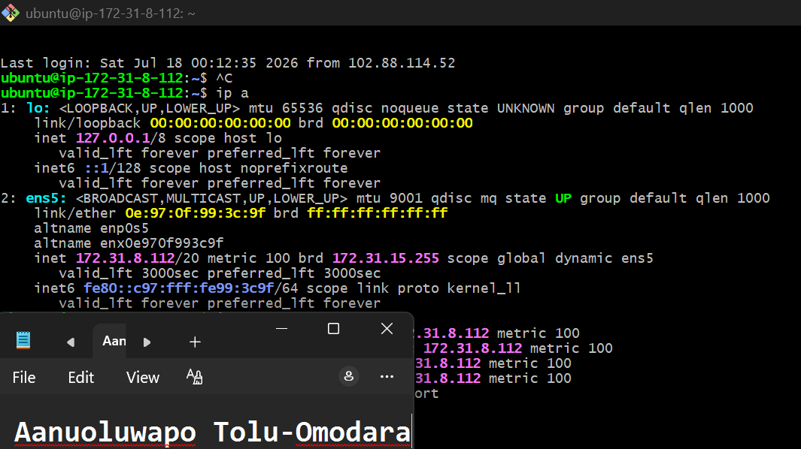

---

#### Screenshot 3 — Output of `sudo ss -tulpen`

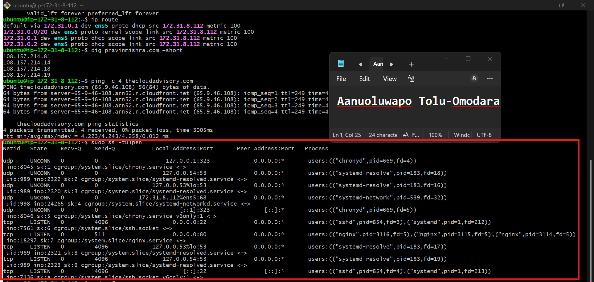

---

#### Screenshot 4 — Output of `sudo ufw status`

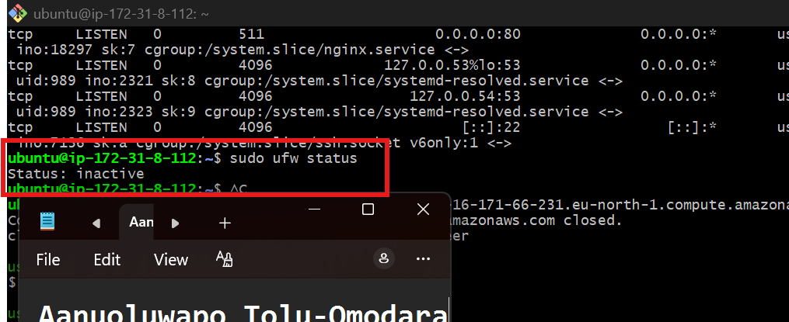

---

### Notes

Answer the following in your own words:

**1. What proves Nginx is listening on 0.0.0.0:80?**

The sudo ss -tulpen command shows tcp LISTEN on 0.0.0.0:80 with the nginx process. This proves that Nginx is actively listening on port 80 on all network interfaces, allowing users to access the web application over HTTP.

---

**2. What proves SSH is active on port 22?**

The sudo ss -tulpen output shows tcp LISTEN on 0.0.0.0:22 with the sshd process. This confirms that the SSH service is running and listening on port 22, allowing secure remote access to the Ubuntu server.

---

**3. Did you find any unexpected open ports? Explain briefly.**

No. I did not find any unexpected open ports. The server is listening on port 22 (SSH) for secure remote administration and port 80 (HTTP) for serving the React application through Nginx. The remaining ports, such as those used by systemd-resolved (DNS) and chronyd (time synchronization), are bound to the local loopback interface (127.0.0.x) or are system services required for normal operating system functionality. These are not exposed externally, so they do not pose an unexpected security risk.

---

# Task 2 — Service Health & Systemd Validation (Nginx)

## Goal

Verify that Nginx is properly installed, running, enabled at boot, and safely configured.

### Evidence

#### Screenshot 1 — Output of `systemctl status nginx --no-pager`

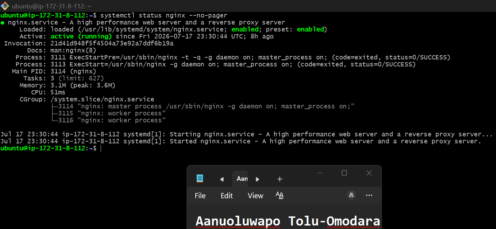

---

#### Screenshot 2 — Output of `sudo nginx -t`

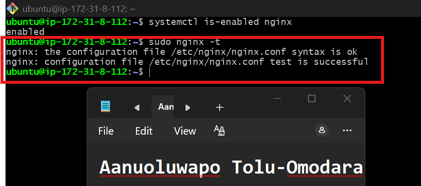

---

#### Screenshot 3 — Output of `sudo ss -lptn '( sport = :80 )'`

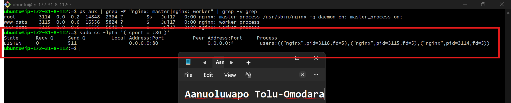

---

### Notes

Answer the following in your own words:

**1. What happens if Nginx fails to restart in production?**

If Nginx fails to restart, it will stop serving web traffic, making the application unavailable to users. Visitors may receive errors such as 502 Bad Gateway, 503 Service Unavailable, or they may be unable to connect to the website, depending on the cause of the failure. This can result in downtime until the issue is identified and resolved.

---

**2. What's your basic rollback plan?**

My basic rollback plan is to restore the last known working Nginx configuration from a backup or version control, verify the configuration using sudo nginx -t, and then restart or reload the Nginx service. After that, I would confirm the application is accessible by checking the service status, testing the website with curl or a browser, and reviewing the logs to ensure the issue has been resolved.

---

# Task 3 — Logs & Request Trace

## Goal

Verify real traffic flow and analyze logs to understand system behavior and errors.

### Evidence

#### Screenshot 1 — Output of `sudo tail -n 30 /var/log/nginx/access.log`

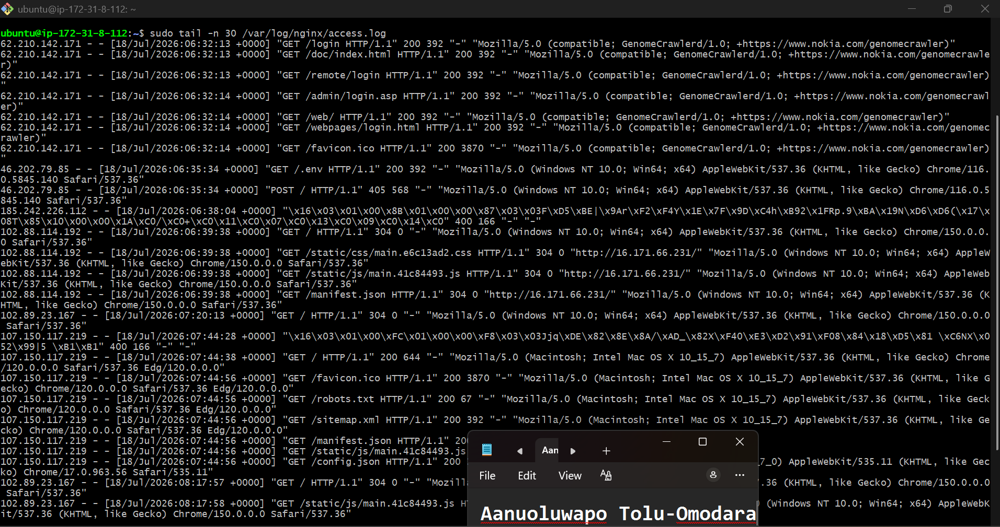

---

#### Screenshot 2 — Output of `sudo tail -n 30 /var/log/nginx/error.log`

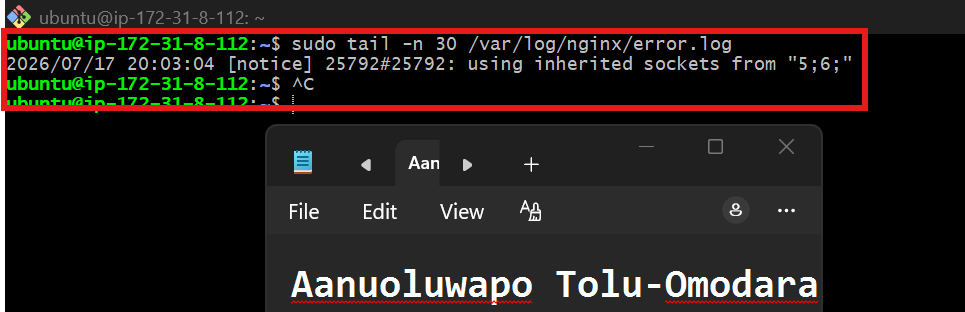

---

#### Screenshot 3 — Output of `sudo journalctl -u nginx --no-pager -n 50`

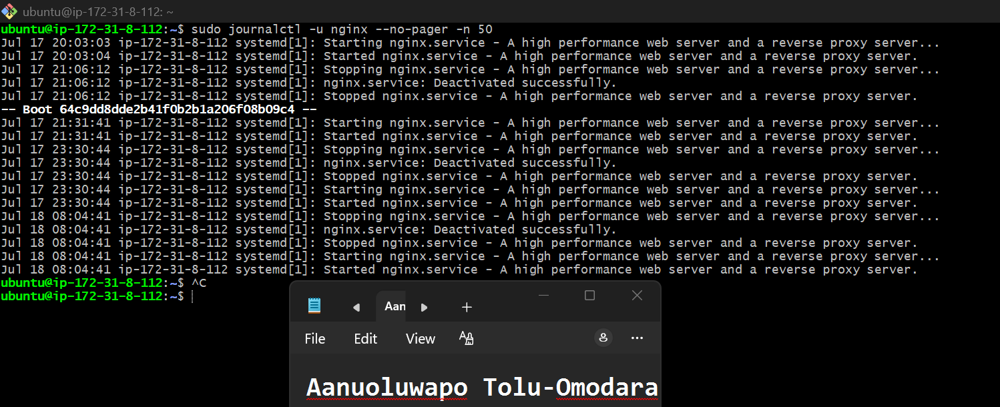

---

### Notes

Answer the following in your own words:

**1. Were there any errors in the logs?**

- If yes, mention 1–2 example error lines from the logs and explain what each one means in simple terms.
- If no, explain what it means if the error log is empty or shows no recent errors during your check.

No, There were no recent error entries in the Nginx error log. The only message recorded was a notice stating that Nginx was using inherited sockets during a graceful restart. This is an informational message that indicates the service reloaded successfully without interrupting active connections, rather than an actual error.

---

**2. If there were no errors, what does that indicate about the system?**

The absence of recent errors indicates that Nginx is operating normally and serving requests without internal failures or configuration issues. Combined with the successful service restarts shown in the systemd journal and the successful HTTP responses in the access log, it confirms that the web server is stable and functioning as expected.

---

**3. Based on the access logs, were your curl requests visible in the log entries? What does that prove about traffic flow?**

Yes. My curl requests appeared in the access log with HTTP 200 OK responses for both the GET and HEAD requests. This confirms that the requests successfully reached the Nginx server, were processed correctly, and the application responded as expected. It also verifies that traffic is flowing properly between the client and the web server.

---

# Task 4 — System Resource Health Check (Capacity Red Flags)

## Goal

Assess server capacity and detect potential performance or failure risks.

### Evidence

#### Screenshot 1 — Output of `uptime`

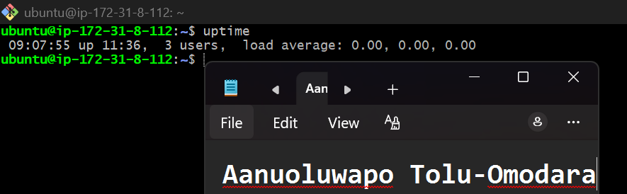

---

#### Screenshot 2 — Output of `free -h`

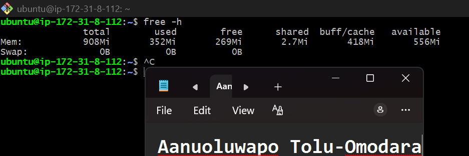

---

#### Screenshot 3 — Output of `df -h`

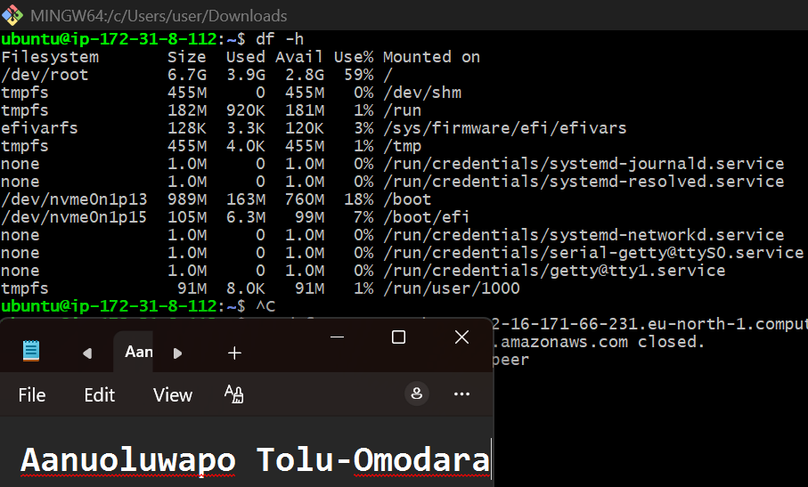

---

#### Screenshot 4 — Output of `sudo du -sh /var/* | sort -h`

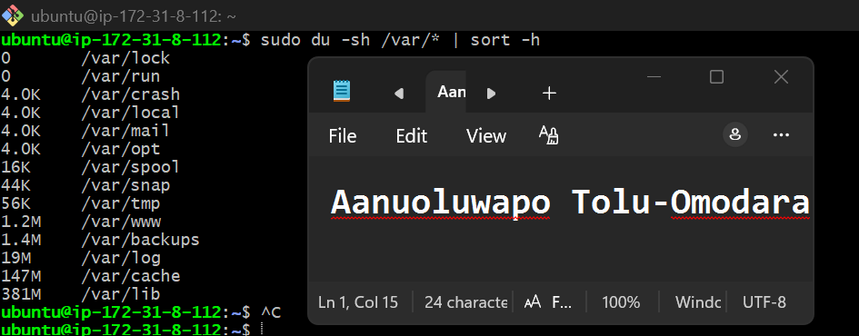

---

### Notes

Answer the following in your own words:

**1. Which resource looks most critical right now? (CPU/load, memory, or disk) Explain why.**

None of the monitored resources appear to be under critical pressure at the moment. The CPU load averages are 0.00, indicating the server is not under processing stress. Memory usage is healthy, with 556 MiB of available RAM and no signs of memory pressure. The root filesystem is 59% utilized, leaving 2.8 GiB of free space. If I had to identify the resource that deserves the closest ongoing monitoring, it would be disk usage, because logs, application data, and package caches can grow gradually over time and eventually lead to service disruptions if storage is not managed proactively.
---

**2. What happens if disk becomes 100% full in a production server?**

If the disk reaches 100% capacity, applications may fail because they can no longer write files or create temporary data. System and application logs may stop recording new events, making troubleshooting much more difficult during an incident. Package installations and updates can fail, databases may refuse write operations or become unstable, and in severe cases even administrative tasks such as logging in through SSH may be affected. Monitoring disk usage and cleaning up unnecessary files before the disk becomes full is an important part of production operations.

---

# Task 5 — Configuration & Deployment Verification

## Goal

Ensure the correct React build is deployed and Nginx is serving it properly.

### Evidence

#### Screenshot 1 — Output of `ls -lah /var/www/html | head -n 20`

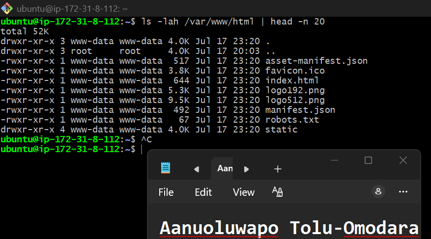

---

#### Screenshot 2 — Output of `grep -R "Deployed by" -n /var/www/html 2>/dev/null | head`

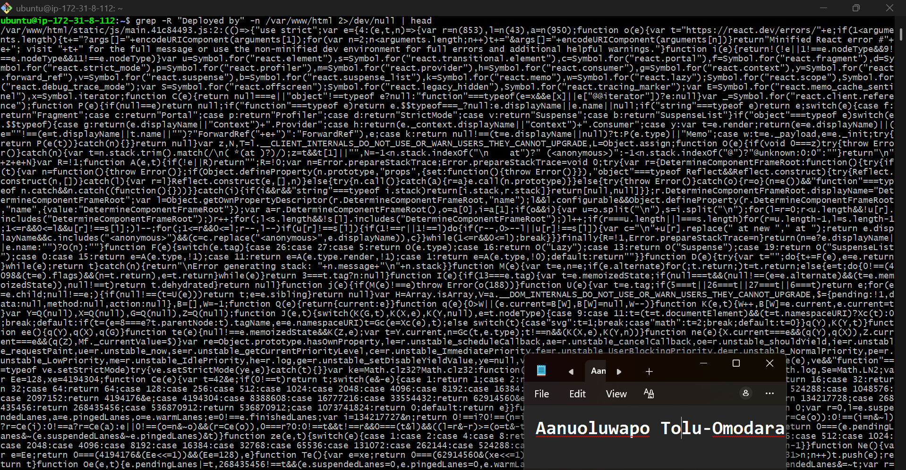

---

#### Screenshot 3 — Output of `grep -n "try_files" /etc/nginx/sites-available/default`

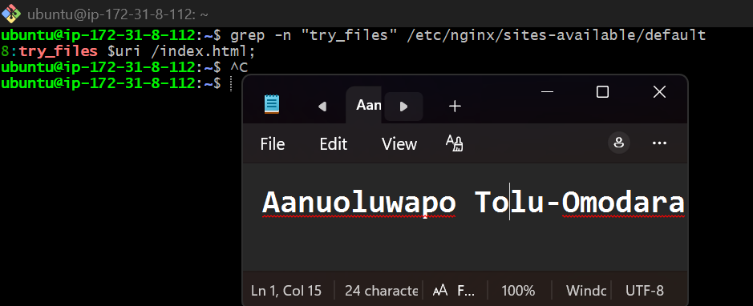

---

### Notes

Answer the following in your own words:

**1. How do you confirm that the correct version of the application is deployed?**

Deployment correctness was verified through several checks. First, ls -lah /var/www/html confirmed that the expected React production build files, including index.html, the static directory, manifest.json, and other assets, are present in Nginx's web root. Next, searching for the custom deployment text (for example, "Deployed by") confirms that the expected application build was deployed rather than an older version. Finally, grep -n "try_files" /etc/nginx/sites-available/default verified that Nginx is configured with the correct try_files $uri /index.html; directive, ensuring React's client-side routing works correctly. Combined with the successful HTTP 200 OK responses from the earlier curl tests, these checks confirm that the correct React application is deployed and being served properly.

---

# Task 6 — Nginx Configuration Failure Simulation

## Goal

Simulate a real-world Nginx misconfiguration and recover the service safely.

### Evidence

#### Screenshot 1 — Output of `sudo nginx -t` showing the syntax error (broken config)

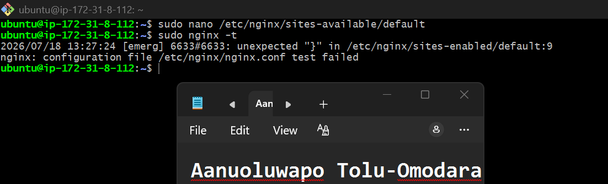

---

#### Screenshot 2 — Output of `sudo nginx -t` showing syntax ok (fixed config)

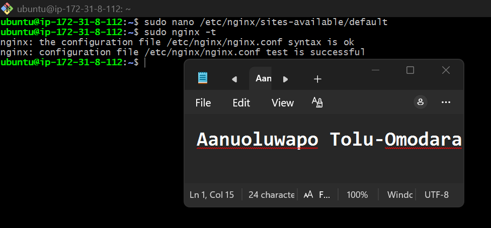

---

#### Screenshot 3 — Output of `curl -I http://<public-ip>` confirming recovery (200 OK)

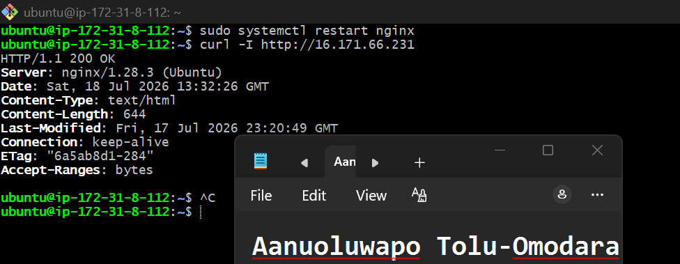

---

### Notes

Answer the following in your own words:

**1. What caused the configuration failure?**

The configuration failure was caused by removing the semicolon from the try_files $uri /index.html; directive in the Nginx configuration file. Since Nginx requires each directive to end with a semicolon, the parser detected a syntax error and sudo nginx -t failed, preventing the configuration from being applied.

---

**2. How did you fix the issue?**

I reopened the Nginx configuration file and restored the missing semicolon to the try_files directive. I then ran sudo nginx -t again to verify that the configuration syntax was valid. After the test passed successfully, I restarted the Nginx service with sudo systemctl restart nginx and confirmed the application was accessible by sending a curl -I request, which returned HTTP/1.1 200 OK

---

**3. How can you avoid this kind of issue in real production systems?**

This type of issue can be avoided by always validating the Nginx configuration with sudo nginx -t before restarting or reloading the service. Configuration files should be stored in version control so changes can be reviewed and reverted if necessary. Changes should also be tested in a staging environment before reaching production, and automated validation should be included in CI/CD pipelines to catch syntax errors before deployment.

---

# Task 7 — Web Application Failure Simulation

## Goal

Simulate missing deployment content and recover the application safely.

### Evidence

#### Screenshot 1 — Output of `curl -I http://<public-ip>` showing failure (non-200 response)

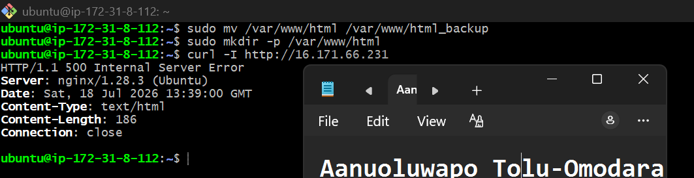

---

#### Screenshot 2 — Output of `curl -I http://<public-ip>` confirming recovery (200 OK)

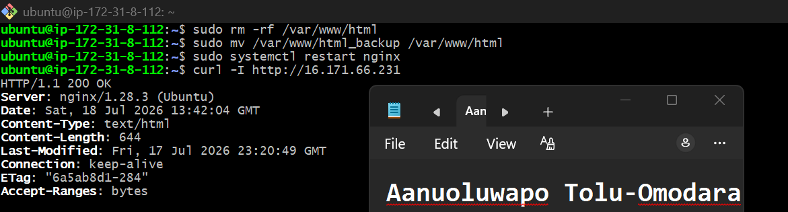

---

### Notes

Answer the following in your own words:

**1. What caused the application to break in this scenario?**

The application broke because the web root directory (/var/www/html) was replaced with an empty directory. Although Nginx was still running and correctly configured, the React application files, including index.html, were no longer available. As a result, Nginx could not serve the application and returned an error to users.

---

**2. How did you fix the issue and restore the application?**

I restored the application by removing the empty web directory and moving the backup directory back to /var/www/html. After restoring the original files, I restarted the Nginx service and verified the recovery using curl -I, which returned HTTP/1.1 200 OK, confirming that the application was working normally again.

---

**3. What steps would you take to prevent this kind of issue in real production systems?**

To prevent this type of issue in production, I would always create a backup before deployment and maintain a tested rollback plan. I would use a CI/CD pipeline to automate deployments, validate that all required application files exist before switching to the new release, and perform post-deployment health checks. I would also use versioned deployments or atomic releases so that if a deployment fails, the previous working version can be restored immediately without affecting users.

---

# Task 8 — Security & Reliability Review

## Goal

Review and reflect on the security and reliability practices applied during this assignment.

### Security & Reliability Notes

Answer the following in your own words:

**1. Why is SSH key-based authentication more secure than sharing passwords?**

SSH key-based authentication is more secure because it uses a cryptographic key pair instead of a password that can be guessed or stolen. The private key stays on the user's device and is never sent over the network, making it much harder for attackers to gain unauthorized access. It also reduces the risk of brute-force and password-based attacks.

---

**2. Why should only required ports be open on a production server?**

Only the ports needed by the application should be open because every open port increases the server's attack surface. Closing unnecessary ports reduces the chances of unauthorized access, network attacks, and exploitation of unused services. This follows the principle of least exposure and improves overall security.

---

**3. Why is it important for Nginx to be enabled on boot?**

Enabling Nginx on boot ensures the web server starts automatically whenever the server restarts, whether due to maintenance, updates, or an unexpected reboot. This minimizes downtime and ensures the application becomes available again without requiring manual intervention.

---

**4. What are the risks of sharing secrets, keys, or credentials publicly?**

Sharing secrets, private keys, API tokens, or credentials publicly can allow unauthorized users to access servers, cloud resources, or sensitive data. This can lead to data breaches, service disruption, financial loss, or unauthorized use of cloud resources. Sensitive credentials should always be stored securely and never committed to public repositories.

---

**5. Why should cloud resources be stopped or terminated when they are no longer needed?**

Unused cloud resources should be stopped or terminated to avoid unnecessary costs and reduce security risks. Running resources that are no longer required continue to consume billable services and may become targets for attacks if left unmanaged. Cleaning up unused resources is a good operational and cost-management practice.

---

# LinkedIn Post (Required)

## Evidence

#### LinkedIn Post URL

Paste your LinkedIn post URL here:

`Add your URL here`

---

#### Screenshot — Published LinkedIn post

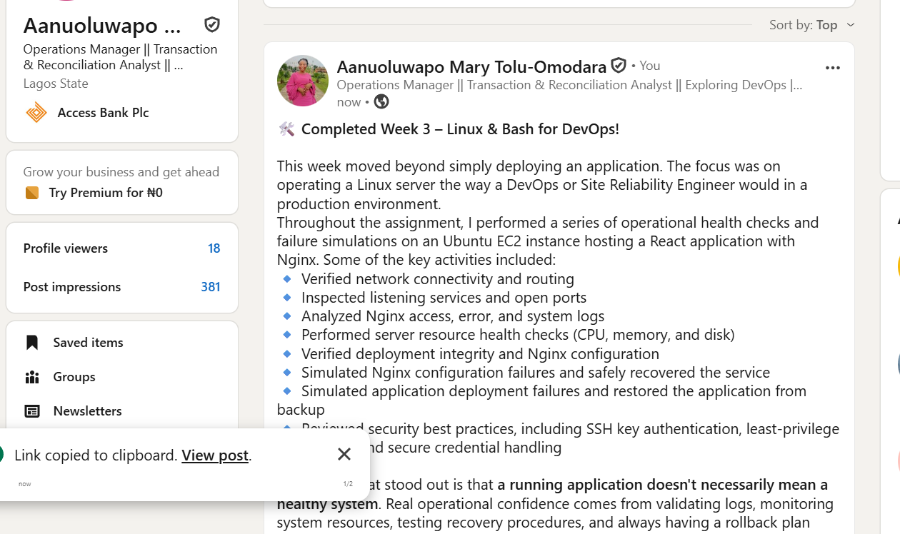

---

# Submission Instructions

- Add all required screenshots in your submission
- Full name must be visible in required screenshots
- Do not expose sensitive information (keys, passwords, account IDs)

---

# Completion Checklist

- [ ] Task 1: Screenshots (browser, ip a, ss -tulpen, ufw status) + Notes answered
- [ ] Task 2: Screenshots (nginx status, nginx -t, ss port 80) + Notes answered
- [ ] Task 3: Screenshots (access log, error log, journalctl) + Notes answered
- [ ] Task 4: Screenshots (uptime, free -h, df -h, du -sh) + Notes answered
- [ ] Task 5: Screenshots (ls html, grep deployed by, grep try_files) + Notes answered
- [ ] Task 6: Screenshots (nginx -t fail, nginx -t pass, curl recovery) + Notes answered
- [ ] Task 7: Screenshots (curl failure, curl recovery) + Notes answered
- [ ] Task 8: Security & Reliability Notes answered
- [ ] LinkedIn post published and URL submitted
- [ ] Full Name visible in all required screenshots
- [ ] No sensitive data exposed

---

## 📌 About DMI & CloudAdvisory

DevOps Micro Internship (DMI) is a project-based DevOps program run by Pravin Mishra (The CloudAdvisory) focused on real-world execution, systems thinking, and career readiness.

It helps learners build strong DevOps foundations with hands-on experience.

---

## 📌 Resources

- 🌐 DMI Official Website: https://pravinmishra.com/dmi  
- 🎓 DevOps for Beginners (Udemy): https://www.udemy.com/course/devops-for-beginners-docker-k8s-cloud-cicd-4-projects/  
- 🎓 Agentic AI DevOps with Claude Code: https://www.udemy.com/course/ultimate-agentic-ai-devops-with-claude-code/  
- 🎓 DevOps with Claude Code: Terraform, EKS, ArgoCD & Helm: https://www.udemy.com/course/devops-with-claude-code-terraform-eks-argocd-helm/  
- ▶️ YouTube Playlist: https://www.youtube.com/playlist?list=PLFeSNDtI4Cho  
- 🔗 Pravin Mishra (LinkedIn): https://www.linkedin.com/in/pravin-mishra-aws-trainer/  
- 🏢 CloudAdvisory (LinkedIn): https://www.linkedin.com/company/thecloudadvisory/

---

*This submission is part of DevOps Micro Internship (DMI) Cohort 3 — Agentic AI Track.*