# Assignment 5 — Bash Script Automation Drill (OPS Checklist)

Part of the DevOps Micro Internship (DMI) Cohort 3 with Agentic AI

---

## Purpose

In this assignment, you will practice Bash scripting by building a series of small automation scripts covering environment setup, variables, arrays, loops, file conditionals, if-else logic, and functions. These scripts form the foundation of real-world Linux automation used in DevOps, cloud, and production support environments.

---

# Task 1 — Bash Environment & Workspace Setup

## Goal

Verify that Bash is available on your system and create a clean workspace for this assignment.

### Evidence

#### Screenshot 1 — Output of `echo $SHELL` and `bash --version`

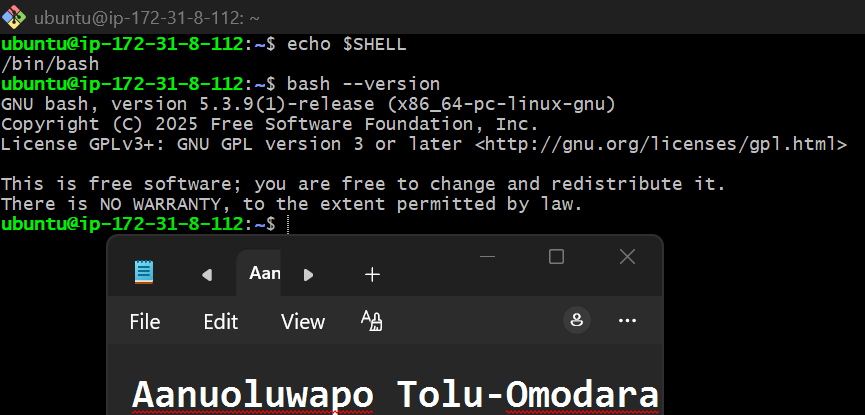

---

#### Screenshot 2 — Output of `pwd` and `ls -lah` showing the scripts directory

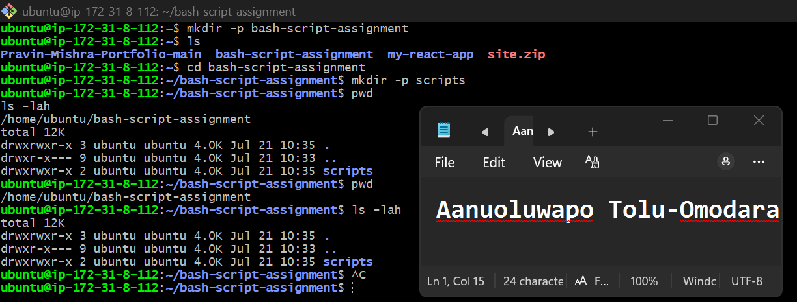

---

### Notes

Answer the following in your own words:

**1. What is Bash?**

Bash (Bourne Again Shell) is a command-line shell and scripting language used mainly on Linux and Unix systems. It allows users to interact with the operating system by running commands and creating scripts to automate repetitive tasks, making work faster and more efficient.

---

**2. What is the difference between shell and Bash?**

A shell is a program that lets users communicate with the operating system through commands. Bash is one specific type of shell. While there are other shells like sh, zsh, and ksh, Bash is one of the most popular because it is powerful, easy to use, and supports scripting for automation.

---

**3. Why is it important to confirm the Bash version before writing scripts?**

It is important to check the Bash version to make sure Bash is installed and that the features used in your scripts are supported. This helps avoid compatibility issues and ensures the script will run correctly on the system.

---

# Task 2 — Your First Bash Script

## Goal

Create your first Bash script, make it executable, and run it from the terminal.

### Evidence

#### Screenshot 1 — Content of `first-script.sh`

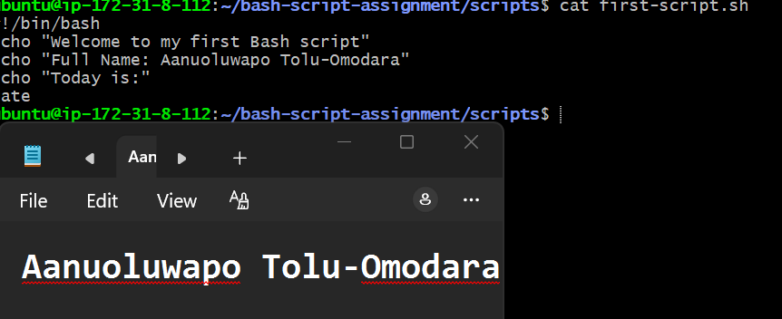

---

#### Screenshot 2 — Output of `./first-script.sh`

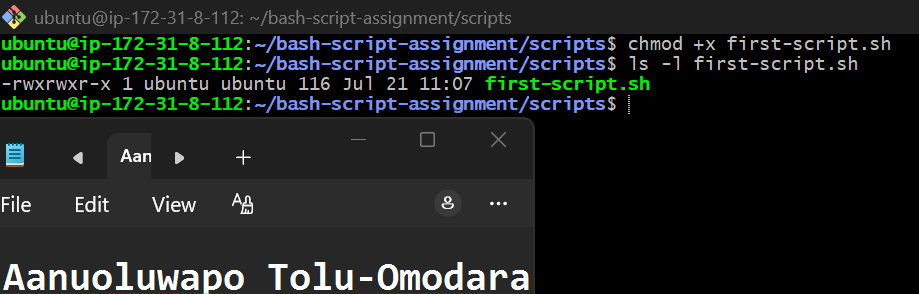

---

#### Screenshot 3 — Output of `ls -l first-script.sh` showing executable permission

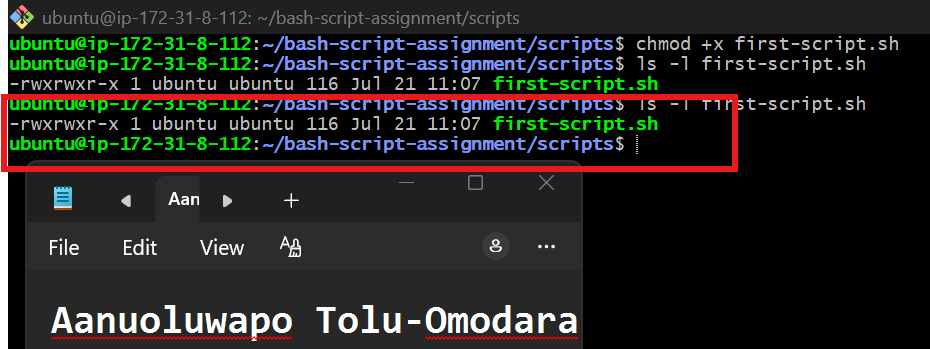

---

### Notes

Answer the following in your own words:

**1. What is the purpose of `#!/bin/bash`?**

#!/bin/bash is called the shebang line. It tells the operating system to use the Bash interpreter to execute the commands in the script. This ensures the script runs with Bash regardless of the current shell being used.

---

**2. Why do we use `chmod +x` before running a script?**

We use chmod +x to give the script execute permission. Without this permission, the operating system will not allow the script to be run directly using ./script.sh. It makes the script executable like a normal program.

---

**3. What is the difference between running a script using `./script.sh` and `bash script.sh`?**

When you run ./script.sh, the operating system executes the script directly. The script must have execute permission, and the shebang (#!/bin/bash) tells the system which interpreter to use.

When you run bash script.sh, you are explicitly asking Bash to execute the script. In this case, the script does not need execute permission because Bash reads and runs the file directly.

---

# Task 3 — Variables: User Information Script

## Goal

Use variables to store and display user-related information.

### Evidence

#### Screenshot 1 — Content of `user-info.sh`

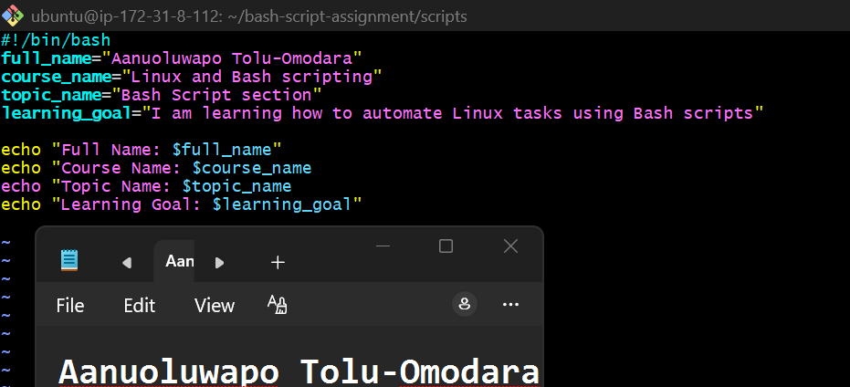

---

#### Screenshot 2 — Output of `./user-info.sh`

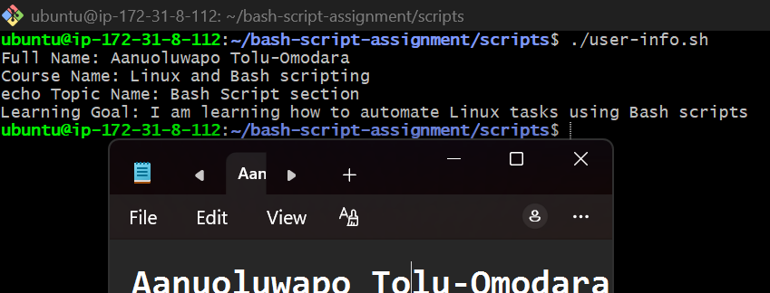

---

### Notes

Answer the following in your own words:

**1. What is a variable in Bash?**

Add your answer here.

---

**2. Why should we avoid spaces around the `=` sign when creating variables?**

A variable in Bash is a named storage location that holds a value which can be used later in a script. It helps make scripts easier to read and allows the same information to be reused without typing it multiple times.
---

**3. How do you access the value stored inside a Bash variable?**

We should avoid spaces around the = sign because Bash does not recognize it as a valid variable assignment. If spaces are added, Bash treats the variable name and value as separate commands, which causes an error.

---

# Task 4 — Arrays & Loops: Tools Checklist Script

## Goal

Use arrays and loops to print a checklist of tools used in Bash scripting.

### Evidence

#### Screenshot 1 — Content of `tools-checklist.sh`

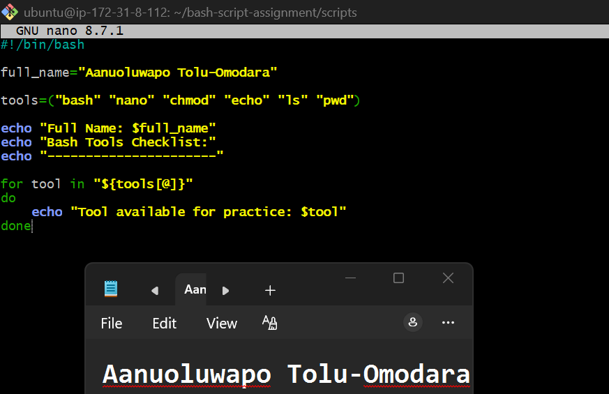

---

#### Screenshot 2 — Output of `./tools-checklist.sh`

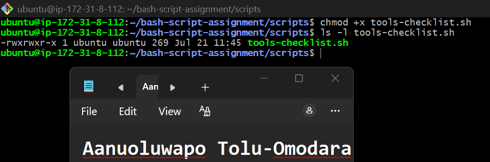

---

### Notes

Answer the following in your own words:

**1. What is an array in Bash?**

An array in Bash is a variable that can store multiple values under a single name. Instead of creating separate variables for related items, an array lets you keep them together and access them when needed.

---

**2. Why are arrays useful in scripts?**

Arrays make scripts more organized and easier to manage because they allow you to store related values in one place. They also work well with loops, making it easy to process multiple items without writing the same code repeatedly.
---

**3. What does `"${tools[@]}"` mean?**

"${tools[@]}" represents all the values stored in the tools array. It allows the loop to access each item in the array one at a time while keeping each value separate, even if an item contains spaces

---

**4. What is the purpose of the `for` loop in this script?**

The for loop goes through each item in the tools array and prints it one by one. This makes it easy to display every tool in the list without writing a separate echo command for each one.

---

# Task 5 — Loops: Number Counter Script

## Goal

Use loops to repeat a task multiple times.

### Evidence

#### Screenshot 1 — Content of `counter.sh`

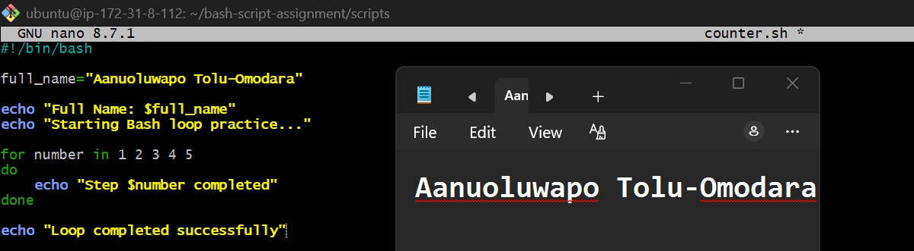

---

#### Screenshot 2 — Output of `./counter.sh`

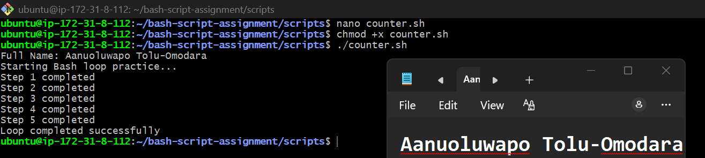

---

### Notes

Answer the following in your own words:

**1. What is a loop?**

A loop is a programming structure that repeats a set of commands multiple times. It helps automate repetitive tasks by running the same code until all the required items have been processed.

---

**2. Why do we use loops in Bash scripting?**

Loops help automate repetitive tasks and reduce the amount of code we need to write. They make scripts shorter, easier to maintain, and more efficient.
---

**3. How many times did the loop run in your script?**

The loop ran five times because it processed the numbers 1, 2, 3, 4, and 5, printing a message for each one.

---

**4. What would you change if you wanted the loop to run 10 times?**

I would extend the list of numbers in the for loop to include 6, 7, 8, 9, and 10, so the loop runs ten times instead of five.

---

# Task 6 — Files & Conditionals: File Validation Script

## Goal

Use file checks and conditionals to verify whether files and directories exist.

### Evidence

#### Screenshot 1 — Output of `ls -lah ../test-folder`

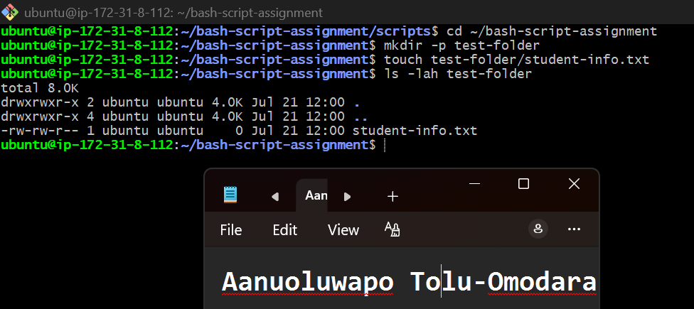

---

#### Screenshot 2 — Content of `file-check.sh`

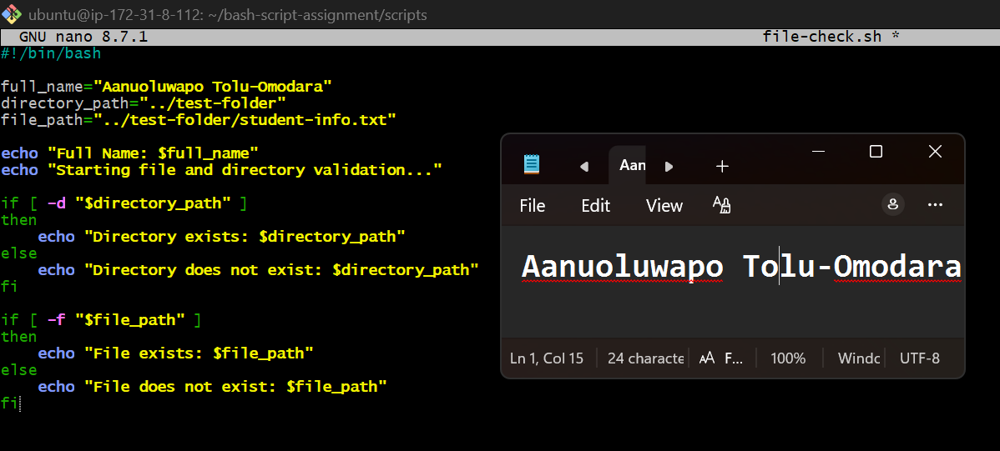

---

#### Screenshot 3 — Output of `./file-check.sh`

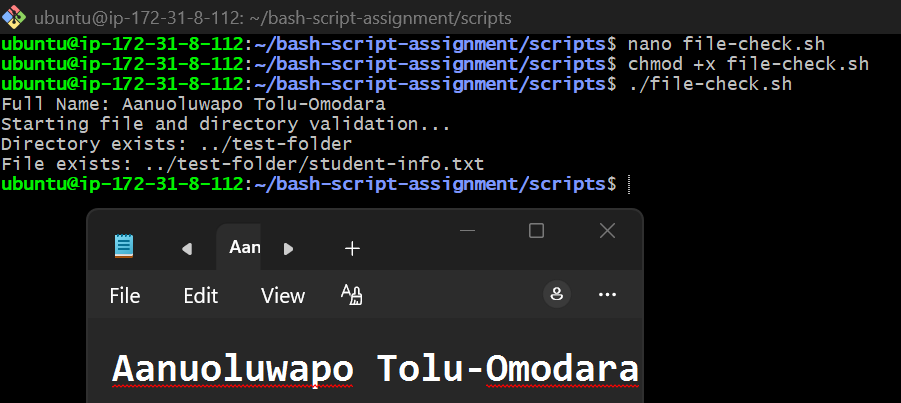

---

### Notes

Answer the following in your own words:

**1. What does `-d` check in Bash?**

The -d option checks whether a specified path exists and is a directory. If the directory exists, the condition is true.

---

**2. What does `-f` check in Bash?**

The -f option checks whether a specified path exists and is a regular file. If the file exists, the condition evaluates to true.

---

**3. Why should file and directory paths be stored in variables?**

Storing paths in variables makes the script easier to read and maintain. If a path changes, you only need to update the variable instead of changing it in multiple places throughout the script.

---

**4. What happens if the file does not exist?**

If the file does not exist, the -f condition evaluates to false, so the else block runs and displays a message indicating that the file could not be found.

---

# Task 7 — Conditionals: Pass or Retry Script

## Goal

Use if-else conditionals to make decisions based on a variable value.

### Evidence

#### Screenshot 1 — Content of `score-check.sh` with `score=85`

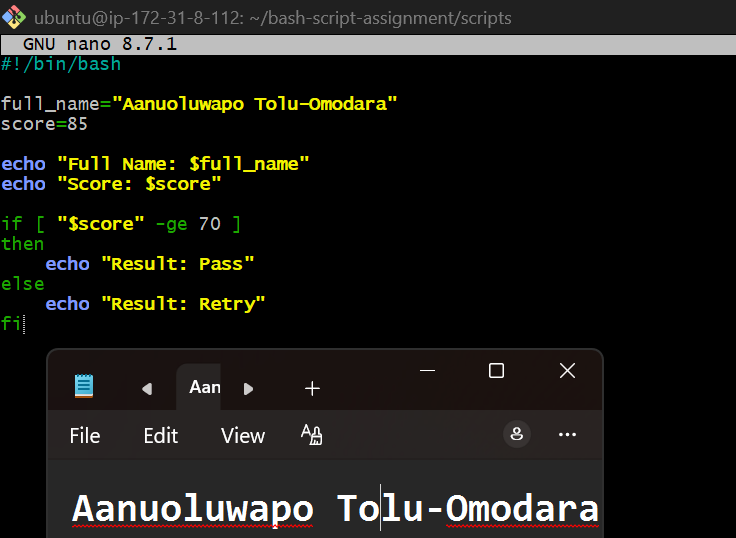

---

#### Screenshot 2 — Output showing `Result: Pass`

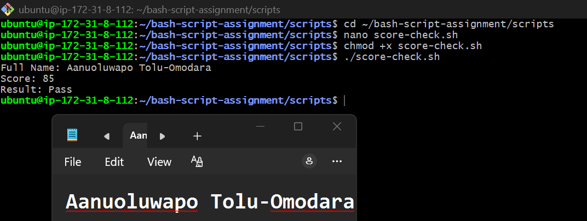

---

#### Screenshot 3 — Content of `score-check.sh` with `score=55`

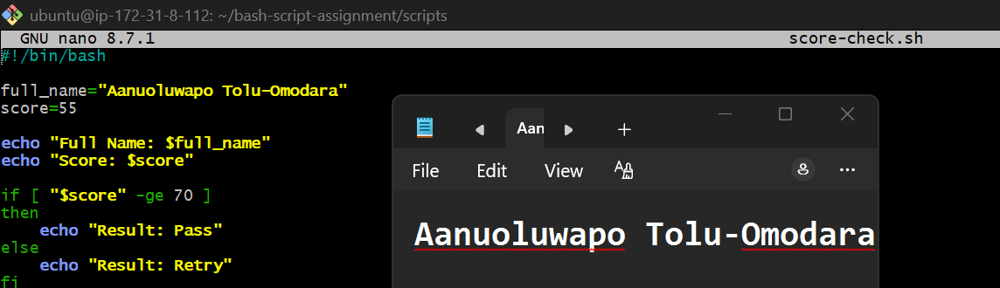

---

#### Screenshot 4 — Output showing `Result: Retry`

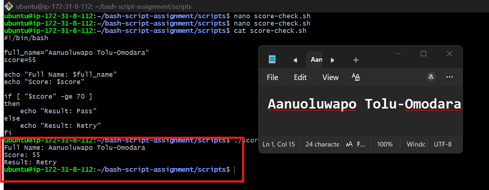

---

### Notes

Answer the following in your own words:

**1. What is the purpose of if-else in Bash?**

The if-else statement allows a Bash script to make decisions based on a condition. If the condition is true, one set of commands runs; if it is false, a different set of commands runs. This makes scripts more flexible and able to respond to different situations.

---

**2. What does `-ge` mean?**

-ge means greater than or equal to. It is used to compare two numbers and checks whether the first number is greater than or equal to the second. In this script, it checks if the score is 70 or above.

---

**3. Why should conditions be tested with different values?**

Testing conditions with different values helps confirm that the script behaves correctly in every situation. In this task, using 85 verifies the Pass condition, while 55 verifies the Retry condition.

---

**4. How can conditionals help in automation scripts?**

Conditionals help automation scripts make decisions automatically based on the current situation. For example, a script can check whether a file exists, a service is running, or a server has enough disk space, and then perform the appropriate action based on the result.

---

# Task 8 — Functions: Final Bash Automation Script

## Goal

Create a final Bash script using functions to organize reusable code.

### Evidence

#### Screenshot 1 — Content of `final-automation.sh`

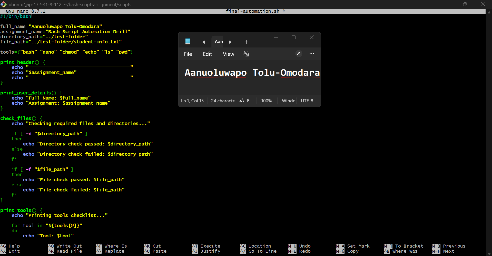

---

#### Screenshot 2 — Output of `./final-automation.sh`

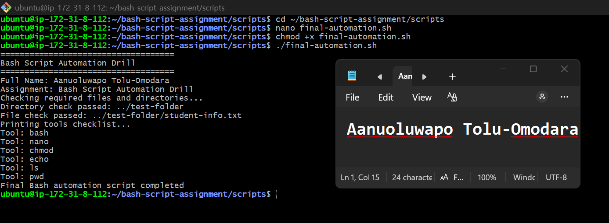

---

#### Screenshot 3 — Output of `ls -lah` showing all created scripts

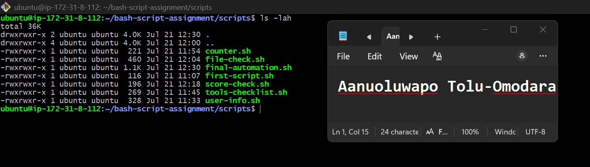
---

### Notes

Answer the following in your own words:

**1. What is a function in Bash?**

A function in Bash is a named block of commands that performs a specific task. Once it is created, you can run all the commands inside it by simply calling the function's name. This helps avoid repeating the same code.

---

**2. Why are functions useful in scripts?**

Functions make scripts easier to read, organize, and maintain by breaking large scripts into smaller, reusable sections. They also reduce code duplication because the same function can be called whenever it is needed.

---

**3. Which functions did you create in this script?**

In this script, I created four functions:

print_header() to display the assignment title.
print_user_details() to display my name and assignment name.
check_files() to verify that the required directory and file exist.
print_tools() to display each tool stored in the array using a loop.

---

**4. How does this final script combine variables, arrays, loops, conditionals, files, and functions?**

This script combines several Bash concepts into one program. It uses variables to store information such as my name and file paths, an array to store tool names, and a for loop to display each tool. It uses if-else conditionals with -d and -f to check whether the required directory and file exist. Finally, it organizes all these tasks into functions, making the script structured, reusable, and easier to understand.

---

# LinkedIn Post (Required)

## Evidence

#### LinkedIn Post URL

Paste your LinkedIn post URL here:

`Add your URL here`

---

#### Screenshot — Published LinkedIn post

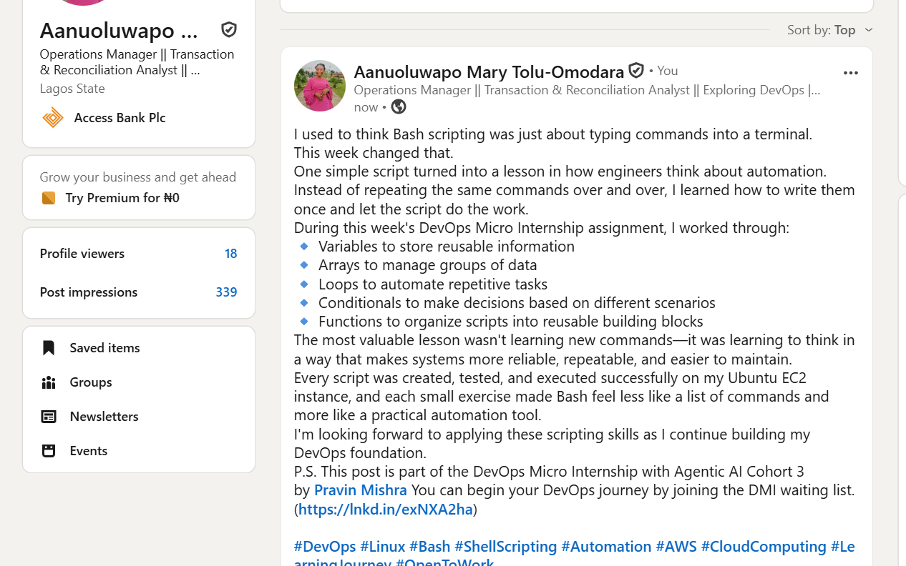

---

# Submission Instructions

- Add all required screenshots in your submission
- Full name must be visible in required screenshots
- All script files must be created and run successfully
- Required notes must be answered clearly for every task
- Do not expose sensitive information (keys, passwords, credentials)

---

# Completion Checklist

- [ ] Task 1: Environment setup verified, workspace created (Screenshots 1–2, Notes answered)
- [ ] Task 2: First script created, executed, permissions verified (Screenshots 1–3, Notes answered)
- [ ] Task 3: Variables script created and run (Screenshots 1–2, Notes answered)
- [ ] Task 4: Arrays and loops script created and run (Screenshots 1–2, Notes answered)
- [ ] Task 5: Counter loop script created and run (Screenshots 1–2, Notes answered)
- [ ] Task 6: File validation script created and run (Screenshots 1–3, Notes answered)
- [ ] Task 7: Pass/Retry conditional script tested with both values (Screenshots 1–4, Notes answered)
- [ ] Task 8: Final automation script created and run (Screenshots 1–3, Notes answered)
- [ ] All scripts run without errors
- [ ] Full Name visible in all required screenshots
- [ ] LinkedIn post published and URL submitted
- [ ] No sensitive data exposed

---

## 📌 About DMI & CloudAdvisory

DevOps Micro Internship (DMI) is a project-based DevOps program run by Pravin Mishra (The CloudAdvisory) focused on real-world execution, systems thinking, and career readiness.

It helps learners build strong DevOps foundations with hands-on experience.

---

## 📌 Resources

- 🌐 DMI Official Website: https://pravinmishra.com/dmi  
- 🎓 DevOps for Beginners (Udemy): https://www.udemy.com/course/devops-for-beginners-docker-k8s-cloud-cicd-4-projects/  
- 🎓 Agentic AI DevOps with Claude Code: https://www.udemy.com/course/ultimate-agentic-ai-devops-with-claude-code/  
- 🎓 DevOps with Claude Code: Terraform, EKS, ArgoCD & Helm: https://www.udemy.com/course/devops-with-claude-code-terraform-eks-argocd-helm/  
- ▶️ YouTube Playlist: https://www.youtube.com/playlist?list=PLFeSNDtI4Cho  
- 🔗 Pravin Mishra (LinkedIn): https://www.linkedin.com/in/pravin-mishra-aws-trainer/  
- 🏢 CloudAdvisory (LinkedIn): https://www.linkedin.com/company/thecloudadvisory/

---

*This submission is part of DevOps Micro Internship (DMI) Cohort 3 — Agentic AI Track.*