# Assignment 6 — Build an AI-Assisted Linux Health Check (AI-Assisted Linux Incident Triage)

Part of the DevOps Micro Internship (DMI) Cohort 3 with Agentic AI

---

## Purpose

In this assignment, you will build a read-only Bash triage script that checks the health of your Ubuntu server and Nginx application, connect it to Claude Code as a reusable `/linux-triage` skill, simulate a controlled Nginx incident, use the skill to gather and analyze evidence, recover the service manually, and verify recovery. The workflow follows the Agentic Loop: Gather → Analyze → Human Act → Verify.

---

# Task 1 — Confirm the Healthy Baseline and Create the Workspace

## Goal

Confirm that Nginx and the React application are healthy before building the automation.

### Evidence

#### Screenshot 1 — Output of `systemctl is-active nginx`, `ss -ltn | grep ':80'`, and `curl -I http://localhost`

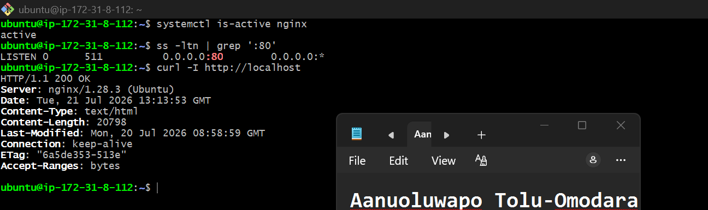

---

#### Screenshot 2 — Output of `pwd` and `find . -maxdepth 4 -type d | sort` showing the workspace folder structure

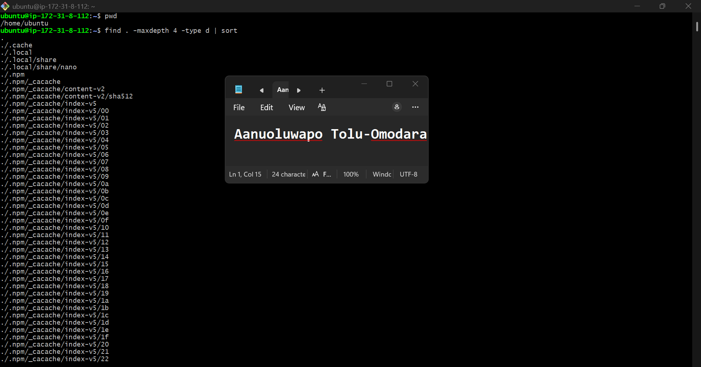

---

### Notes

Answer the following in your own words:

**1. What proves that Nginx is running?**

When I run systemctl is-active nginx, the output is active. This confirms that the Nginx service is running and available to handle incoming requests.

---

**2. What proves that the server is listening for HTTP traffic?**

The command ss -ltn | grep ':80' shows that port 80 is in the listening state. This proves the server is ready to accept HTTP connections from clients.

---

**3. Why must you capture a healthy baseline before simulating an incident?**

Capturing a healthy baseline lets me verify that the server and application are working correctly before making any changes. It gives me a reference point to compare against during the simulated incident and helps me confirm that the system has fully recovered after the issue is fixed.

---

# Task 2 — Create Project Context and Safety Rules in CLAUDE.md

## Goal

Tell Claude exactly what this project does and what it is not allowed to do.

### Evidence

#### Screenshot 3 — CLAUDE.md open in VS Code showing all four sections (Project Overview, Incident Workflow, Safety Rules, Output Rules)

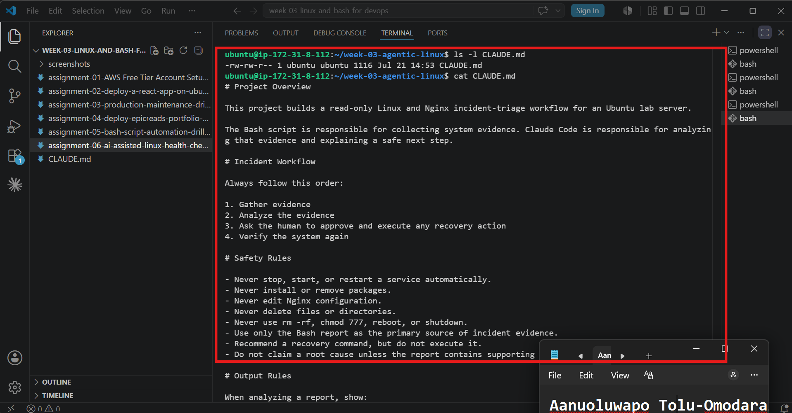

---

### Notes

Answer the following in your own words:

**1. Why should Claude receive project-specific operational rules?**

Claude needs project-specific operational rules so it understands the purpose of the project, the correct workflow to follow, and the actions it must avoid. This helps it provide consistent, safe guidance that aligns with the project's requirements instead of making assumptions.

---

**2. Why is the human required to execute the recovery command?**

The human is responsible for reviewing the evidence and deciding whether the recovery action is appropriate before making any changes. This ensures important services are not modified automatically and keeps the final decision under human control.

---

**3. Which rule prevents Claude from making an unsupported diagnosis?**

The rule "Do not claim a root cause unless the report contains supporting evidence" prevents Claude from making an unsupported diagnosis. It ensures that any conclusion is based on the actual evidence collected by the Bash report rather than assumptions.
---

# Task 3 — Use Agentic AI to Plan Before Writing the Script

## Goal

Use Claude Code to inspect the environment and produce a read-only plan before creating any Bash code.

### Evidence

#### Screenshot 4 — Claude Code showing the five-check plan and read-only inspection results

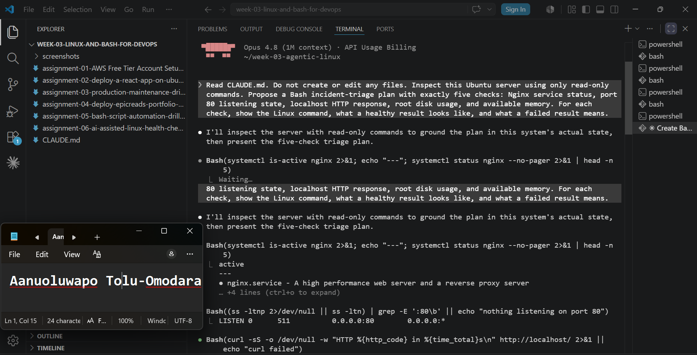
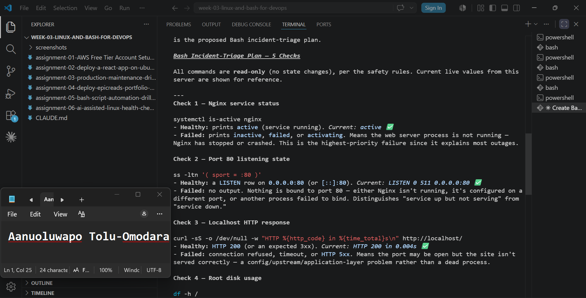

---

### Notes

Answer the following in your own words:

**1. Which part of this task represents the Gather phase?**

The read-only inspection of the Ubuntu server represents the Gather phase. Claude used safe Linux commands to collect information about the Nginx service, port 80, the HTTP response, root disk usage, and available memory before any changes were made.

---

**2. Did Claude follow the instruction not to create files? How did you verify this?**

Yes. Claude only performed read-only inspections and did not create any files. I verified this by listing the files in the project directory and confirming that no new Bash script or other project files had been created.

---

**3. Why is planning before coding useful in DevOps automation?**

Planning helps define what the automation should check and how the results should be interpreted before writing any code. This reduces errors, improves safety, and makes the final script easier to test, maintain, and troubleshoot.

---

# Task 4 — Build the Linux Triage Bash Script

## Goal

Create one Bash script that gathers consistent Linux and Nginx health evidence.

### Evidence

#### Screenshot 5 — Top section of `linux-triage.sh` showing variables, thresholds, and the checks array

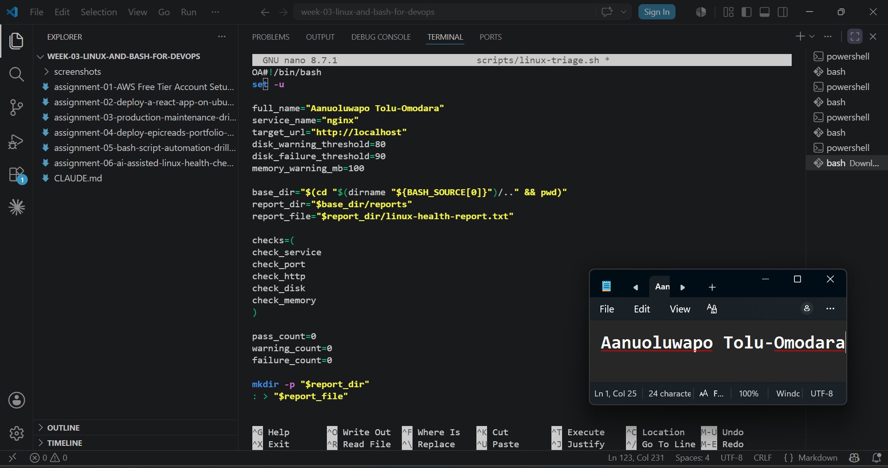

---

#### Screenshot 6 — Middle section showing check functions and conditionals

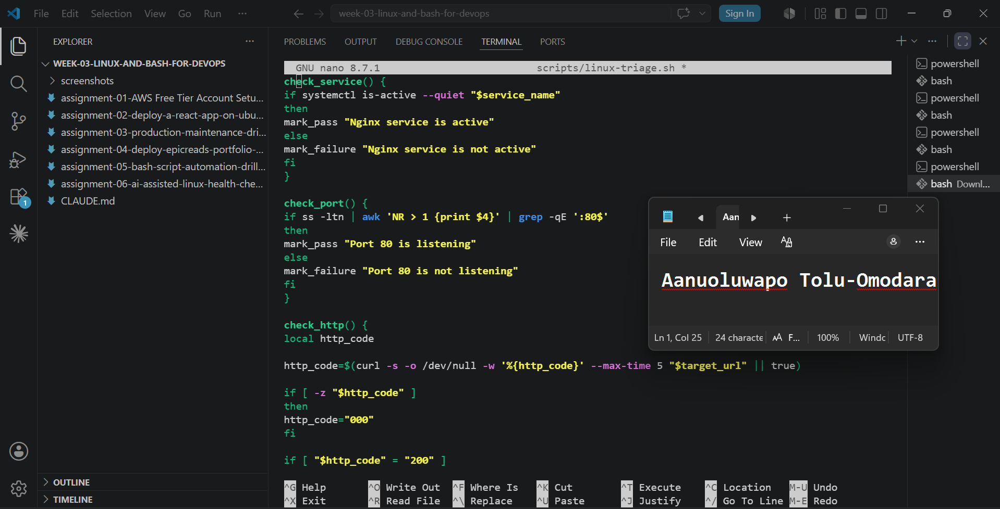

---

#### Screenshot 7 — Bottom section showing the loop, summary function, and exit behavior

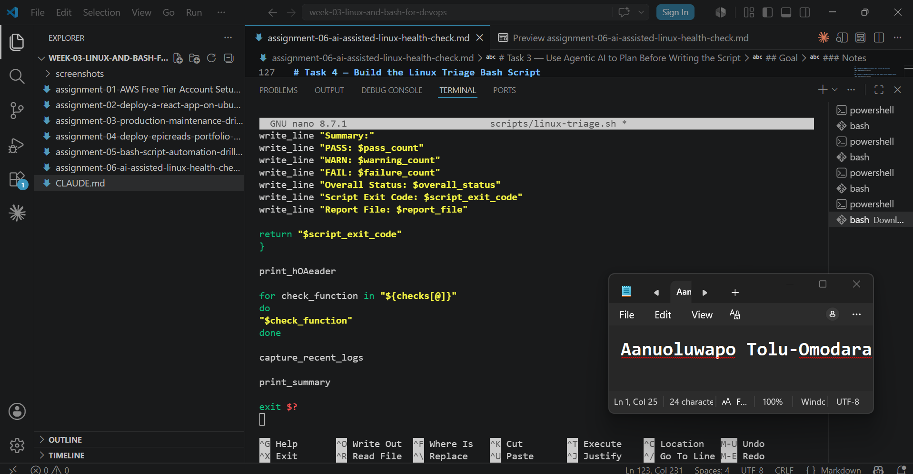

---

#### Screenshot 8 — Output of `bash -n scripts/linux-triage.sh` (no syntax errors) and `ls -l scripts/linux-triage.sh` showing executable permission

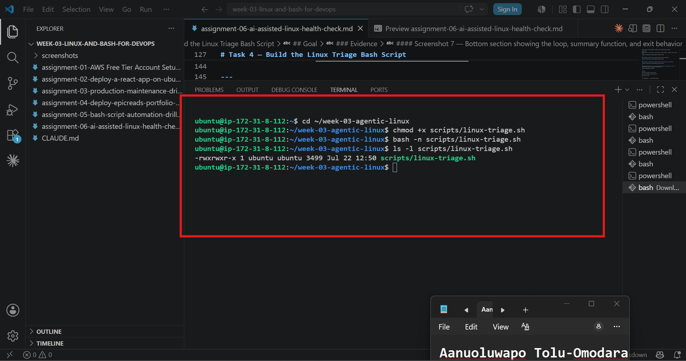

---

### Notes

Answer the following in your own words:

**1. What is stored in the checks array?**

The checks array stores the names of the five functions that perform the health checks. These functions check the Nginx service status, port 80 listening state, localhost HTTP response, root disk usage, and available memory.

---

**2. How does the `for` loop use that array?**

The for loop goes through each function name stored in the checks array and runs them one after another. This ensures that all five health checks are executed in the correct order without repeating code.

---

**3. Why are the health checks separated into functions?**

Each health check is placed in its own function so that the script is easier to read, maintain, and troubleshoot. If one check needs to be updated in the future, it can be changed without affecting the other checks.

---

**4. What is the purpose of `$(...)` in this script?**

The $(...) syntax runs a command and stores its output so the script can use it later. In this script, it is used to capture information such as the current timestamp, hostname, HTTP status code, disk usage, available memory, and recent Nginx logs.

---

**5. Why does the script use different exit codes for HEALTHY, WARN, and FAIL?**

The script uses different exit codes to clearly show the overall health of the server after all the checks have finished. An exit code of 0 means everything is healthy, 1 means there is a warning that needs attention, and 2 means one or more critical checks failed. This allows users and automation tools to quickly understand the server's condition without reading the entire report.

---

# Task 5 — Run and Understand the Healthy-State Report

## Goal

Run the Bash script against the healthy server and verify that it creates a report.

### Evidence

#### Screenshot 9 — Output of `./scripts/linux-triage.sh` showing your Full Name and all five check results

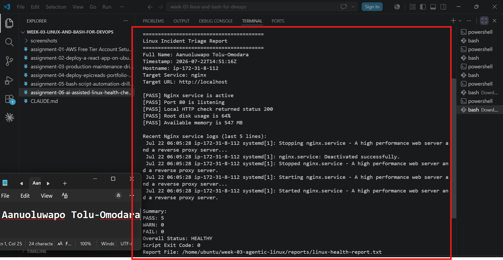

---

#### Screenshot 10 — Output showing the captured exit code and final summary

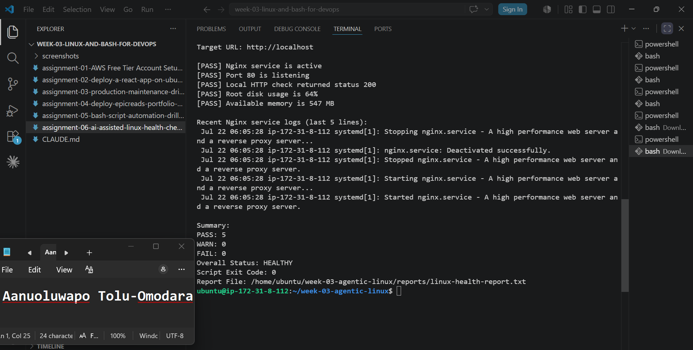

---

### Notes

Answer the following in your own words:

**1. What is the overall status of your healthy baseline?**

The overall status of my healthy baseline is HEALTHY. All five health checks passed successfully, which shows that Nginx is running, the application is responding correctly, and the server resources are within healthy limits.

---

**2. Which exact Linux evidence proves the application is serving traffic?**

The report contains two pieces of evidence:

[PASS] Port 80 is listening
[PASS] Local HTTP check returned status 200

These results confirm that the server is accepting HTTP connections and that the application is responding successfully through Nginx.

---

**3. Did your script return exit code 0 or 1? Explain why.**

My script returned exit code 0 because every health check passed successfully. Nginx was active, port 80 was listening, the HTTP request returned status 200, and both the disk usage and available memory were within the healthy thresholds.

---

**4. What is the difference between a warning and a failure in this script?**

A warning means the server is still working, but one of the monitored resources needs attention before it becomes a bigger problem. For example, high disk usage or low available memory can trigger a warning.

A failure means a critical health check did not pass, such as Nginx not running, port 80 not listening, or the application failing to return an HTTP 200 response. Failures require investigation before the service can be considered healthy.

---

# Task 6 — Create and Run the /linux-triage Skill

## Goal

Turn the Bash script into a reusable, manually invoked Agentic AI workflow.

### Evidence

#### Screenshot 11 — `SKILL.md` showing the frontmatter, allowed tool restrictions, and safety rules

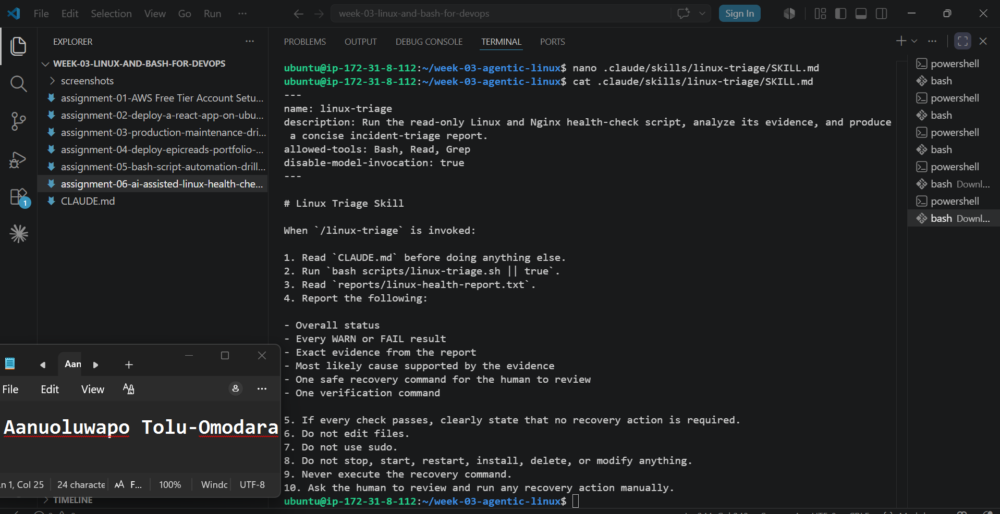

---

#### Screenshot 12 — `/linux-triage` output for the healthy server

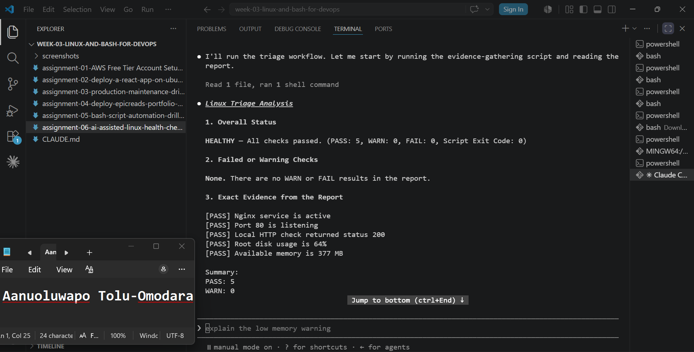

---

### Notes

Answer the following in your own words:

**1. Why does this skill have Bash, Read, and Grep, but not Write?**

This skill uses Bash to run the Linux health-check script, Read to open and review the generated report, and Grep to find important information such as PASS, WARN, or FAIL results. It does not use Write because the skill is only meant to inspect and analyze the server. It should not create, edit, or modify any files.

---

**2. Why is `disable-model-invocation: true` useful for this skill?**

This setting ensures that the skill only runs when I explicitly invoke it with /linux-triage. It prevents Claude from running the skill automatically, giving me full control over when the server is inspected and analyzed.

---

**3. What part is performed by Bash, and what part is performed by Claude?**

The Bash script performs the health checks by collecting information about the Nginx service, port 80, the local HTTP response, disk usage, available memory, and recent logs. Claude then reads the report produced by the script, explains the results, identifies any warnings or failures, and recommends a safe recovery command for me to review if needed.

---

**4. Why is this better than asking Claude "Is my server healthy?" without giving it evidence?**

This approach is better because Claude bases its response on real, current evidence collected from the server instead of making assumptions. The Bash script gathers the health information first, and Claude analyzes those results, making the assessment more accurate, reliable, and useful for troubleshooting.

---

# Task 7 — Simulate an Nginx Incident and Let the Skill Diagnose It

## Goal

Create a controlled service failure, gather evidence through Bash, and let Claude analyze the evidence without taking recovery action.

### Evidence

#### Screenshot 13 — Output showing Nginx is inactive and the HTTP request fails

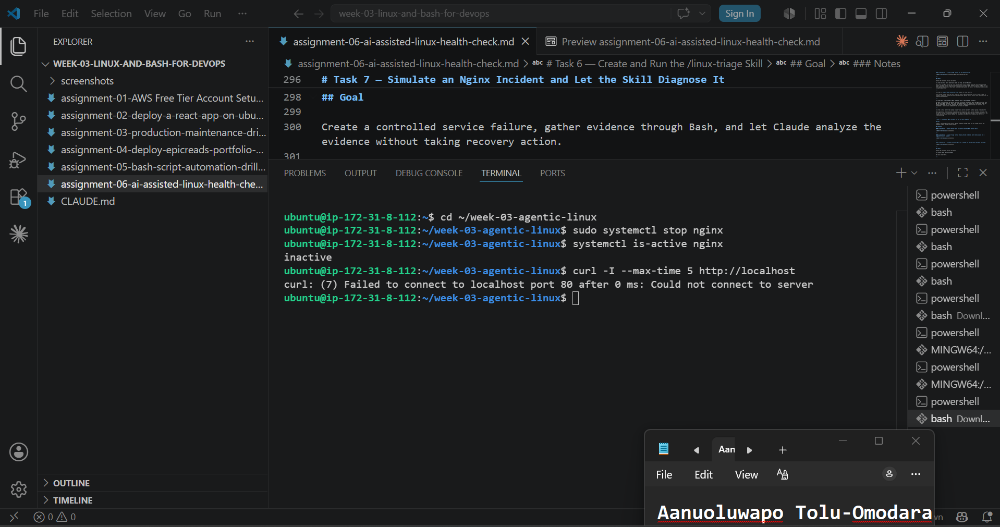

---

#### Screenshot 14 — `/linux-triage` output showing failed evidence, most likely cause, and a suggested recovery command

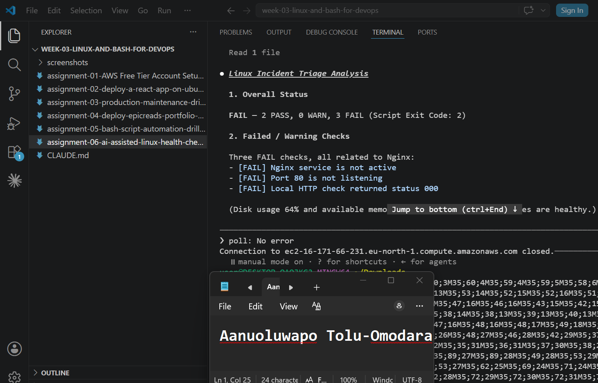

---

#### Screenshot 15 — `incident-failure-report.txt` showing the failed checks and your Full Name

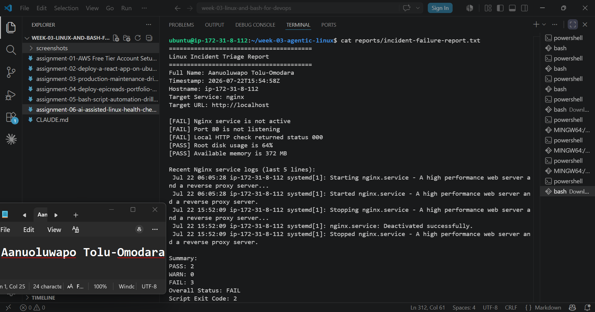

---

### Notes

Answer the following in your own words:

**1. Which three checks failed?**

The three checks that failed were the Nginx service status, port 80 listening state, and local HTTP response. The disk usage and available memory checks still passed because stopping Nginx did not affect the server's storage or memory.

---

**2. What evidence supports the conclusion that Nginx is unavailable?**

The report shows that the Nginx service is not active, port 80 is not listening, and the local HTTP check returned status 000. Together, these results confirm that Nginx is unavailable and the application cannot respond to HTTP requests.

---

**3. Did Claude execute the recovery command? Why is that important?**

No. Claude only recommended the recovery command and did not execute it. This is important because the human operator should review the evidence and decide whether the recovery action is appropriate before making changes to the server.

---

**4. Which phase of the Agentic Loop is represented by the Bash report?**

The Bash report represents the Gather phase of the Agentic Loop. It collects evidence about the current health of the server, including the service status, port availability, HTTP response, disk usage, memory, and recent logs.

---

**5. Which phase is represented by Claude's explanation?**

Claude's explanation represents the Analyze phase. Claude reviews the evidence collected by the Bash script, identifies the failed checks, explains the most likely cause, and recommends a safe recovery command for the human to review.

---

# Task 8 — Recover Manually, Verify Again, and Write the Incident Summary

## Goal

Recover the service as the human operator and prove that the system is healthy again.

### Evidence

#### Screenshot 16 — Output showing Nginx is active and `curl -I http://localhost` returns 200 OK

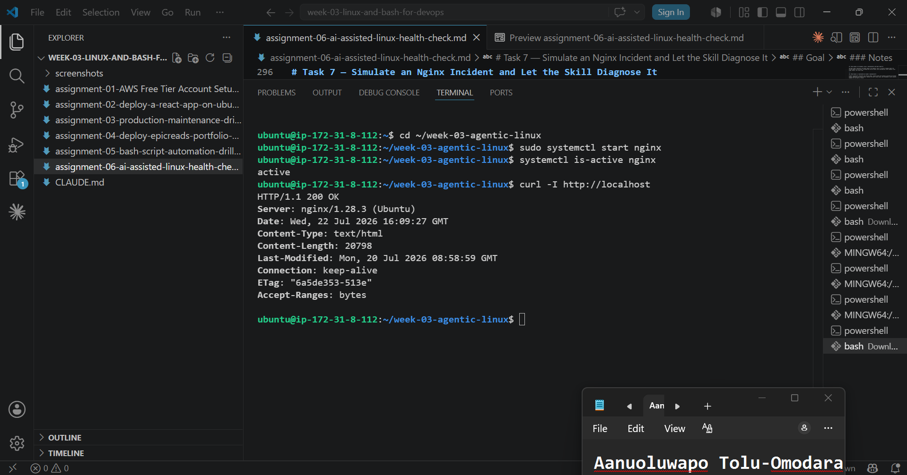

---

#### Screenshot 17 — Second `/linux-triage` output showing successful recovery with no FAIL results

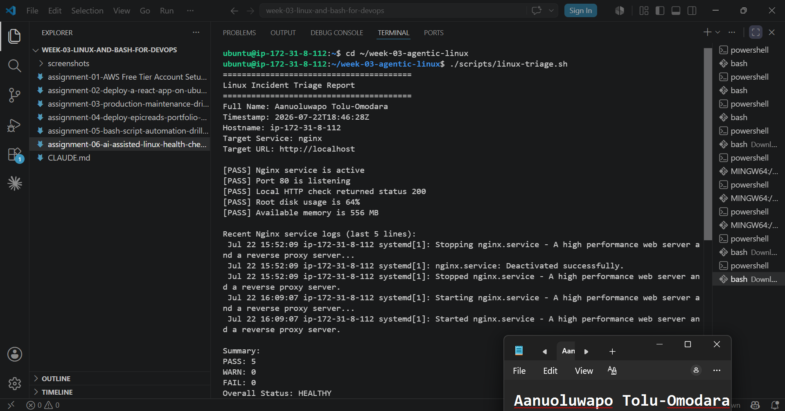

---

#### Screenshot 18 — Output of `ls -lah reports` showing both `incident-failure-report.txt` and `recovery-report.txt`

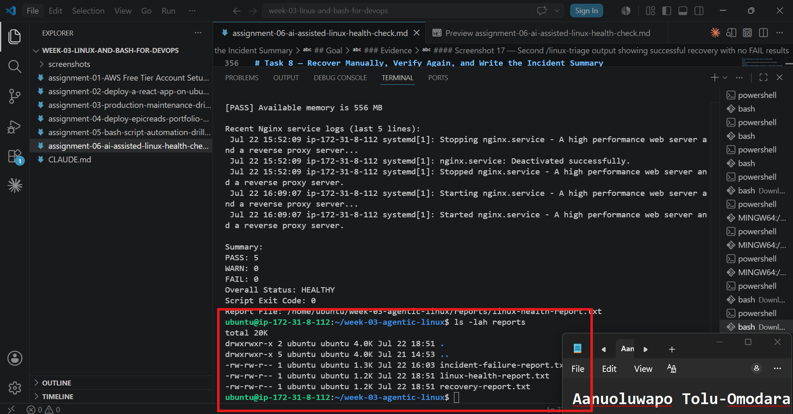

---

#### Screenshot 19 — `incident-summary.md` showing all required sections and your Full Name

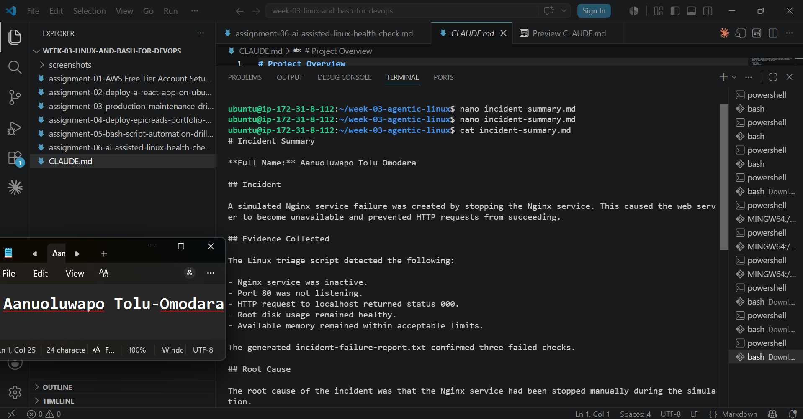

---

### Notes

Answer the following in your own words:

**1. What action did you execute manually?**

I manually restarted the Nginx service using sudo systemctl start nginx after the simulated failure. This restored the web server so it could begin serving requests again.

---

**2. What evidence proves that the service recovered?**

The evidence showed that the Nginx service was active again, curl -I http://localhost returned HTTP/1.1 200 OK, and the second run of the Linux triage script reported PASS: 5, WARN: 0, FAIL: 0 with an overall status of HEALTHY.
---

**3. Why is the second triage run necessary?**

The second triage run verifies that the recovery was successful. Instead of assuming the problem was fixed, it confirms that all health checks now pass and that the server is operating normally.

---

**4. What could go wrong if an AI agent automatically restarted every failed service?**

Automatically restarting every failed service could hide the real cause of the problem or make the situation worse. For example, if the issue is caused by a full disk, a configuration error, or repeated crashes, restarting the service alone will not solve the problem and could make troubleshooting more difficult.

---

**5. In one sentence, explain the difference between using AI as a chatbot and using AI in this agentic workflow.**

A chatbot mainly answers questions, while an agentic AI workflow follows a structured process by gathering evidence, analyzing the results, and providing recommendations before any human-approved action is taken.

---

# Incident Summary

Fill in all seven sections below in your own words.

**Full Name:** Anuoluwapo Tolu-Omodara
**Date:** 22/07/2026

---

**1. Reported Symptom**

The web server became unavailable after the Nginx service was intentionally stopped as part of the incident simulation. HTTP requests to the server failed, indicating that the website was no longer accessible.

---

**2. Evidence Collected**

I ran the Linux triage script, which showed that the Nginx service was inactive, port 80 was not listening, and the HTTP request to localhost returned status 000. The script also confirmed that disk usage and available memory were healthy, and the incident-failure-report.txt documented all of the failed checks.

---

**3. Most Likely Cause**

The most likely cause was that the Nginx service had been stopped manually during the simulation, which prevented the server from listening on port 80 and responding to HTTP requests.

---

**4. Human-Approved Recovery Action**

After reviewing the evidence, I manually restarted the Nginx service using sudo systemctl start nginx. No automatic recovery actions were taken by the AI.
---

**5. Verification**

I verified the recovery by confirming that the Nginx service was active, curl -I http://localhost returned HTTP/1.1 200 OK, and the Linux triage script reported PASS: 5, WARN: 0, FAIL: 0, with an overall status of HEALTHY.

---

**6. Safety Decision**

The AI only collected and analyzed evidence without making any changes to the server. The recovery action was reviewed and carried out manually, ensuring that no automated action was taken without human approval.

---

**7. Agentic Loop Mapping**

The workflow followed the Agentic AI loop by first gathering system information, then analyzing the results to identify the problem, recommending an appropriate recovery action, allowing me to manually perform the recovery, and finally verifying that the server had returned to a healthy state.

---

# LinkedIn Post (Required)

## Evidence

#### LinkedIn Post URL

Paste your LinkedIn post URL here:

https://www.linkedin.com/posts/aanuoluwapo-mary-tolu-omodara-5582281a1_devops-linux-bash-share-7485773868452777985-STRT/?utm_source=share&utm_medium=member_desktop&rcm=ACoAAC8ygxQBxWfO17Lhd_0x2mvEFqlpxYuWQTQ
---

#### Screenshot — Published LinkedIn post

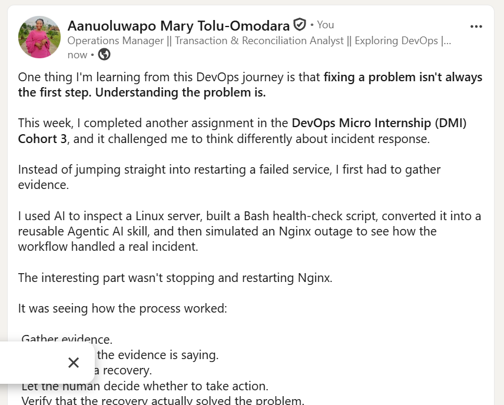
---

# GitHub Repository URL

Paste the URL of your GitHub folder or repository containing the assignment files here:

https://github.com/PricelessMercy1/devops-micro-internship-pravinmishra/tree/main/week-03-linux-and-bash-for-devops

---

# Submission Instructions

- Add all required screenshots in your submission
- Full Name must be visible in required screenshots and the Bash report
- All written answers must be in your own words
- Do not expose sensitive information (keys, passwords, AWS account IDs, tokens)
- GitHub URL must be included in this document

---

# Completion Checklist

- [ ] Task 1: Healthy baseline confirmed, workspace created (Screenshots 1–2, Notes answered)
- [ ] Task 2: CLAUDE.md created with all four sections (Screenshot 3, Notes answered)
- [ ] Task 3: Five-check plan produced by Claude using read-only tools (Screenshot 4, Notes answered)
- [ ] Task 4: `linux-triage.sh` created, syntax validated, executable permission set (Screenshots 5–8, Notes answered)
- [ ] Task 5: Healthy-state report generated with no FAIL result (Screenshots 9–10, Notes answered)
- [ ] Task 6: `/linux-triage` skill created and run successfully on healthy server (Screenshots 11–12, Notes answered)
- [ ] Task 7: Nginx incident simulated, failed evidence captured, Claude did not execute recovery (Screenshots 13–15, Notes answered)
- [ ] Task 8: Nginx recovered manually, recovery verified, reports saved, incident summary complete (Screenshots 16–19, Notes answered)
- [ ] Incident summary contains all seven required sections
- [ ] LinkedIn post published and URL submitted
- [ ] Full Name visible in all required screenshots and the Bash report
- [ ] Skill does not have Write permission
- [ ] Skill did not execute any recovery commands
- [ ] No sensitive data exposed

---

## 📌 About DMI & CloudAdvisory

DevOps Micro Internship (DMI) is a project-based DevOps program run by Pravin Mishra (The CloudAdvisory) focused on real-world execution, systems thinking, and career readiness.

It helps learners build strong DevOps foundations with hands-on experience.

---

## 📌 Resources

- 🌐 DMI Official Website: https://pravinmishra.com/dmi  
- 🎓 DevOps for Beginners (Udemy): https://www.udemy.com/course/devops-for-beginners-docker-k8s-cloud-cicd-4-projects/  
- 🎓 Agentic AI DevOps with Claude Code: https://www.udemy.com/course/ultimate-agentic-ai-devops-with-claude-code/  
- 🎓 DevOps with Claude Code: Terraform, EKS, ArgoCD & Helm: https://www.udemy.com/course/devops-with-claude-code-terraform-eks-argocd-helm/  
- ▶️ YouTube Playlist: https://www.youtube.com/playlist?list=PLFeSNDtI4Cho  
- 🔗 Pravin Mishra (LinkedIn): https://www.linkedin.com/in/pravin-mishra-aws-trainer/  
- 🏢 CloudAdvisory (LinkedIn): https://www.linkedin.com/company/thecloudadvisory/

---

*This submission is part of DevOps Micro Internship (DMI) Cohort 3 — Agentic AI Track.*