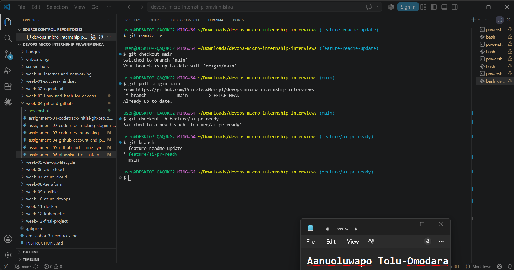
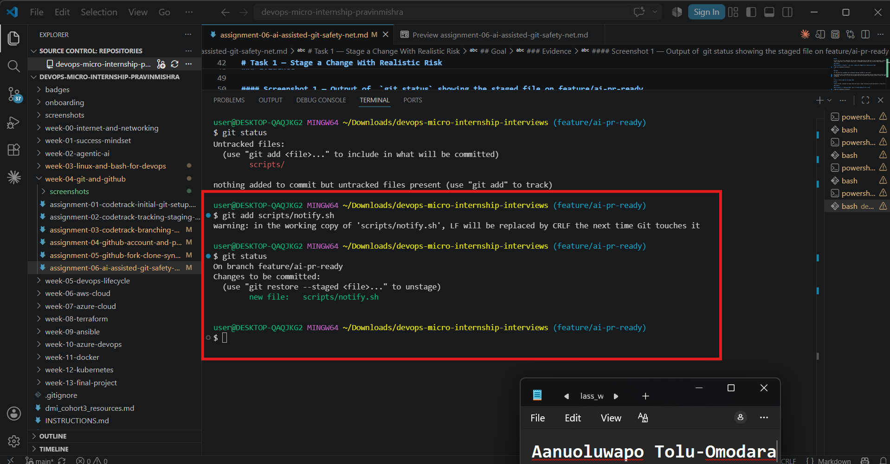
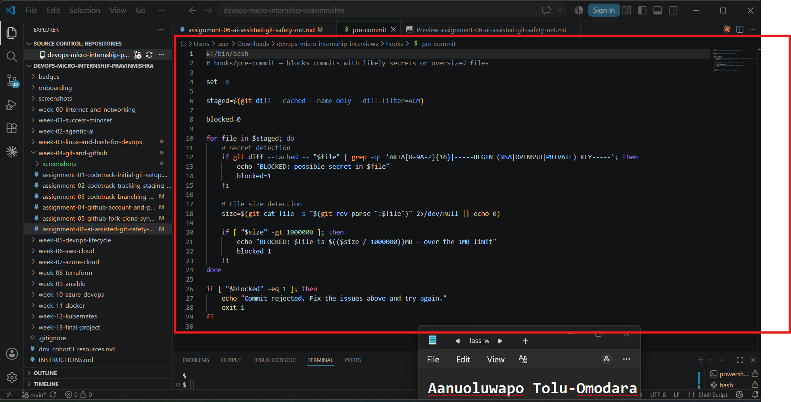
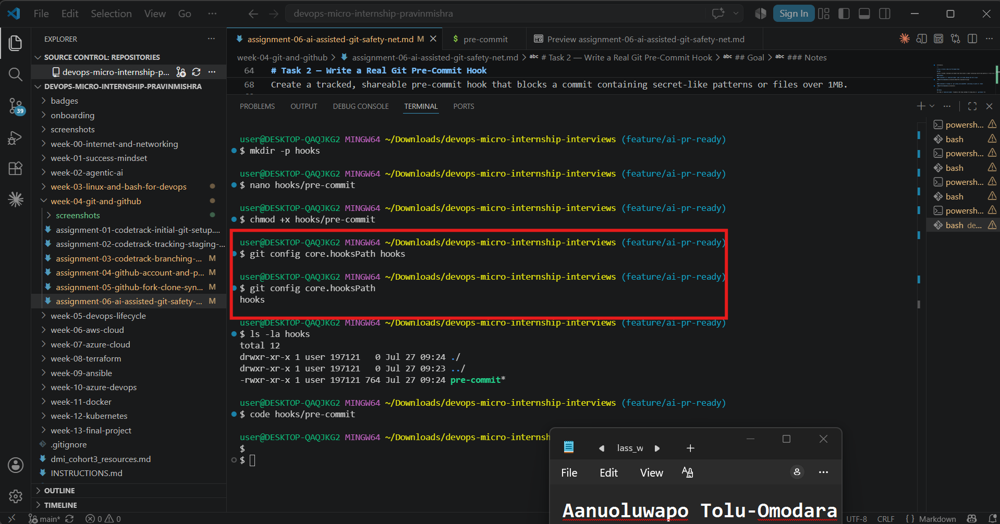
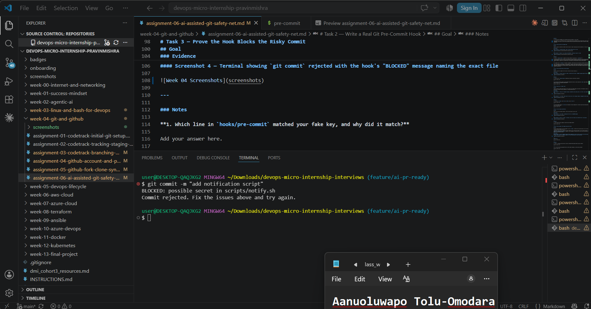
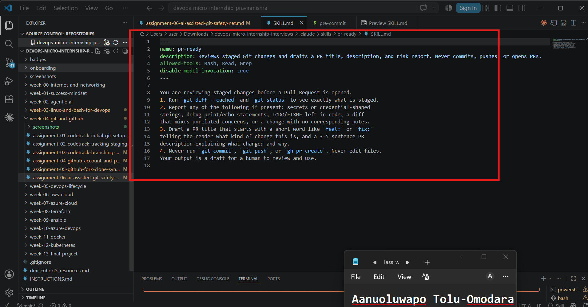
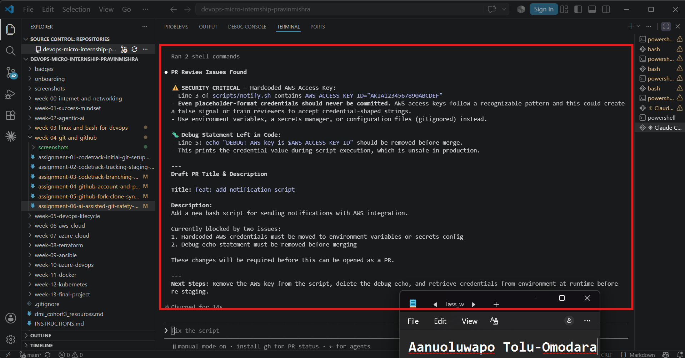
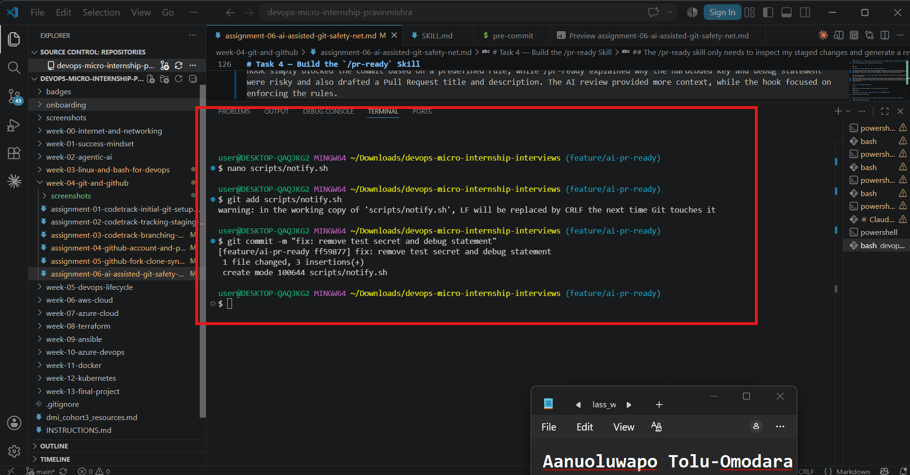
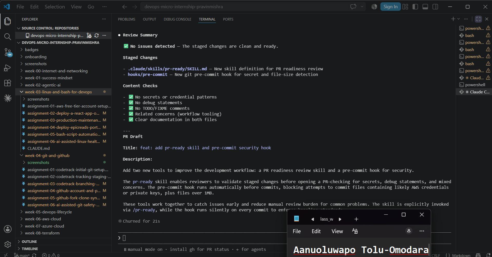
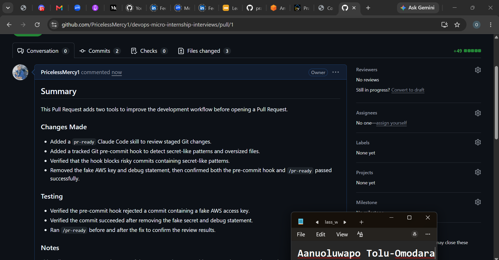

# Assignment 6 — Building an AI-Assisted Git Safety Net (PR Ready Check)

Part of the DevOps Micro Internship (DMI) Cohort 3 with Agentic AI

---

## Purpose

In Week 2 you built Claude Code hooks that block a dangerous action *before* it happens (`PreToolUse`), and a restricted skill that could look but not touch (`allowed-tools` without `Write`). In this assignment you will discover that Git has the exact same idea, decades older: a **pre-commit hook** that blocks a commit before it's created.

You will build both halves of a real "PR Ready" workflow:

1. A **Git hook that follows fixed rules** — scans staged changes for hardcoded secrets and oversized files and refuses the commit. No AI involved, no guessing, just a rule that gives the same answer every time.
2. A **restricted Claude Code skill** (`/pr-ready`) that reads your staged diff and drafts a Pull Request title, description, and a short list of things worth a second look — the kind of judgment a fixed rule can't make (mixed changes, missing context, unclear intent). The skill never commits, pushes, or opens the PR. You do that yourself, using its draft as a starting point.

This mirrors the Agentic Loop from Week 3's Linux triage assignment: **Gather → Analyze → Human Act → Verify**. The hook and the skill both gather and analyze; only you act.

---

# Task 0 — Confirm Your Fork and Create a Feature Branch

## Goal

Confirm you are working in your own fork, then create a dedicated branch for this assignment.

### Evidence

#### Screenshot 1 — Output of git remote -v and git branch showing the new branch

---

### Notes

**1. Why create a dedicated branch instead of doing this work on main?**

Creating a dedicated branch keeps my work isolated from the main branch. This allows me to develop, test, and make changes without affecting the stable version of the project. It also makes it easier to review the changes, create a clean Pull Request, and merge only the work related to this assignment.

---

# Task 1 — Stage a Change With Realistic Risk

## Goal

On your own fork of this repository (the one you've been submitting your DMI work in since onboarding), create a new branch and stage a change that a real reviewer should catch: a hardcoded-looking secret and a leftover debug statement.

### Evidence

#### Screenshot 1 — Output of  `git status` showing the staged file on feature/ai-pr-ready

---

### Notes

**1. Why does this assignment use an obviously fake key instead of a real one?**

The assignment uses a fake AWS-style key to safely demonstrate how automated security checks detect secrets without exposing real credentials. This allows us to test the pre-commit hook and AI-assisted review process without risking the leakage of sensitive information.

---

# Task 2 — Write a Real Git Pre-Commit Hook

## Goal

Create a tracked, shareable pre-commit hook that blocks a commit containing secret-like patterns or files over 1MB.

### Evidence

#### Screenshot 2 — `hooks/pre-commit` open in VS Code showing the full script

---

#### Screenshot 3 — Output of `git config core.hooksPath` confirming it points to `hooks`

---

### Notes

**1. Why is `hooks/pre-commit` tracked in the repo instead of living only in `.git/hooks/`?**

The hooks/pre-commit file is tracked in the repository so everyone working on the project can use the same pre-commit checks. If it only existed in .git/hooks/, it would stay on one developer's computer and wouldn't be shared through Git. Keeping it in the repository makes it easier for the whole team to use the same rules and maintain consistent code quality.

---

**2. Compare this to `PreToolUse` from Week 2 Assignment 6. What does each one intercept, and what do they have in common?**

The Git pre-commit hook intercepts a commit before Git creates it and checks the staged files for issues like secrets or oversized files. The PreToolUse hook from Week 2 intercepted tool commands before Claude Code executed them. Although they work in different environments, they both serve the same purpose: stopping risky actions before they happen and helping enforce security and project standards automatically.

---

# Task 3 — Prove the Hook Blocks the Risky Commit

## Goal

Attempt to commit the staged file from Task 1 and show the hook rejecting it.

### Evidence

#### Screenshot 4 — Terminal showing `git commit` rejected with the hook's "BLOCKED" message naming the exact file

---

### Notes

**1. Which line in `hooks/pre-commit` matched your fake key, and why did it match?**

The line using grep -qE 'AKIA[0-9A-Z]{16}|-----BEGIN (RSA|OPENSSH|PRIVATE) KEY-----' matched the fake key. It matched because the key started with AKIA followed by 16 uppercase letters and numbers, which fits the pattern the hook was designed to detect.

---

**2. Could this hook have caught a poorly-named variable that stores a secret without the `AKIA` prefix? What does that tell you about the limits of a fixed rule like this?**

No. If the secret didn't match one of the patterns the hook was looking for, it would likely go undetected. This shows that fixed-rule checks are good at finding known patterns, but they can't understand context or identify every possible secret. That's why combining rule-based checks with AI-assisted review provides better overall protection.

---

# Task 4 — Build the `/pr-ready` Skill

## Goal

Create a manually invoked Claude Code skill that reads your staged changes and produces a PR-readiness report and a draft PR description — without writing, committing, or pushing anything itself.

### Evidence

#### Screenshot 5 — `SKILL.md` frontmatter showing `allowed-tools: Bash, Read, Grep` (no `Write`) and `disable-model-invocation: true`

---

#### Screenshot 6 — `/pr-ready` output while the risky file is still staged, showing it flagged the secret and/or debug statement

---

### Notes

**1. Why does `/pr-ready` have `Bash` and `Read` but not `Write`?**

The /pr-ready skill only needs to inspect my staged changes and generate a review report. It uses Bash, Read, and Grep to gather and analyze information, but it doesn't need Write because it shouldn't modify files or perform actions like committing or pushing code. Keeping it read-only ensures that I remain responsible for making the final changes and decisions.
---

**2. The pre-commit hook and `/pr-ready` both looked at the same staged diff. Did they flag the same things? What did one catch that the other didn't?**

Both the pre-commit hook and /pr-ready detected the fake AWS access key in the staged file. The difference is that the pre-commit hook simply blocked the commit based on a predefined rule, while /pr-ready explained why the hardcoded key and debug statement were risky and also drafted a Pull Request title and description. The AI review provided more context, while the hook focused on enforcing the rules.

---

# Task 5 — Fix the Issues and Re-Verify

## Goal

Remove the secret and debug statement, then prove both gates now pass clean.

### Evidence

#### Screenshot 7 — `git commit` succeeding after the fix (no BLOCKED message)

---

#### Screenshot 8 — Second `/pr-ready` run showing a clean risk report and a drafted PR title + description

---

### Notes

**1. What exactly did you change to satisfy the pre-commit hook?**

I removed the fake AWS access key and deleted the debug statement that printed it. After staging the updated file, the pre-commit hook no longer detected any secret-like patterns, so the commit completed successfully without being blocked.

---

# Task 6 — Push and Open a Pull Request Using the AI Draft

## Goal

Push your branch and open a real Pull Request, using `/pr-ready`'s drafted title and description as your starting point — read it critically and edit before you use it.

**Important:** Open this Pull Request with base repository set to **your own fork** — not the shared upstream `pravinmishraaws/devops-micro-internship-pravinmishra` repository. This assignment's hook and skill files are your own practice work, not a change meant for the shared class repo.

### Evidence

#### Screenshot 9 — Your Pull Request showing the base repository is your own fork, plus the title and description, with the `/pr-ready` draft visible for comparison (paste it in the PR conversation or your notes below)

---

#### PR Link

https://github.com/PricelessMercy1/devops-micro-internship-interviews/pull/1

---

### Notes

**1. What, if anything, did you edit in the AI's drafted PR description before using it? Why?**

I made minor edits to the AI-generated draft to correct a few incomplete sentences, improve the grammar, and make the description clearer. I kept the overall structure and content of the AI's draft while ensuring it accurately described my changes.
---

**2. If you had blindly copy-pasted the AI's draft without reading it, what could go wrong?**

If I had copied the AI's draft without reviewing it, I could have submitted incorrect or incomplete information. In my case, the draft contained a few wording errors that needed to be corrected. Reviewing the draft also helped me confirm that it accurately reflected the work I completed before I submitted the Pull Request.

---

**3. Why does this PR need to target your own fork instead of the shared upstream repository?**

This PR needs to target my own fork because the assignment is my personal practice work and isn't intended to change the shared upstream repository. Opening the PR against my fork allows me to demonstrate the complete workflow without affecting the main project or other learners' work.

---

# Task 7 — Map the Workflow to the Agentic Loop

## Goal

Explain this assignment's workflow using the same Gather → Analyze → Human Act → Verify structure from Week 3.

### Notes

**1. Which step(s) represent Gather?**

The Gather step happened when the pre-commit hook and the /pr-ready skill collected information about my staged changes. The hook scanned the staged files for secret-like patterns and oversized files, while /pr-ready used git diff --cached and git status to review what was staged before the Pull Request.

---

**2. Which step(s) represent Analyze?**

The Analyze step was when both tools reviewed the gathered information. The pre-commit hook checked the staged files against fixed rules and blocked the commit when it found the fake AWS key. The /pr-ready skill analyzed the changes in more detail, identified the security risks and debug statement, and generated a PR readiness report with a draft title and description.

---

**3. Which step is Human Act, and why must a human — not Claude — run `git commit`, `git push`, and open the PR?**

The Human Act step was when I removed the fake secret and debug statement, staged the corrected files, committed the changes, pushed my branch, and opened the Pull Request. These actions should be performed by a human because they affect the repository and require someone to review the changes, make the final decision, and take responsibility for what is being submitted.

---

**4. Which step is Verify?**

The Verify step was when I ran the pre-commit hook and the /pr-ready skill again after fixing the issues. The hook allowed the commit to succeed, and /pr-ready reported that there were no security or quality issues, confirming that the changes were ready for a Pull Request.

---

**5. In one or two sentences: why do you need *both* the fixed-rule pre-commit hook and the AI skill? Isn't one enough?**

Both tools serve different purposes. The pre-commit hook quickly enforces fixed security rules before a commit is created, while the AI skill provides a broader review with context, explanations, and a draft Pull Request. Using both gives a more complete and reliable review process than either tool alone.

---

# Task 8 — LinkedIn Post

## Goal

Publish a LinkedIn post summarizing what you built and what you learned about combining fixed-rule safety checks with AI-assisted review.

### Evidence

#### LinkedIn Post URL

https://www.linkedin.com/posts/aanuoluwapo-mary-tolu-omodara-5582281a1_devops-git-github-share-7487849898256740352-3Dfo/?utm_source=share&utm_medium=member_desktop&rcm=ACoAAC8ygxQBxWfO17Lhd_0x2mvEFqlpxYuWQTQ

---

## Key Learnings

Add 3-5 bullet points on what you learned this week.

-I reinforced the importance of reviewing AI-generated suggestions instead of accepting them blindly, ensuring that Pull Request titles and descriptions are accurate and complete.
-I gained hands-on experience creating a restricted Claude Code skill that reviews staged changes and generates a Pull Request draft without modifying the repository.
-I learned how to use the Agentic Loop (Gather → Analyze → Human Act → Verify) in a practical Git and Pull Request workflow.

---

# Submission Instructions

- Ensure `hooks/pre-commit` and `.claude/skills/pr-ready/SKILL.md` are committed to your GitHub repository
- Add all required screenshots to your submission
- All written answers must be in your own words
- Do not use a real secret or credential anywhere in your submission — the fake key in Task 1 is intentional and must stay clearly fake
- Open your Pull Request against your own fork, not the shared upstream repository
- Push your final changes to your forked repository
- Include your PR link and LinkedIn post URL

---

## GitHub Repository URL

Paste your forked repository URL here:

https://github.com/PricelessMercy1/devops-micro-internship-interviews

---

# Completion Checklist

- [ ] Branch `feature/ai-pr-ready` created with a staged file containing a fake secret and a debug statement
- [ ] `hooks/pre-commit` created and tracked in the repo (not only in `.git/hooks/`)
- [ ] `core.hooksPath` configured to point at `hooks/`
- [ ] Pre-commit hook shown blocking the risky commit
- [ ] `.claude/skills/pr-ready/SKILL.md` created with correct `allowed-tools` (no `Write`) and `disable-model-invocation: true`
- [ ] `/pr-ready` run against the risky diff and shown flagging issues
- [ ] Risky file fixed; `git commit` succeeds cleanly
- [ ] `/pr-ready` re-run showing a clean report and drafted PR title/description
- [ ] Pull Request opened using the AI draft as a starting point, with your own fork as the base repository (not upstream), PR link included
- [ ] Agentic Loop mapping (Task 7) completed in your own words
- [ ] LinkedIn post published and URL submitted
- [ ] All required screenshots added
- [ ] GitHub repository URL provided

---

## 📌 About DMI & CloudAdvisory

DevOps Micro Internship (DMI) is a project-based DevOps program run by Pravin Mishra (The CloudAdvisory) focused on real-world execution, systems thinking, and career readiness.

It helps learners build strong DevOps foundations with hands-on experience.

---

## 📌 Resources

- 🌐 DMI Official Website: https://dmi.pravinmishra.com?utm_source=github&utm_medium=readme  
- 🎓 University: https://university.pravinmishra.com?utm_source=github&utm_medium=readme  
- 💬 Discord Community: https://discord.pravinmishra.com?utm_source=github&utm_medium=readme  
- 📝 Blog: https://dmi.pravinmishra.com/blog?utm_source=github&utm_medium=readme  
- ▶️ YouTube Playlist: https://www.youtube.com/playlist?list=PLFeSNDtI4Cho  
- 🔗 Pravin Mishra (LinkedIn): https://www.linkedin.com/in/pravin-mishra-aws-trainer/  
- 🏢 CloudAdvisory (LinkedIn): https://www.linkedin.com/company/thecloudadvisory/

---

*This submission is part of DevOps Micro Internship (DMI) Cohort 3 — Agentic AI Track.*
