# Assignment 4 — Gotto Job: Backlog Refinement & Sprint 1 in Jira

Part of the DevOps Micro Internship (DMI) Cohort 3 with Agentic AI

---

## Purpose

In this 90-minute, time-boxed exercise, you will act as a Scrum team — or run in Solo Mode, playing every role yourself — to turn the Gotto Job template into a value-ordered backlog, estimate the work in story points, plan Sprint 1, open the burndown chart, and ship one small UI-only increment (text, color, spacing, a label, or a CTA — no backend changes).

---

# Task 1 — Roles & Mode Setup (Team vs Solo)

## Goal

Choose Team Mode or Solo Mode, and document how each Scrum role (Product Owner, Scrum Master, Dev Lead, DevOps Lead) was handled.

### Evidence

#### Screenshot 1 — Jira "Create project" screen, or the project sidebar after creation

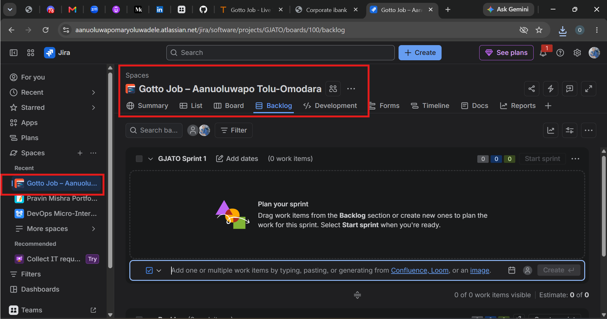

---

### Notes

Write one line for each role: PO (what you prioritized), SM (how you ensured process), Dev Lead (what you built), DevOps Lead (how you shipped).

Mode: Solo Mode — I performed all four Scrum roles for the Sprint.

PO: I prioritized the backlog based on user value, focusing first on UI improvements that would make Gotto Job clearer, easier to discover, and more trustworthy.
SM: I ensured the Scrum process was followed by timeboxing the work, refining the backlog, planning Sprint 1, tracking progress, and completing the retrospective.
Dev Lead: I built the selected UI Story by making the required front-end change to the Gotto Job template and validating the result.
DevOps Lead: I committed the change to Git, deployed the updated files to the EC2/Nginx environment, and verified the change live in the browser.

---

# Task 2 — Create the Jira Project (Team-managed → Scrum)

## Goal

Create a Team-managed Scrum project named `Gotto Job – Team <#>` (Team Mode) or `Gotto Job – <YourName>` (Solo Mode).

### Evidence

#### Screenshot 2 — Project created page showing the project name and key

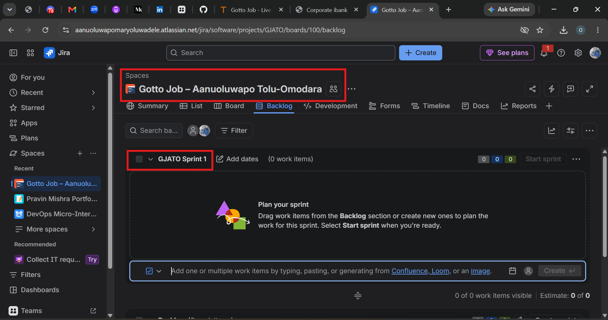

---

# Task 3 — Create the Epic

## Goal

Create the Epic `Improve Gotto Job UI discoverability & trust` to group the UI improvement initiative.

### Evidence

#### Screenshot 3 — Backlog showing the Epic panel with the Epic visible

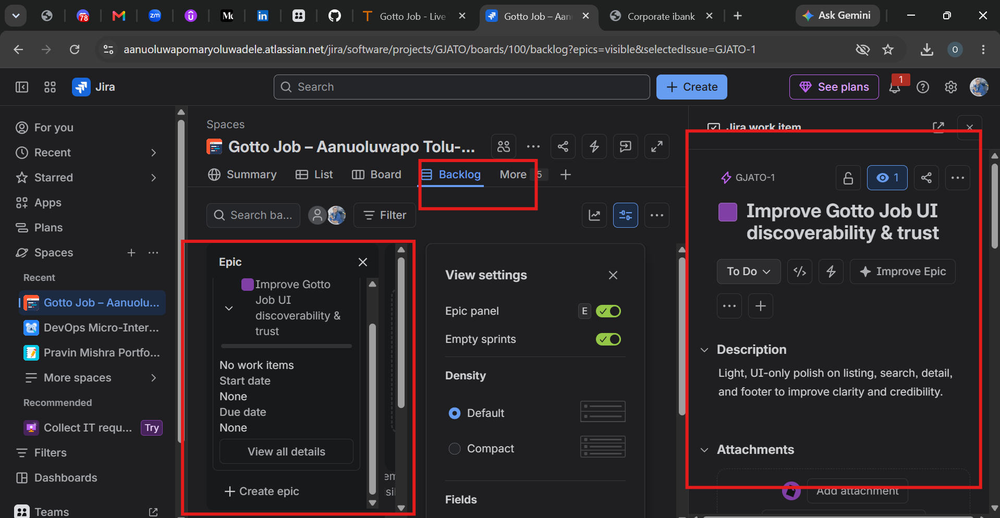

---

# Task 4 — Seed the Product Backlog (6–8 Stories + Fibonacci Points + Ranking)

## Goal

Create at least six Stories under the Epic, estimate each with 1, 2, or 3 story points, and rank them by value.

### Evidence

#### Screenshot 4 — Backlog showing the Epic and at least six Stories under it

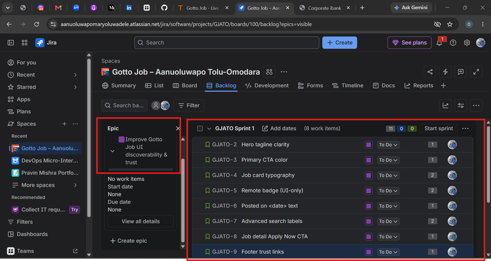

---

#### Screenshot 5 — One Story opened showing its Story Points and acceptance criteria filled in

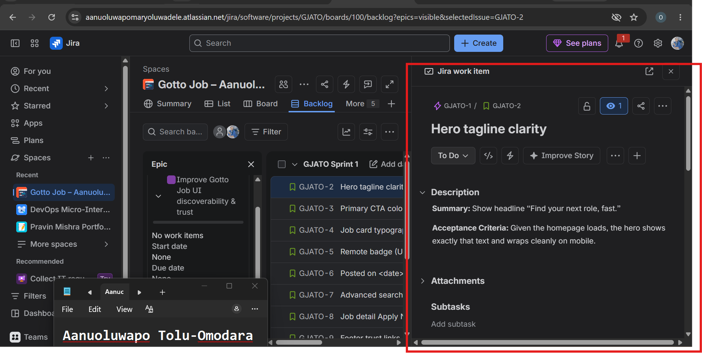

---

# Task 5 — Planning Poker (Estimate + Debate Notes)

## Goal

Confirm the Story Points (1, 2, or 3) for each Story and record brief reasoning for each estimate.

### Evidence

#### Screenshot 6 — Backlog showing Story Points visible, or two or three Stories opened showing their points

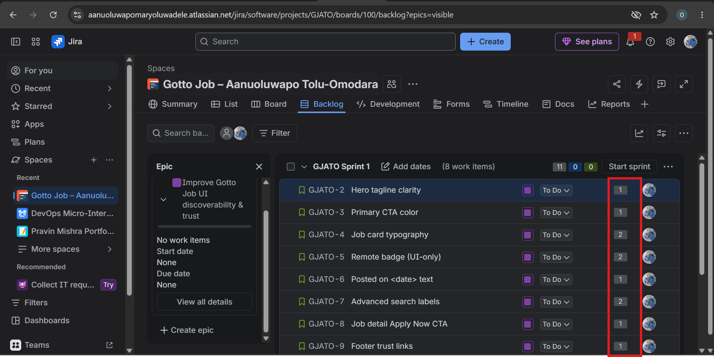

---

### Notes

For each story, explain in one or two lines why it is a 1, 2, or 3 (mention any debate, even in Solo Mode).

GJATO-2 — Hero tagline clarity — 1 point
This is a small UI-only change involving the homepage hero text. I estimated it at 1 point because there is minimal implementation and testing effort.

GJATO-3 — Primary CTA color — 1 point
This is a straightforward CSS/UI change to the primary button color. I considered whether site-wide button styling might increase the effort, but kept it at 1 point because there is no complex logic involved.

GJATO-4 — Job card typography — 2 points
This requires adjusting the size and weight of job titles and checking the visual layout. I estimated 2 points because it requires some styling and responsive verification rather than a simple text change.

GJATO-5 — Remote badge (UI-only) — 2 points
This involves adding and displaying a “REMOTE” badge on relevant job cards. I estimated 2 points because it requires both the UI element and verification of how it appears on the cards.

GJATO-6 — Posted on <date> text — 1 point
This is a small UI/content change to display a human-readable posted date on job cards. I estimated 1 point because there is no complex functionality involved.

GJATO-7 — Advanced search labels — 2 points
This requires clarifying multiple search labels and placeholders, followed by checking their alignment and presentation. I estimated 2 points because several UI elements are involved.

GJATO-8 — Job detail Apply Now CTA — 1 point
This involves adding a prominent “Apply Now” button with a simple link. I estimated 1 point because it is a small, focused UI change without complex functionality.

GJATO-9 — Footer trust links — 1 point
This involves adding the “About” and “Contact” links to the footer. I estimated 1 point because it is a simple UI/navigation change with limited implementation effort.

Planning Poker / Debate Note

Solo Mode Planning Poker: I reviewed each estimate based on relative implementation effort, UI complexity, and verification required. I challenged the 1-point estimates to confirm that they did not involve hidden complexity, while the 2-point stories were kept higher because they involve multiple UI elements or additional visual verification. The estimates were then confirmed as 1, 1, 2, 2, 1, 2, 1, and 1 points, for a total of 11 story points.

---

# Task 6 — Sprint Planning: Create Sprint 1 + Sprint Goal + Scope

## Goal

Create Sprint 1, move three or four Stories into it (approximately 3–6 points), set the Sprint Goal, and break each selected Story into Build, Verify, Deploy, and Screenshot Sub-tasks.

### Evidence

#### Screenshot 7 — Sprint 1 with the selected Stories inside it

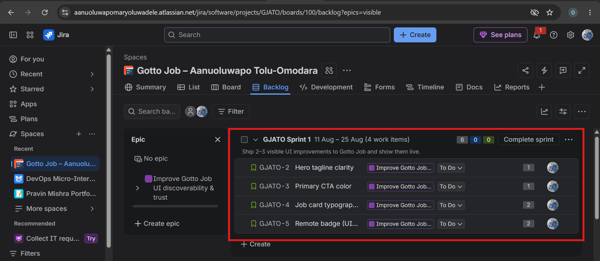

---

#### Screenshot 8 — One Story showing the Sub-tasks created

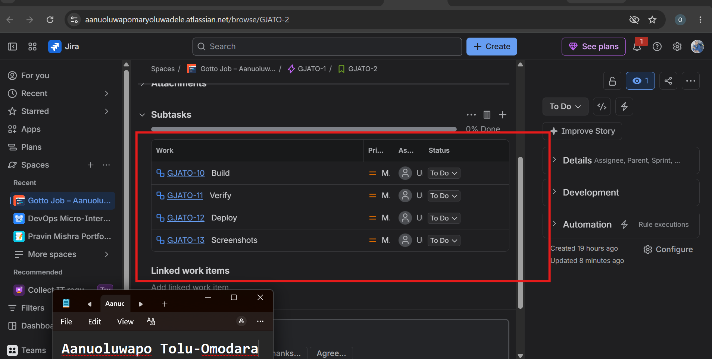

---

# Task 7 — Reports: Open Burndown Chart

## Goal

Open the Burndown Chart and confirm it exists for Sprint 1. It is acceptable if the chart is not yet populated.

### Evidence

#### Screenshot 9 — Burndown Chart page opened, even if empty

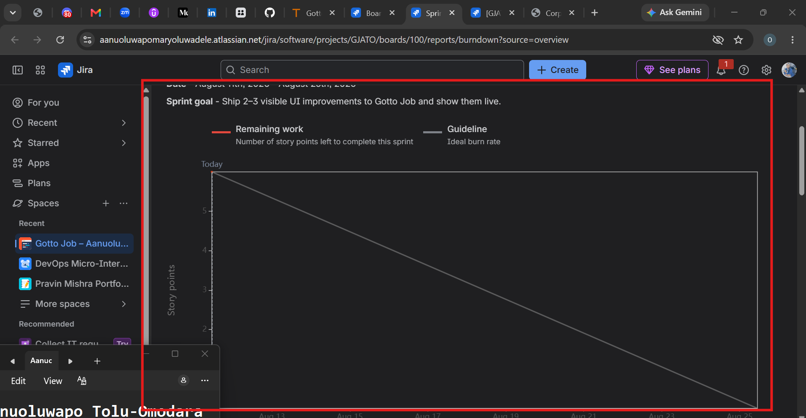

---

# Task 8 — Ship One Small Increment (Build + Deploy + Proof)

## Goal

Implement one small UI-only Story from Sprint 1, commit it, deploy it live, and move the Story and its Sub-tasks to Done in Jira.

### Evidence

#### Screenshot 10 — Jira board showing the Story moved to Done

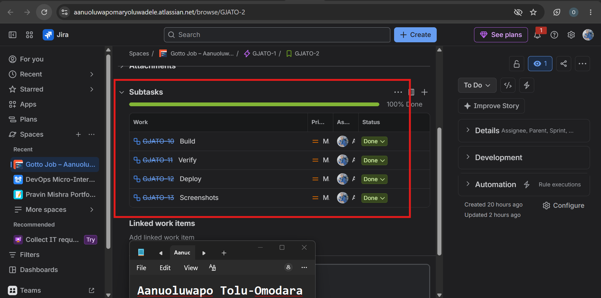

---

#### Screenshot 11 — Git commit output

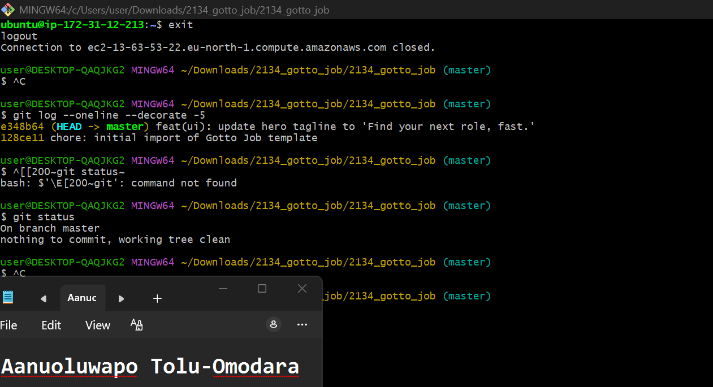

---

#### Screenshot 12 — Live URL in the browser showing the UI change, with the URL visible

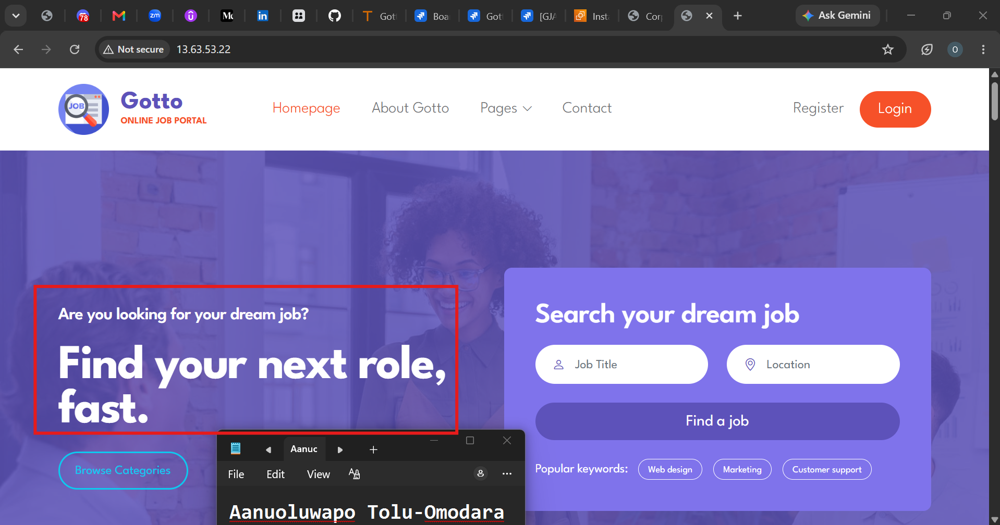

---

# Task 9 — Retro Notes (Scrum Pillar + Value)

## Goal

Add a retro comment covering what went well, what to improve, one Scrum pillar observed (Transparency, Inspection, or Adaptation), and one Scrum value (Openness, Focus, Commitment, Courage, or Respect).

### Evidence

#### Screenshot 13 — Jira retro comment visible

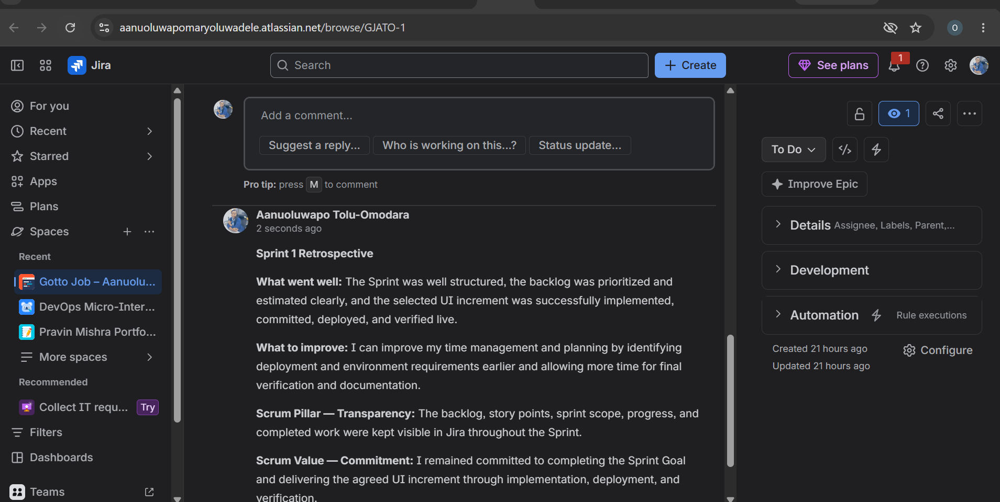

---

# Task 10 — LinkedIn Post (Mandatory)

## Goal

Publish a LinkedIn post about what you delivered, including your live URL, three to five lines on what you did and learned, and one screenshot (Burndown Chart, Sprint board, or the live UI change).

## Evidence

#### LinkedIn Post URL

Paste your LinkedIn post URL here:

https://www.linkedin.com/posts/aanuoluwapo-mary-tolu-omodara-5582281a1_devops-devopsinternship-aws-share-7492914571674980352-l8Xm/?utm_source=share&utm_medium=member_desktop&rcm=ACoAAC8ygxQBxWfO17Lhd_0x2mvEFqlpxYuWQTQ

---

#### Screenshot 14 — Published LinkedIn post

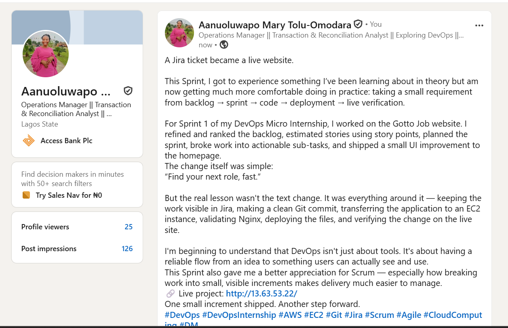

---

# Submission Instructions

- Add all 14 required screenshots
- Full name must be visible in required screenshots
- Do not expose sensitive information (keys, passwords, account IDs)

---

# Completion Checklist

- [ ] Task 1: Team Mode or Solo Mode selected and all four roles documented (Screenshot 1 & Notes)
- [ ] Task 2: Team-managed Scrum project created with the required name (Screenshot 2)
- [ ] Task 3: UI improvement Epic created (Screenshot 3)
- [ ] Task 4: 6–8 Stories added under the Epic and ranked by value (Screenshots 4 & 5)
- [ ] Task 5: Story Points set (1, 2, or 3) with reasoning recorded (Screenshot 6 & Notes)
- [ ] Task 6: Sprint 1 created with Sprint Goal, 3–4 Stories, and Sub-tasks (Screenshots 7 & 8)
- [ ] Task 7: Burndown Chart opened (Screenshot 9)
- [ ] Task 8: One UI-only increment implemented, committed, deployed, and verified (Screenshots 10–12)
- [ ] Task 9: Retro comment with one Scrum pillar and one Scrum value (Screenshot 13)
- [ ] Task 10: Mandatory LinkedIn post published with the live URL, backlog refinement, Sprint planning, one shipped increment, proof, and Screenshot 14
- [ ] Full Name visible in required screenshots
- [ ] No sensitive data exposed

---

## 📌 About DMI & CloudAdvisory

DevOps Micro Internship (DMI) is a project-based DevOps program run by Pravin Mishra (The CloudAdvisory) focused on real-world execution, systems thinking, and career readiness.

It helps learners build strong DevOps foundations with hands-on experience.

---

## 📌 Resources

- 🌐 DMI Official Website: https://dmi.pravinmishra.com?utm_source=github&utm_medium=readme  
- 🎓 University: https://university.pravinmishra.com?utm_source=github&utm_medium=readme  
- 💬 Discord Community: https://discord.pravinmishra.com?utm_source=github&utm_medium=readme  
- 📝 Blog: https://dmi.pravinmishra.com/blog?utm_source=github&utm_medium=readme  
- ▶️ YouTube Playlist: https://www.youtube.com/playlist?list=PLFeSNDtI4Cho  
- 🔗 Pravin Mishra (LinkedIn): https://www.linkedin.com/in/pravin-mishra-aws-trainer/  
- 🏢 CloudAdvisory (LinkedIn): https://www.linkedin.com/company/thecloudadvisory/

---

*This submission is part of DevOps Micro Internship (DMI) Cohort 3 — Agentic AI Track.*
