# Assignment 6 — AI-Assisted Terraform Drift and Policy Review

Part of the DevOps Micro Internship (DMI) Cohort 3 with Agentic AI

---

## Student Details

**Full Name:** Aanuoluwapo Tolu-Omodara 
**GitHub Repository/Folder URL:** https://github.com/PricelessMercy1/devops-micro-internship-pravinmishra/

---

## Purpose

Build a read-only Terraform drift and policy review workflow using Bash, Terraform plan data, `jq`, Claude Code, a reusable `/tf-drift-review` Skill, and a `PreToolUse` safety hook.

The workflow must follow this pattern:

```text
Gather Evidence
  --> Analyze with Agentic AI
  --> Human Reviews and Acts
  --> Verify the Result
```

The `/tf-drift-review` Skill and `tf-drift-check.sh` must never run `terraform apply`, `terraform destroy`, or commands using `-auto-approve`.

---

# Task 1 — Confirm the Clean Baseline and Create the Workspace

## Goal

Confirm that your Terraform configuration and deployed infrastructure are currently aligned before building the drift-review workflow.

## Evidence

### Screenshot 1 — Clean Terraform Plan

Add a screenshot of `terraform plan` showing no pending changes.

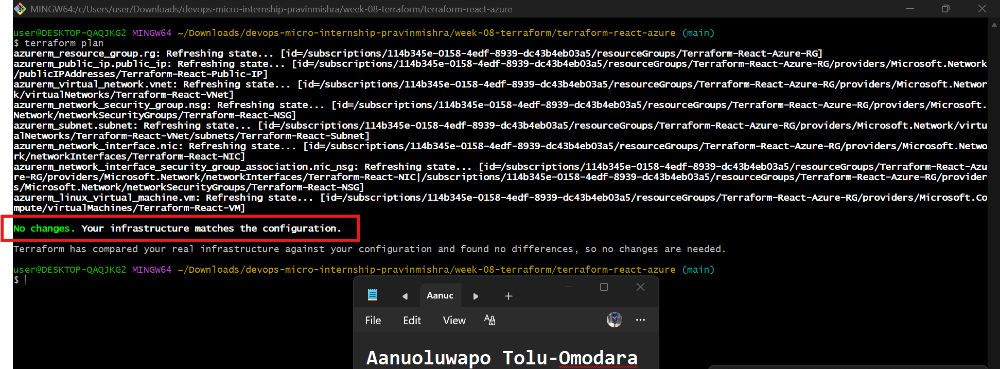

---

### Screenshot 2 — Assignment Workspace

Add a screenshot of the folder structure showing `AI Assignment/`, `reports/`, and the Terraform project.

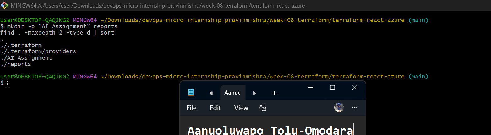

## Questions

### 1. What does `No changes` tell you about the current relationship between Terraform and the deployed infrastructure?

It tells me that Terraform's state, my .tf configuration, and the actual infrastructure running in Azure are all in agreement. When I ran terraform plan, Terraform refreshed its state by checking the real resources in Azure — not just relying on what was previously recorded — and confirmed there's no difference between what my configuration says should exist and what's actually there.

### 2. Why is a clean baseline important before introducing a test change?

Because a plan showing resources being created from scratch isn't the same thing as a plan showing a change to infrastructure that already exists. When I first ran terraform plan after destroying my resources, it showed 8 resources to add — that's not drift, that's missing infrastructure. If I tested my drift-review workflow against that kind of plan, I wouldn't actually be testing whether it can detect drift, destructive changes, or policy violations — I'd just be testing whether Terraform notices something isn't deployed yet. Starting from a clean, verified baseline means that any difference the workflow detects later in Task 6 can be traced directly to the controlled change I introduce, not to some other mismatch that was already there.

---

# Task 2 — Create Project Context and Safety Rules in `CLAUDE.md`

## Goal

Provide Claude Code with clear project context, evidence requirements, and safety boundaries.

## Evidence

### Screenshot 3 — Project Context and Safety Rules

Add a screenshot of `CLAUDE.md` open in VS Code showing the Project Overview, Review Workflow, Safety Rules, and Output Rules.

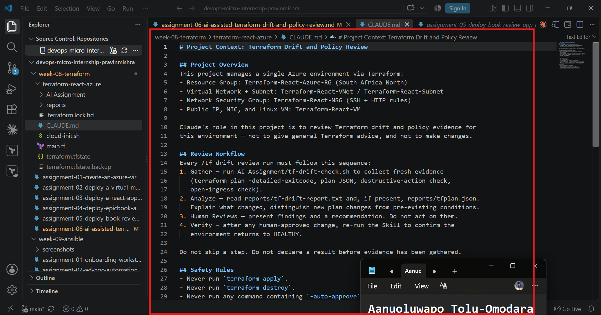

## Questions

### 1. Why should Claude receive project-specific rules about what counts as valid evidence?

Without project-specific rules, Claude could treat an ambiguous result, like a missing file or an empty check, as something to guess about instead of something to flag. Giving Claude clear rules about what valid evidence looks like for my specific setup means its conclusions stay grounded in what was actually gathered from my environment, not general assumptions about Terraform.

### 2. Why must the human remain responsible for running `terraform apply`?

Running terraform apply changes live infrastructure, and that action is irreversible. I need to be the one who reviews the plan and makes that call, not Claude. This is enforced in two place; the Safety Rules in CLAUDE.md, and the PreToolUse hook I'll add in Task 7, so the boundary doesn't depend on Claude's judgment alone.

### 3. Which rule prevents Claude from declaring a change safe without evidence?

The rule that says if the plan is clean, Claude should say so plainly and not invent findings, combined with the instruction in the Review Workflow not to declare a result before evidence has actually been gathered. Together these stop Claude from making a safety claim that isn't backed by something it actually checked.

---

# Task 3 — Build the Terraform Drift and Policy Check Script

## Goal

Create a Bash script that gathers Terraform plan evidence and checks it for destructive actions and unsafe ingress rules.

## Evidence

### Screenshot 4 — Script Variables and Checks Array

Add a screenshot of the top section of `tf-drift-check.sh` showing the variables and `checks` array.

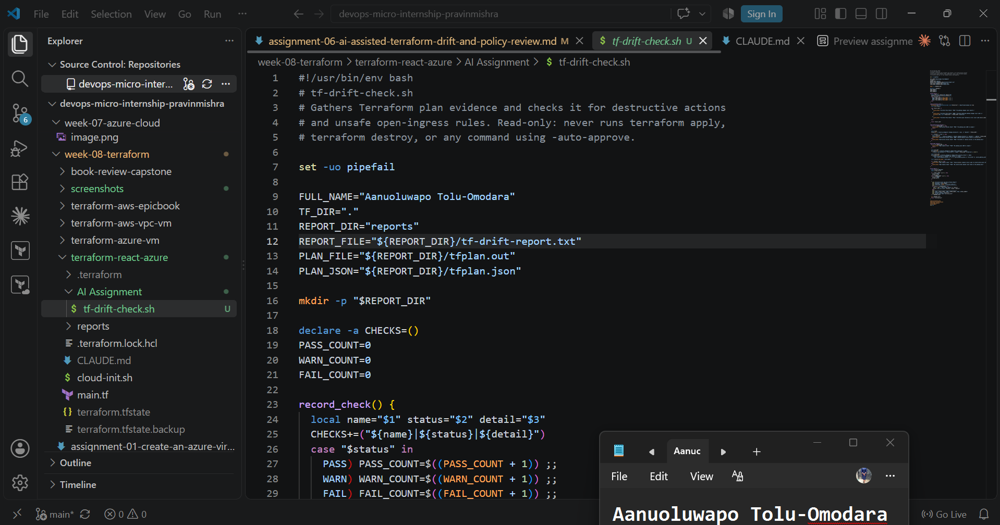

---

### Screenshot 5 — Destructive-Action and Open-Ingress Checks

Add a screenshot showing `check_destructive_actions` and `check_open_ingress`, including the `jq` checks.

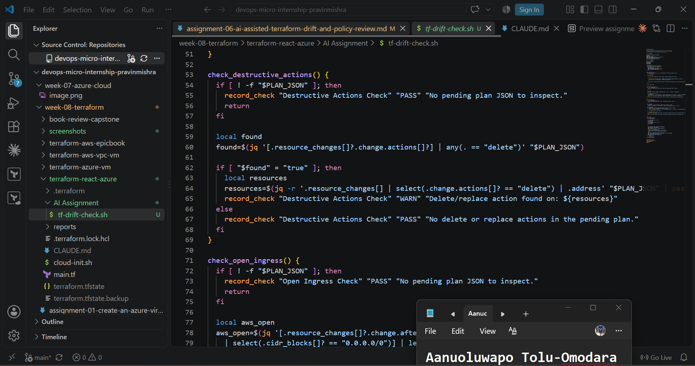

---

### Screenshot 6 — Script Validation and Permissions

Add a screenshot showing successful `bash -n` and `ls -l` output.

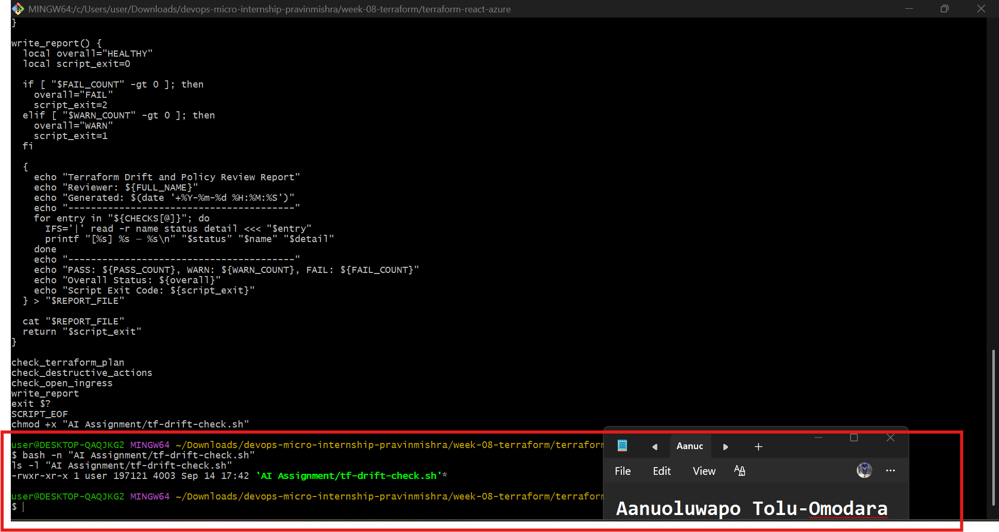

## Questions

### 1. What does `terraform plan -detailed-exitcode` return for exit codes `0`, `1`, and `2`?

Exit code 0 means no pending changes; my infrastructure matches my configuration. Exit code 1 means Terraform hit an actual error while planning. Exit code 2 means Terraform found changes that need to be reviewed — something in my configuration or my real infrastructure has moved out of sync.

### 2. Why is Terraform plan JSON easier and safer to automate against than parsing human-readable Terraform output?

The JSON output has a consistent, structured format I can query reliably with jq — fields like resource_changes[].change.actions are always in the same place. Human-readable plan output is meant for people to read, so its wording and formatting can shift, and searching it with text patterns is fragile. Automating against JSON means my checks won't silently break just because Terraform's display formatting changes.

### 3. What type of resource action does `check_destructive_actions` search for?

It searches for the "delete" action inside each resource's change.actions array in the plan JSON.

### 4. Why does finding a `delete` action also help detect replacements?

Because Terraform represents a resource replacement as a combination of ["delete", "create"] — it deletes the old resource and creates a new one in its place. Since a replacement always includes a delete, checking for delete alone catches both a straightforward deletion and a replacement.

### 5. Why must this script never run `terraform apply`?

Because this script's job is only to gather and report evidence, not to make decisions or change infrastructure. If it could run terraform apply, it would stop being a safe, read-only check and become something that could alter live infrastructure automatically — without a human ever reviewing what it found first.

---

# Task 4 — Run the Script Against the Clean Baseline

## Goal

Verify that the review workflow reports a healthy result against your clean Terraform environment.

## Evidence

### Screenshot 7 — Healthy Baseline Report

Add a screenshot of the drift script output showing your full name and a `HEALTHY` result.

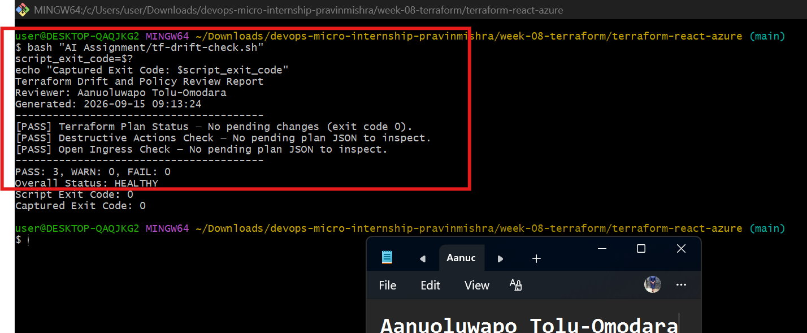

---

### Screenshot 8 — Baseline Script Exit Code

Add a screenshot showing the captured script exit code `0`.

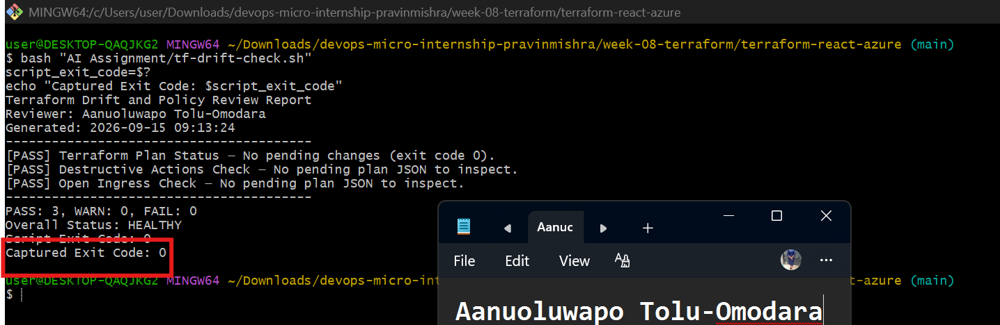

## Questions

### 1. What is the Overall Status of your baseline?

HEALTHY, with all three checks passing.

### 2. Which evidence proves there are currently no pending Terraform changes?

The Terraform Plan Status check reported PASS with "No pending changes (exit code 0)," and that's confirmed by the Script Exit Code and Captured Exit Code both coming back as 0.

### 3. Was `reports/tfplan.json` created? Explain why or why not.

No, it wasn't created. My script only converts the plan to JSON when terraform plan -detailed-exitcode returns exit code 2, meaning there are pending changes to actually inspect. Since my plan returned exit code 0 — a clean baseline — there was nothing pending, so generating the JSON file would have been unnecessary.

---

# Task 5 — Create and Run the `/tf-drift-review` Claude Code Skill

## Goal

Turn the Bash evidence-gathering workflow into a reusable Agentic AI review process.

## Evidence

### Screenshot 9 — `/tf-drift-review` Skill Configuration

Add a screenshot of `SKILL.md` showing the frontmatter, allowed tools, and safety rules.

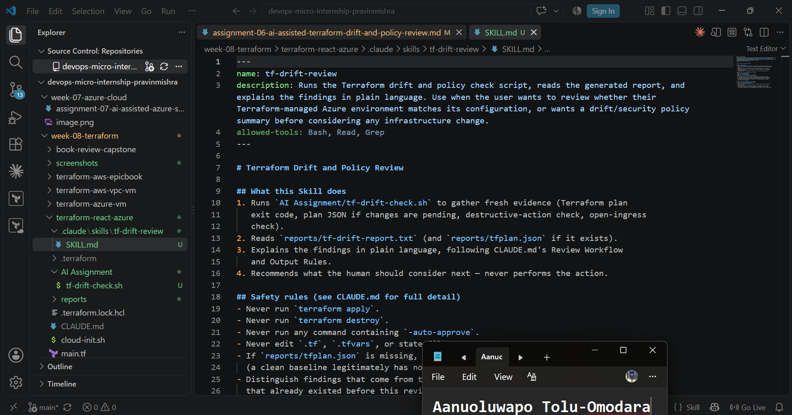

---

### Screenshot 10 — Clean Agentic AI Review

Add a screenshot of `/tf-drift-review` showing the clean `HEALTHY` result.

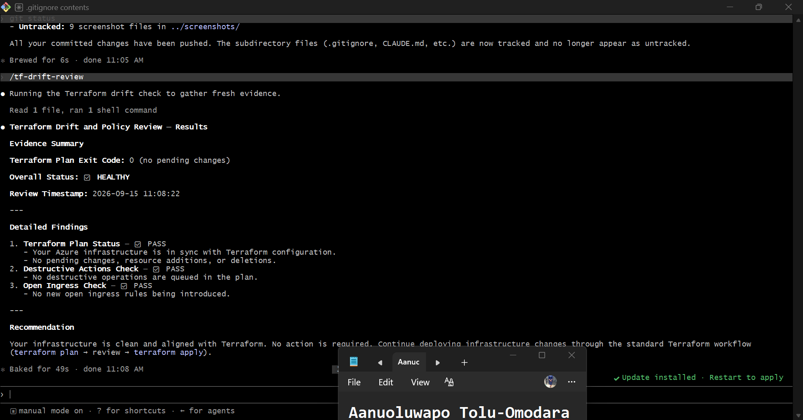

## Questions

### 1. Why does this Skill have `Bash`, `Read`, and `Grep`, but not `Write`?

The Skill's job is to inspect and analyze, not to modify anything. Bash lets it run my drift-check script, Read lets it open files like CLAUDE.md and the generated reports, and Grep lets it search through those files for specific details. There's no Write tool because I don't want this Skill to be able to touch my Terraform files or any other project file as part of a review — it should only ever report on what it finds, never change it.

### 2. Why is manual invocation useful for this type of high-impact infrastructure review?

Because it keeps me in the loop on when a review even happens. A drift review can surface things that touch production infrastructure, security, or networking, and I don't want that kind of check firing automatically and potentially triggering some downstream action without me actually asking for it. Running it manually means I decide when I want fresh evidence, and I get to look at the results myself before anything is considered for action.

### 3. Which part of the workflow is deterministic Bash automation?

The tf-drift-check.sh script itself. It runs terraform plan -detailed-exitcode, captures the exit code, generates the plan JSON only when there are pending changes, and uses jq to check for destructive actions and open ingress rules. Given the same infrastructure state, it produces the same checks and the same output every time — there's no AI judgment involved in that part at all.

### 4. Which part requires Claude's reasoning?

Everything that happens after the evidence is collected. Claude has to interpret what the Terraform exit code actually means, explain the significance of what the checks found, tell apart something that's genuinely new from something that was already there before, and give me a recommendation based on what the evidence actually shows; not just repeat the raw numbers back at me.

### 5. Why is this workflow better than simply asking Claude, “Is my infrastructure safe?”

Because this way Claude is working from specific, structured evidence instead of making a broad guess. Deterministic checks run first, and only then does Claude interpret those results; so there's a clear boundary around what it's actually allowed to claim. A HEALTHY result tells me the current plan has no unexpected changes; it doesn't mean Claude has verified my entire environment is secure. If I just asked "is my infrastructure safe?" with no process behind it, I'd be trusting a guess I couldn't actually verify.

---

# Task 6 — Introduce a Controlled Difference and Detect It

## Goal

Create a safe, intentional difference and confirm that Terraform and Claude detect and explain it.

## Evidence

### Screenshot 11 — Controlled Difference

Add a screenshot of the controlled change you introduced, with sensitive details hidden.

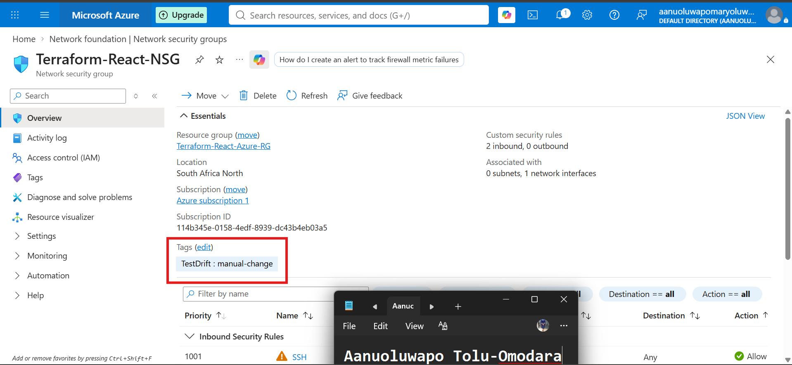

---

### Screenshot 12 — Detected Difference and Risk Assessment

Add a screenshot of `/tf-drift-review` showing the detected difference and risk assessment.

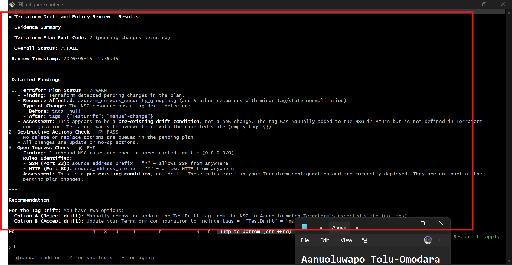

---

### Screenshot 13 — Detected Drift Report

Add a screenshot of `drift-detected-report.txt` showing your full name and the `WARN` or `FAIL` result.

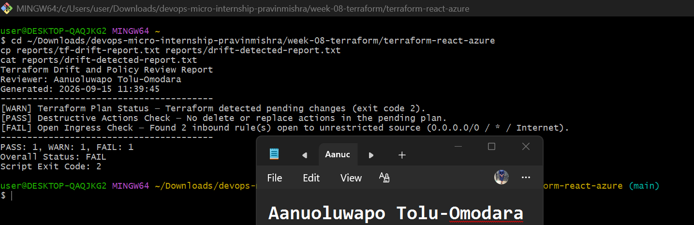

## Questions

### 1. What change did you introduce?

I manually added a tag to my NSG in the Azure Portal — Key: TestDrift, Value: manual-change — directly through the console, completely outside Terraform.

### 2. Was it true infrastructure drift or a Terraform configuration change?

True infrastructure drift. My .tf files were never touched; the real Azure resource changed while my Terraform configuration stayed exactly the same, so the two fell out of sync.

### 3. What Terraform plan evidence proves that a change is pending?

terraform plan -detailed-exitcode returned exit code 2 instead of 0, and the plan showed the NSG's tags field going from null to {"TestDrift": "manual-change"} — an in-place update Terraform wants to make to bring the resource back in line with my configuration.

### 4. Was the action an update, deletion, replacement, or security-rule change?

An in-place update, Terraform wants to reconcile the tag, not delete or replace the NSG, and it isn't touching my actual security rules at all.

### 5. What did Claude recommend?

Claude laid out two options: either remove the tag from Azure to match my Terraform configuration, or add the tag into my .tf file so Terraform adopts it going forward. It also flagged the open SSH/HTTP rules separately as a pre-existing security concern, not something caused by this change.

### 6. Why should you review the recommendation before taking action?

Because Claude can only reason from the evidence it was given — it doesn't have the full picture of why I made a change or what I actually intend for this environment long-term. I'm the one who decided to introduce this tag as a test, so I'm also the one who should decide how to resolve it, rather than letting either option get applied automatically.

---

# Task 7 — Add a `PreToolUse` Hook to Block Unsafe Apply Attempts

## Goal

Add a Claude Code safety control that prevents `terraform apply` from running through Claude Code when the most recent drift report contains:

```text
Overall Status: FAIL
```

## Evidence

### Screenshot 14 — `PreToolUse` Safety Hook

Add a screenshot of `.claude/settings.json` showing the `PreToolUse` safety hook.

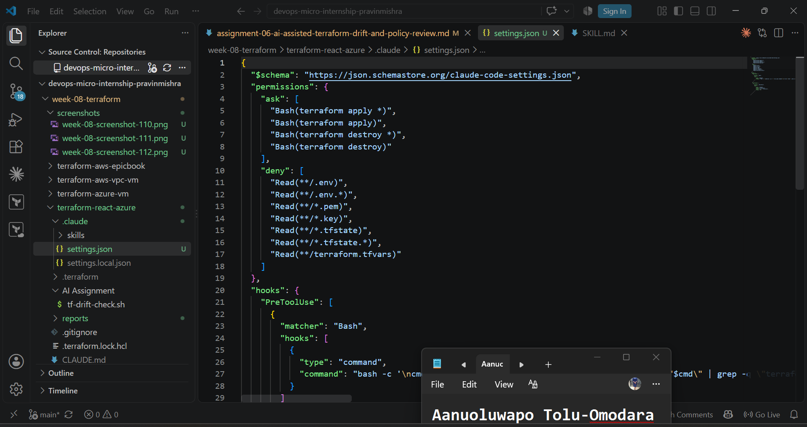

---

### Screenshot 15 — Blocked Apply Attempt

Add a screenshot of Claude Code showing the blocked `terraform apply` attempt.


## Questions

### 1. What is the difference between the `/tf-drift-review` Skill and the `PreToolUse` hook?

The Skill is where the thinking happens — it runs my script, reads the report, and explains what's going on in plain language. The hook doesn't think at all. It's a small, deterministic check that sits in front of any terraform apply attempt and looks at one thing: does my latest report say FAIL? If it does, it blocks the command outright, no matter what Claude concluded or recommended.

### 2. Which component performs analysis?

The /tf-drift-review Skill. That's where Claude reads the evidence and interprets it — explaining the exit code, separating new drift from pre-existing conditions, and giving me a recommendation.

### 3. Which component enforces the safety gate?

The PreToolUse hook. It's the part that actually has the power to stop a command from running, independent of Claude's own reasoning.

### 4. Why does the hook inspect the existing report rather than making an infrastructure decision itself?

Because the hook isn't meant to understand my infrastructure — it's meant to enforce a rule reliably. Reading a report and checking for the text "Overall Status: FAIL" is something a script can do the same way every single time, with no room for it to get talked into an exception. If the hook tried to reason about the infrastructure itself, it would just become a second, less capable version of Claude — and I'd lose the whole point of having a deterministic layer in the first place.

### 5. Why is a deterministic guard useful for high-impact commands?

Because it doesn't matter how convincing an argument sounds in the moment — the guard enforces the same outcome every time, regardless of reasoning, mood, or how the request is phrased. For something as high-impact as changing live infrastructure, I want a rule that holds even if the reasoning around it gets messy, and a deterministic check gives me that in a way that pure judgment never fully can.

---

# Task 8 — Resolve the Difference and Verify the Final State

## Goal

Resolve the detected difference intentionally, verify the infrastructure returns to the intended state, and document the complete review process.

## Evidence

### Screenshot 16 — Human-Reviewed Resolution

Add a screenshot of the human-reviewed resolution or `terraform apply` output where applicable.


---

### Screenshot 17 — Final Healthy Review

Add a screenshot of the final `/tf-drift-review` showing `HEALTHY`.


---

### Screenshot 18 — Saved Reports

Add a screenshot of `ls -lah reports` showing both:

- `drift-detected-report.txt`
- `resolved-report.txt`


---

### Screenshot 19 — Drift Review Summary

Add a screenshot of `drift-review-summary.md` showing all required sections and your full name.


## Terraform Drift Review Summary

### 1. Change Introduced

Explain the controlled change you introduced.

State whether it was:

- True infrastructure drift, or
- A Terraform configuration change

Write your answer here.

### 2. Evidence Collected

Describe the Terraform plan evidence and affected resource.

Write your answer here.

### 3. Risk Assessment

Explain the risk identified by the Bash check and Claude Code.

Write your answer here.

### 4. Human-Approved Action

Explain the action you reviewed and executed manually.

Write your answer here.

### 5. Verification

Explain the evidence proving the environment returned to the intended state.

Write your answer here.

### 6. Safety Decision

Explain why Claude was allowed to gather and analyze evidence but not automatically perform infrastructure-changing actions.

Write your answer here.

### 7. Agentic Loop Mapping

Explain how your workflow followed:

```text
Gather --> Analyze --> Human Act --> Verify
```

Write your answer here.

## Questions

### 1. What action did you execute to resolve the difference?

Write your answer here.

### 2. Did you review `terraform plan` before taking action?

Write your answer here.

### 3. What evidence proves the environment is now aligned?

Write your answer here.

### 4. Why is a second drift review required after the fix?

Write your answer here.

### 5. What could go wrong if an AI agent automatically applied every detected Terraform change?

Write your answer here.

### 6. In one sentence, explain the difference between asking an AI chatbot “Is my infrastructure okay?” and using this evidence-based Agentic AI workflow.

Write your answer here.

---

# LinkedIn Post — Mandatory

## Goal

Publish a LinkedIn post in your own words describing:

- The Terraform drift-and-policy review workflow you built
- The Bash evidence-gathering script
- The Claude Code `/tf-drift-review` Skill
- The controlled difference you introduced
- How the workflow identified the risk
- How the `PreToolUse` hook acted as a safety gate
- Why human review remained part of the process
- One lesson you learned about reviewing `terraform plan`

Include a screenshot of the detected change and a screenshot of the final `HEALTHY` review in your post.

Suggested tags:

```text
#DMIByPravinMishra #Terraform #AgenticAI #ClaudeCode #DevOps
```

## LinkedIn Evidence

### LinkedIn Post URL

Add your LinkedIn post URL here.

### Published LinkedIn Post Screenshot — Mandatory

Add a screenshot of the published LinkedIn post here.

---

# Required Assignment Files

Confirm that the following files are included in your GitHub repository:

- `CLAUDE.md`
- `AI Assignment/tf-drift-check.sh`
- `.claude/skills/tf-drift-review/SKILL.md`
- `.claude/settings.json` containing the safety hook
- `reports/drift-detected-report.txt`
- `reports/resolved-report.txt`
- `drift-review-summary.md`

---

# Submission Instructions

- Complete Tasks 1–8 in sequence.
- Include Screenshots 1–19 exactly as specified.
- Answer every question under Tasks 1–8 in your own words.
- Complete all seven sections of the Terraform Drift Review Summary.
- Include the GitHub repository/folder URL containing the assignment files.
- Include your full name in the required reports and screenshots.
- Include the LinkedIn post URL and a screenshot of the published LinkedIn post.
- Do not expose access keys, passwords, tokens, account IDs, private keys, Terraform secrets, or other sensitive information.
- Review all screenshots carefully and hide or redact sensitive details where necessary.

---

# Completion Checklist

- [ ] Confirmed a clean Terraform baseline
- [ ] Created the required assignment workspace
- [ ] Created or updated `CLAUDE.md`
- [ ] Added project context and safety rules
- [ ] Created `tf-drift-check.sh`
- [ ] Added my full name to the report
- [ ] Validated the Bash script
- [ ] Made the script executable
- [ ] Used `terraform plan -detailed-exitcode`
- [ ] Used Terraform plan JSON
- [ ] Used `jq` to inspect destructive actions
- [ ] Used `jq` to inspect unsafe ingress
- [ ] Confirmed the baseline returns `HEALTHY`
- [ ] Created `/tf-drift-review`
- [ ] Restricted the Skill to appropriate tools
- [ ] Confirmed the Skill remains read-only
- [ ] Confirmed the Skill never runs `terraform apply`
- [ ] Confirmed the Skill never runs `terraform destroy`
- [ ] Introduced a controlled detectable difference
- [ ] Correctly identified whether it was true drift or a configuration change
- [ ] Saved `drift-detected-report.txt`
- [ ] Added the `PreToolUse` safety hook
- [ ] Verified the hook blocks `terraform apply` when the report is `FAIL`
- [ ] Reviewed the Terraform evidence before resolving the change
- [ ] Performed any infrastructure-changing action manually
- [ ] Ran the drift review again after resolution
- [ ] Confirmed the final status is `HEALTHY`
- [ ] Saved `resolved-report.txt`
- [ ] Completed `drift-review-summary.md`
- [ ] Mapped the workflow to `Gather --> Analyze --> Human Act --> Verify`
- [ ] Included all 19 numbered screenshots
- [ ] Answered all required questions
- [ ] Published the required LinkedIn post
- [ ] Added the LinkedIn post URL and screenshot
- [ ] Included the GitHub repository/folder URL
- [ ] Confirmed that no sensitive information is exposed

---

*This submission is part of the DevOps Micro Internship (DMI) Cohort 3 — Agentic AI Track.*
