# Assignment 02 — Provision Linux VMs with Terraform and Run Ansible Ad-Hoc Commands

Part of the DevOps Micro Internship (DMI) with Agentic AI

---

## Purpose

In this assignment, you will use Terraform to provision three or four Ubuntu Linux Virtual Machines on either Microsoft Azure or Amazon Web Services.

You will configure SSH key-based authentication, organize the servers using a custom Ansible inventory, and run Ansible ad-hoc commands across individual hosts and inventory groups.

---

# Task 1 — Create the Multi-Host Lab Structure

## Goal

Create a separate project directory for the multi-host lab and prepare the Terraform, Ansible, and documentation files.

This project will use the Git repository and Ansible controller prepared in Assignment 01.

### Evidence

#### Screenshot 1 — Terminal showing the complete `ansible-adhoc-lab` project structure

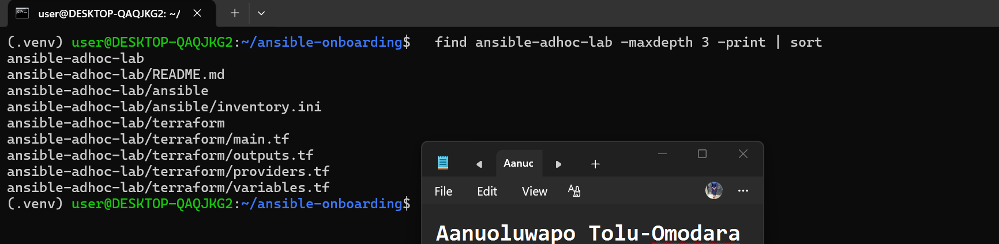

---

#### Screenshot 2 — Terminal showing `git status --short` with the new project files and updated `.gitignore`

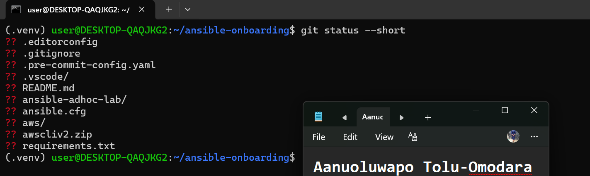

---

### Notes

Kicked things off by building a fresh ansible-adhoc-lab/ project right inside my existing ansible-onboarding setup from Assignment 01 — no point starting from scratch when the controller was already sitting there ready to go. I split things into terraform/ and ansible/ subfolders from the start, mostly so Terraform's state doesn't get tangled up with anything else I might run on this machine later.

Good news: since I was reusing the same controller, I didn't have to touch SSH keys at all — the id_ed25519 pair from Assignment 01 was already loaded and ready.

The one thing I did have to think through was .gitignore. I didn't want to overwrite what was already protecting my venv and SSH keys from Assignment 01, so I just appended the Terraform-specific rules on top — state files, the .terraform/ folder, crash logs, all the usual suspects. Left .terraform.lock.hcl out of the ignore list on purpose, since that file actually matters for keeping provider versions consistent if anyone else (or future-me) reruns this.

Ran a quick find and git status --short at the end just to sanity-check everything landed where it should — and it did. Nothing sensitive leaking into version control, clean structure, ready for Task 2.

---

# Task 2 — Create the Terraform Configuration

## Goal

Create the Terraform configuration required to provision three or four Ubuntu Linux VMs on your selected cloud platform.

Complete only one option:

- Option A — Microsoft Azure
- Option B — Amazon Web Services

Do not configure both providers for this assignment.

### Evidence

#### Screenshot 3 — Terraform configuration showing the three or four server roles and the `for_each` or `count` implementation

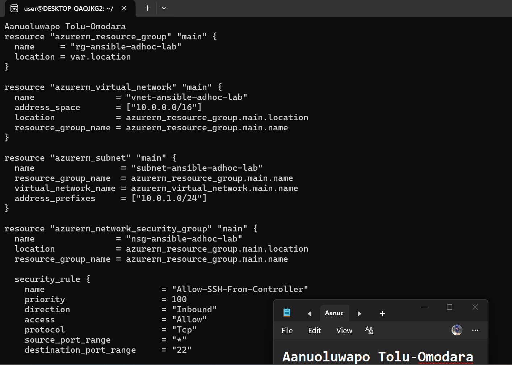

---

#### Screenshot 4 — Terraform configuration showing SSH restricted to the controller IP and HTTP allowed only for web hosts

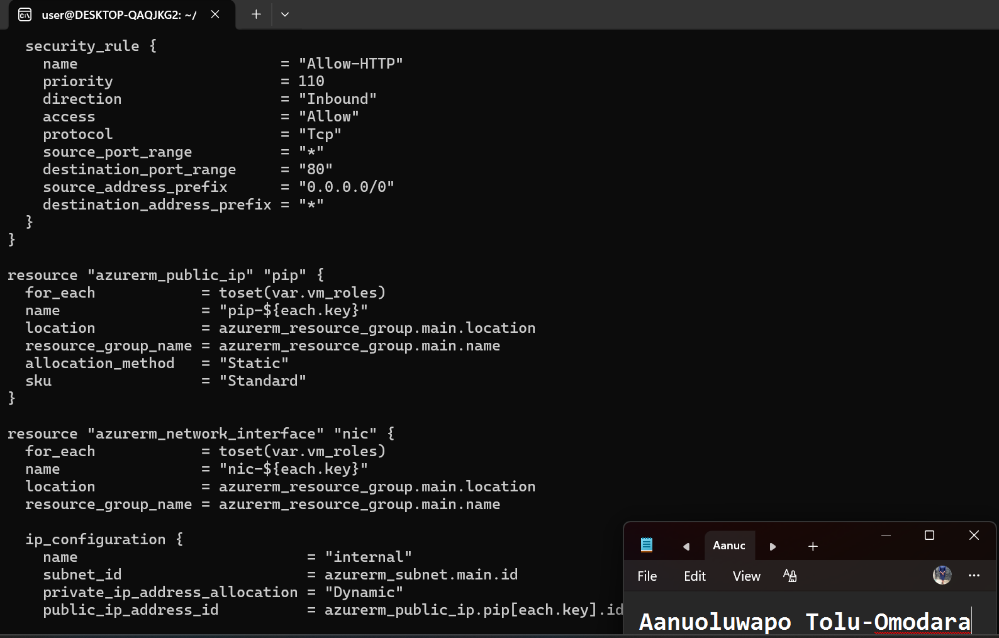

---

#### Screenshot 5 — Terraform output configuration showing how public IP addresses are associated with the server roles

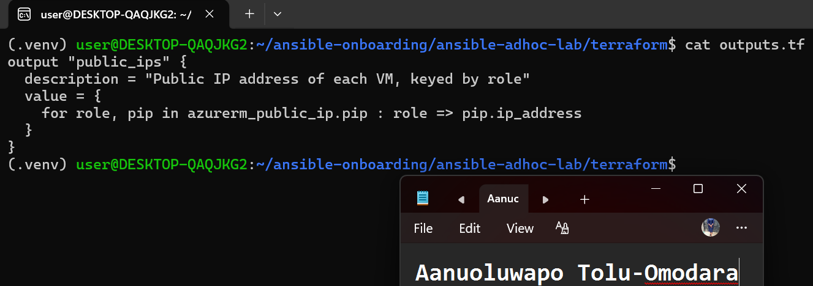

---

### Notes

I chose Azure with the three-VM option (web1, app1, db1). The rubric allows the smaller set, and after my cloud accounts caused problems, keeping the footprint small was the sensible call.

The main design decision was using for_each over a vm_roles list. One block each for the public IPs, network interfaces and VMs creates all three machines. If I ever needed a fourth, I would only add one word to the list.

Security was the part I was most careful with. Port 22 is limited to my controller's public IP as a /32, and only port 80 is open to the world for web traffic. The VMs use my SSH public key from Assignment 01, password login is turned off, and I never put the private key anywhere near a Terraform file. For Azure sign-in I used a service principal with its details kept in a private file in my home folder, outside the repo, so no credentials appear in the Terraform code.

The public_ips output uses a for expression to pair each role with its address, which meant I could copy IPs straight into the inventory later.

---

# Task 3 — Provision the Infrastructure with Terraform

## Goal

Initialize and validate the Terraform configuration, review the execution plan, provision the selected three or four VMs, and retrieve their public IP addresses.

### Evidence

#### Screenshot 6 — Final `terraform apply` output showing `Apply complete`

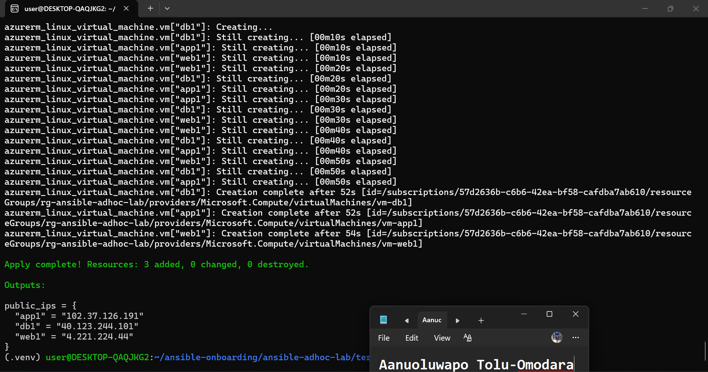

---

#### Screenshot 7 — `terraform output public_ips` showing the role-to-IP mapping for all three or four VMs

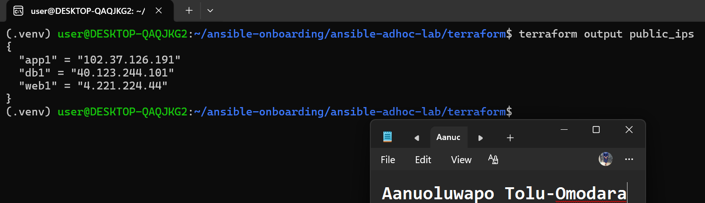

---

#### Screenshot 8 — Azure Portal or AWS Management Console showing all three or four VMs in the `Running` state, with their role-based names visible

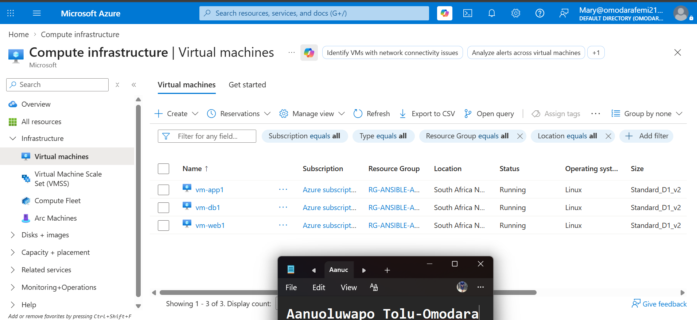

---

### Notes

This task looked simple and turned into the hardest part of the assignment. I first built everything on AWS, but my new account had a 1 vCPU limit and my quota request was denied, so no instance could launch. My older account was suspended. I then moved to Azure, and my own account wouldn't sign in from the command line, so I used an Azure subscription in a tenant I was given access to, with a service principal.

Azure had its own limits. The subscription was a free-trial type with a 4-core cap in South Africa North and no option to raise it. Two Standard_B2ts_v2 VMs used all 4 cores, so the third VM was refused. I changed to Standard_D1_v2, which uses one core each, so three VMs fit. That size only boots older Generation 1 images, so my next apply failed until I switched the Ubuntu image to the Gen 1 version.

That final apply worked, and terraform output public_ips gave me one address per role. The Portal showed all three VMs running. Because I hit errors partway, the last apply only shows 3 resources added, since the network resources were created in the earlier run. Since it was a shared subscription, I plan to destroy everything as soon as I've finished the screenshots.

---

# Task 4 — Verify SSH Key-Based Access

## Goal

Verify that each managed VM can be accessed from the Ansible controller using SSH key-based authentication.

### Evidence

#### Screenshot 9 — Terminal showing successful SSH hostname output from all VMs

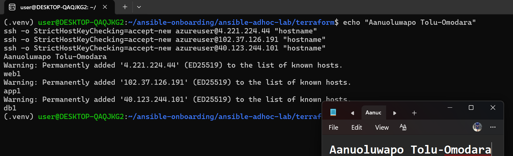

---

### Notes

With the VMs up, I checked SSH straight from the controller with my key and no password prompts. ssh azureuser@<ip> "hostname" returned web1, app1 and db1 from the three addresses, which matches the public_ips map. It also proved that the security rule lets my IP in, and that the key I registered with Terraform is the one working. I used accept-new on the first connection, so the fingerprint prompt didn't get in the way.

---

# Task 5 — Create the Custom Ansible Inventory

## Goal

Create an Ansible inventory file that groups the managed VMs by role.

The inventory allows Ansible to run commands against all servers, or only specific groups such as `web`, `app`, or `db`.

### Evidence

#### Screenshot 10 — `inventory.ini` showing the `web`, `app`, and `db` groups

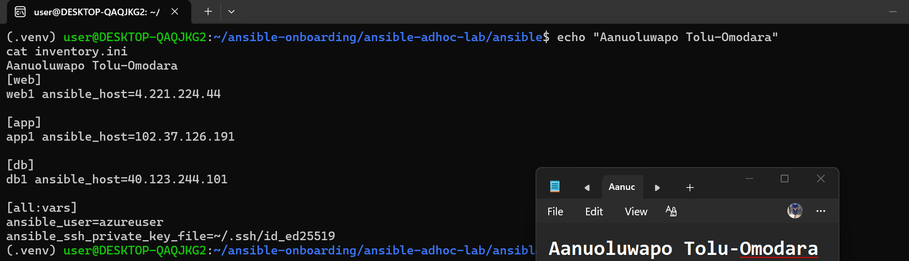

---

#### Screenshot 11 — Output of `ansible-inventory -i inventory.ini --graph`

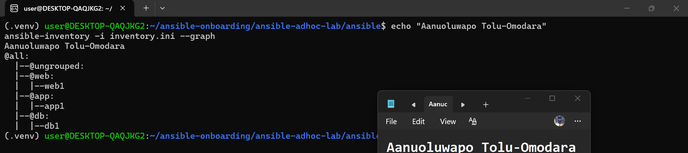

---

### Notes

Building the inventory was the easy part after everything Task 3 put me through. Once Terraform gave me the three public IPs from terraform output public_ips, I just dropped them straight into inventory.ini under three groups: web, app, db. Each group has one host in it since I went with the three-VM option, but the structure is exactly what it would be with more.

The [all:vars] block was the part worth getting right. I set ansible_user=azureuser since that's the admin account Terraform created on the VMs, and pointed ansible_ssh_private_key_file at the same key I've been using since Assignment 01. That one block means I never have to repeat the username or key path for each host individually.

I also created a local ansible.cfg with host_key_checking = False, since these were brand new VMs and I didn't want SSH stopping to ask about fingerprints every time I ran a command. I added interpreter_python = auto_silent too, just to clean up some Python interpreter warnings that were cluttering my output.

Running ansible-inventory --graph confirmed everything was grouped correctly before I touched a single ad-hoc command.

---

# Task 6 — Run Ansible Ad-Hoc Commands

## Goal

Run Ansible ad-hoc commands from the controller to verify connectivity, check server information, and manage packages and services across inventory groups.

This task proves that the inventory is working and that Ansible can control multiple managed VMs without writing a playbook.

### Evidence

#### Screenshot 12 — Output of `ansible all -i inventory.ini -m ping`

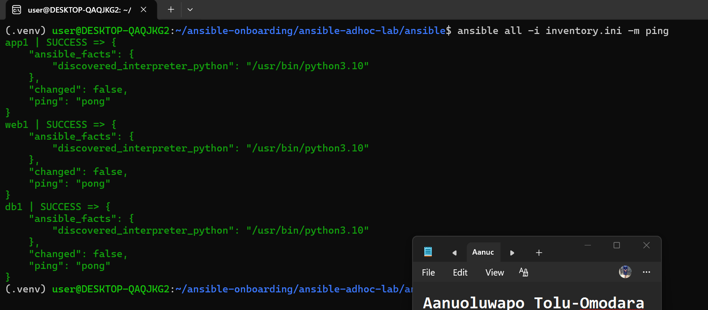

---

#### Screenshot 13 — Output of `ansible all -i inventory.ini -m command -a "uptime"`

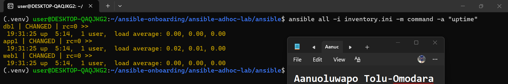

---

#### Screenshot 14 — Output of `ansible web -i inventory.ini -m apt -a "name=nginx state=present update_cache=yes" --become`

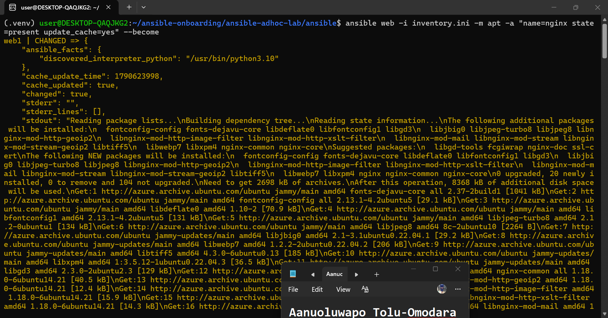

---

#### Screenshot 15 — Output of `ansible web -i inventory.ini -m service -a "name=nginx state=started enabled=yes" --become`

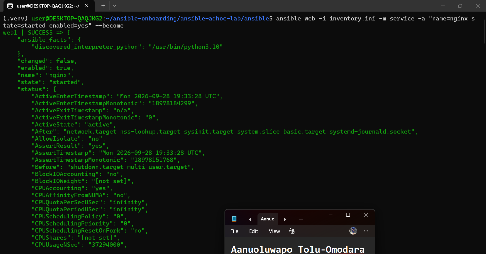

---

#### Screenshot 16 — Output of `ansible all -i inventory.ini -m apt -a "name=htop state=present update_cache=yes" --become`

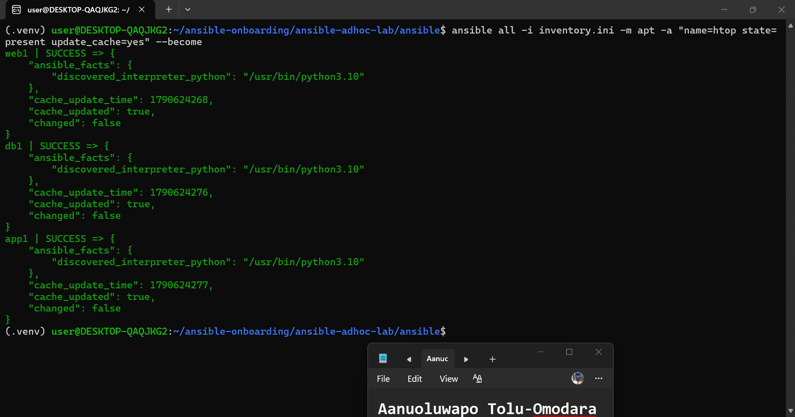

---

#### Screenshot 17 — Output of `ansible web -i inventory.ini -m command -a "systemctl is-active nginx"`

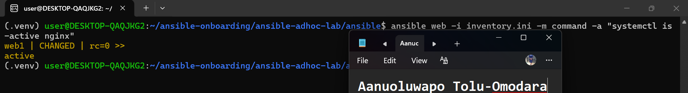

---

### Notes

This is where the whole assignment finally came together. I ran ansible all -m ping first, and getting pong back from all three hosts at once felt like a genuine relief after how long it took to get here — that one command proved SSH, the inventory, and Python on the remote hosts were all working correctly.

From there I moved through the rest in sequence: uptime and whoami across all hosts just to see real data coming back, then installed and started nginx on the web group specifically, using --become since installing packages and managing services needs root. I checked systemctl is-active nginx afterward and got active, which confirmed the whole install-then-start sequence actually worked rather than just reporting success.

I also installed htop across all three hosts using the all group instead of web, which was a good practical reminder of exactly why the group structure matters — some commands are meant for everyone, some are role-specific, and Ansible makes that distinction trivial once the inventory is set up properly.

---

# LinkedIn Post Required

## Evidence

#### LinkedIn Post URL

Paste your LinkedIn post URL here:

https://lnkd.in/p/emWATWw8

---

#### Screenshot — Published LinkedIn post

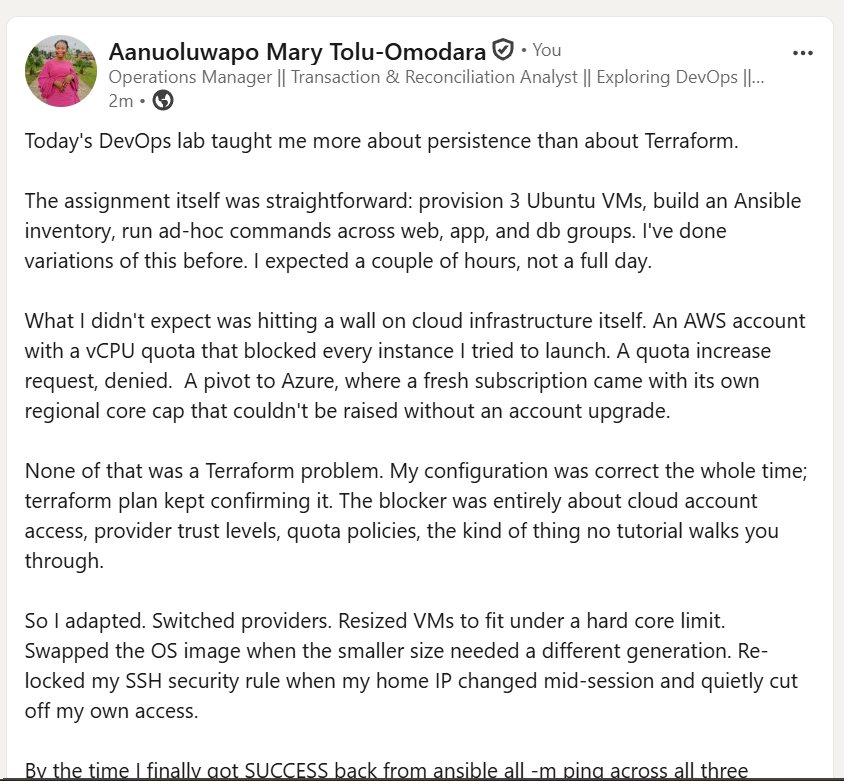

---

# Assignment Questions

Answer the following in your own words:

**1. What is the purpose of an Ansible inventory file?**

It's how Ansible knows what servers exist and how to reach them. Instead of typing IP addresses every time, I give each server a name, tell Ansible how to connect to it, and which credentials to use. Without it, none of the ad-hoc commands would know where to go.

---

**2. What is the difference between the `web`, `app`, and `db` groups in your inventory?**

They let me target commands at exactly the right servers instead of running everything against everything. web is where I installed and started nginx, since that's the server meant to handle traffic. app and db didn't get nginx in this lab, but in a real setup they'd have their own distinct roles. Grouping means a command like ansible web -m apt ... only touches the server where that action actually makes sense.

---

**3. What does the Ansible `ping` module verify?**

It's not a network ping. It confirms that Ansible can SSH into the host and successfully run Python there. A SUCCESS result means the whole chain works: my SSH key, the correct username, and Python being present on the remote machine.

---

**4. Why do package installation commands require `--become`?**

Installing software or managing services on Ubuntu needs root privileges. A normal user can't just run apt install system-wide. --become tells Ansible to escalate privileges on the remote host before running the task, the same as typing sudo if I were logged in myself.

---

**5. When would you use an ad-hoc command instead of a playbook?**

Ad-hoc commands are for something quick and one-off, checking uptime, confirming a service is active, installing a single package. If I just need to do something once, right now, typing one command is faster than writing a whole playbook. Playbooks make sense when the task is repeatable, has multiple steps, or needs to be version-controlled and rerun the same way every time.

---

**6. What is one challenge you faced while setting up SSH or inventory, and how did you fix it?**

Honestly, my biggest challenge wasn't SSH or the inventory file itself, it was just getting to a point where I had working VMs to connect to. My new AWS account had a vCPU quota that blocked me from launching any instances, and my quota increase request was denied. My old AWS account turned out to be suspended. I then moved to Azure, hit a free-trial subscription with a 4-core regional cap that also couldn't be raised, and had to switch to a smaller VM size that fit under that limit, which then needed a different Ubuntu image version to actually boot.

Once the VMs were finally up, I did hit one direct SSH/inventory issue: my home network's public IP changed partway through the session, which silently locked me out since my security rule only allowed my old IP. The fix was checking curl -4 ifconfig.me for my current IP, updating the Terraform variable, and reapplying just that one rule. It was a good reminder that locking SSH down to a specific IP is the right security practice, but it also means that IP has to be re-verified if anything changes mid-session.

---

# Required Files

Confirm that the following files are included in your assignment workspace:

- [ ] `ansible-adhoc-lab/README.md`
- [ ] `ansible-adhoc-lab/terraform/providers.tf`
- [ ] `ansible-adhoc-lab/terraform/main.tf`
- [ ] `ansible-adhoc-lab/terraform/variables.tf`
- [ ] `ansible-adhoc-lab/terraform/outputs.tf`
- [ ] `ansible-adhoc-lab/ansible/inventory.ini`
- [ ] Updated `.gitignore`

---

# Submission Instructions

- Add all required screenshots from the tasks.
- Full Name must be visible in required screenshots.
- Mention whether you used Azure or AWS.
- Mention whether you used the three-VM option or four-VM option.
- Add the public IP addresses of the VMs, redacted if preferred.
- Add your `inventory.ini` proof.
- Add a short explanation of what you learned.
- Answer all assignment questions clearly in your own words.
- Add your LinkedIn post URL.
- Do not expose SSH private keys, Terraform state files, cloud credentials, passwords, access keys, secret keys, account IDs, or subscription IDs.

---

# Completion Checklist

- [ ] Task 1: `ansible-adhoc-lab` project structure created
- [ ] Task 1: `.gitignore` updated for Terraform files
- [ ] Task 2: Terraform configuration created
- [ ] Task 2: Server roles defined for either three or four VMs
- [ ] Task 2: `count` or `for_each` used
- [ ] Task 2: SSH restricted to the controller public IP
- [ ] Task 2: HTTP allowed only for web hosts
- [ ] Task 2: Terraform output maps roles to public IPs
- [ ] Task 3: Terraform initialized successfully
- [ ] Task 3: Terraform configuration validated
- [ ] Task 3: Terraform apply completed successfully
- [ ] Task 3: All selected VMs are running
- [ ] Task 4: SSH key-based access works for every VM
- [ ] Task 5: `inventory.ini` contains `web`, `app`, and `db` groups
- [ ] Task 5: `ansible-inventory -i inventory.ini --graph` shows the correct groups
- [ ] Task 6: `ansible all -i inventory.ini -m ping` returns `SUCCESS`
- [ ] Task 6: Ad-hoc commands run successfully
- [ ] Task 6: `--become` was used for package and service tasks
- [ ] Task 6: Nginx is active on the `web` group
- [ ] Screenshots 1–17 are included
- [ ] Assignment questions are answered
- [ ] LinkedIn post published
- [ ] LinkedIn post URL added
- [ ] No sensitive information is exposed

---

## About DMI & CloudAdvisory

DevOps Micro Internship (DMI) is a project-based DevOps program run by Pravin Mishra and The CloudAdvisory, focused on real-world execution, systems thinking, and career readiness.

It helps learners build strong DevOps foundations with hands-on experience.

---

## Resources

- DMI Official Website: [https://dmi.pravinmishra.com?utm_source=github&utm_medium=readme](https://dmi.pravinmishra.com?utm_source=github&utm_medium=readme)
- University: [https://university.pravinmishra.com?utm_source=github&utm_medium=readme](https://university.pravinmishra.com?utm_source=github&utm_medium=readme)
- Discord Community: [https://discord.pravinmishra.com?utm_source=github&utm_medium=readme](https://discord.pravinmishra.com?utm_source=github&utm_medium=readme)
- Blog: [https://dmi.pravinmishra.com/blog?utm_source=github&utm_medium=readme](https://dmi.pravinmishra.com/blog?utm_source=github&utm_medium=readme)
- YouTube Playlist: [https://www.youtube.com/playlist?list=PLFeSNDtI4Cho](https://www.youtube.com/playlist?list=PLFeSNDtI4Cho)
- Pravin Mishra LinkedIn: [https://www.linkedin.com/in/pravin-mishra-aws-trainer/](https://www.linkedin.com/in/pravin-mishra-aws-trainer/)
- CloudAdvisory LinkedIn: [https://www.linkedin.com/company/thecloudadvisory/](https://www.linkedin.com/company/thecloudadvisory/)

---

*This submission is part of DevOps Micro Internship (DMI) — Agentic AI Track.*