# Assignment 03 — Deploy a Static Website to Multiple Servers Using a Multi-Play Ansible Playbook

Part of the DevOps Micro Internship (DMI) with Agentic AI

---

## Student Details

**Full Name:** Aanuoluwapo Tolu-Omodara 
**Cloud Platform Used:** AWS / Azure  
**Server 1 URL:** `http://<SERVER_1_PUBLIC_IP>`  
**Server 2 URL:** `http://<SERVER_2_PUBLIC_IP>`

---

## Purpose

In this assignment, you will create a multi-play Ansible playbook to install Nginx, deploy a static website to two Ubuntu servers, and verify that the website is accessible from both servers.

You may use either AWS EC2 instances or Azure Virtual Machines as your managed servers.

---

# Task 1 — Create the Project Structure

## Goal

Create the required folders and files for the Ansible project.

## Evidence

### Screenshot 1 — Terminal or VS Code showing the complete `static-web` project structure

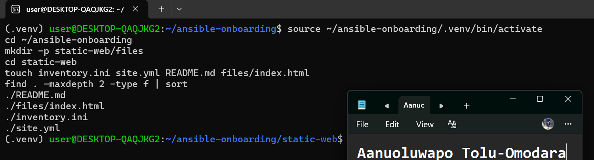

---

# Task 2 — Configure the Ansible Inventory

## Goal

Add both Ubuntu servers to the Ansible inventory.

## Evidence

### Screenshot 2 — Output of `ansible-inventory -i inventory.ini --graph` showing `web1` and `web2`

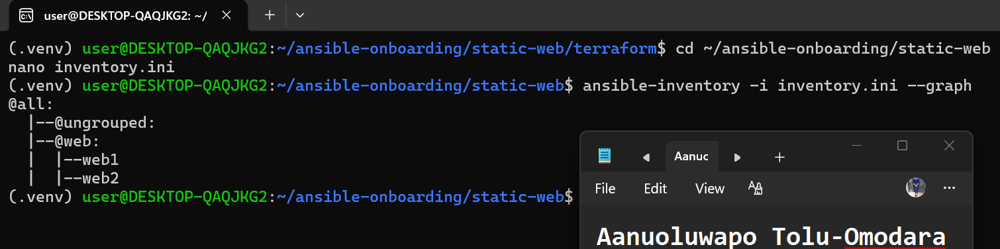

---

## Configuration File

Copy and paste the complete contents of your `inventory.ini` file below:

```ini
[web]
web1 ansible_host=40.123.253.218
web2 ansible_host=20.164.41.210

[web:vars]
ansible_user=azureuser
ansible_ssh_private_key_file=~/.ssh/id_rsa_azure
```

---

# Task 3 — Verify Ansible Connectivity

## Goal

Confirm that the Ansible controller can connect to both servers.

## Evidence

### Screenshot 3 — Ansible ping output showing `SUCCESS` and `pong` for both servers

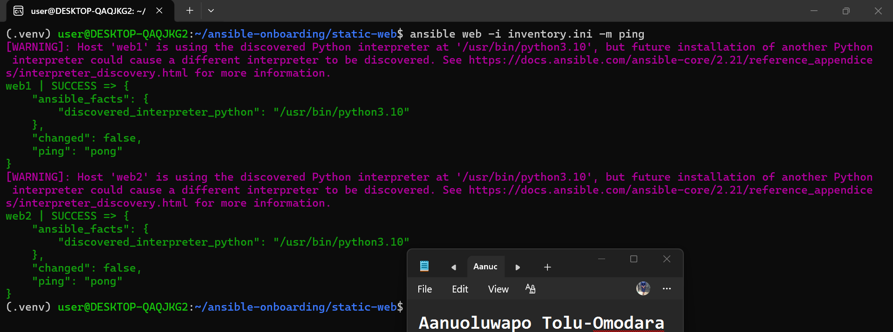

---

# Task 4 — Download and Personalize the Static Website

## Goal

Download `index.html` to the Ansible controller and personalize the website with your full name.

## Evidence

### Screenshot 4 — Edited `files/index.html` showing the footer line with your full name

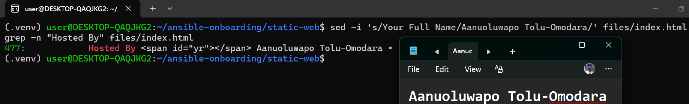

---

# Task 5 — Create the Multi-Play Ansible Playbook

## Goal

Create a single Ansible playbook containing separate plays for installation, deployment, and verification.

## Configuration File

Copy and paste the complete contents of your `site.yml` file below:

```yaml
---
- name: Install and configure Nginx
  hosts: web
  become: true
  tasks:
    - name: Update the APT package cache
      ansible.builtin.apt:
        update_cache: true

    - name: Install Nginx
      ansible.builtin.apt:
        name: nginx
        state: present

    - name: Start and enable Nginx
      ansible.builtin.service:
        name: nginx
        state: started
        enabled: true

- name: Deploy the static website
  hosts: web
  become: true
  tasks:
    - name: Copy index.html to the web root
      ansible.builtin.copy:
        src: files/index.html
        dest: /var/www/html/index.html
        owner: www-data
        group: www-data
        mode: "0644"
      notify: Reload nginx

  handlers:
    - name: Reload nginx
      ansible.builtin.service:
        name: nginx
        state: reloaded

- name: Verify both websites from the controller
  hosts: localhost
  connection: local
  gather_facts: false
  become: false
  tasks:
    - name: Send an HTTP GET request to each web server
      ansible.builtin.uri:
        url: "http://{{ hostvars[item].ansible_host }}"
        status_code: 200
      loop: "{{ groups['web'] }}"
      register: website_checks

    - name: Confirm each server returned HTTP 200
      ansible.builtin.assert:
        that:
          - item.status == 200
        success_msg: "{{ item.item }} returned HTTP {{ item.status }}"
      loop: "{{ website_checks.results }}"
```

---

# Task 6 — Validate the Playbook Syntax

## Goal

Check the playbook for YAML or Ansible syntax errors before running it.

## Evidence

### Screenshot 5 — Successful syntax-check output showing `playbook: site.yml`

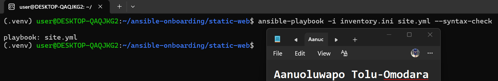

---

# Task 7 — Run the Multi-Play Playbook

## Goal

Install Nginx, deploy the website, and verify both servers in one playbook run.

## Evidence

### Screenshot 6 — Play 3 verification showing HTTP `200` for both servers

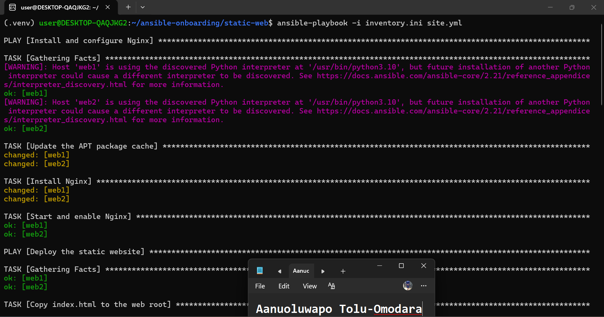

---

### Screenshot 7 — Final play recap showing `unreachable=0` and `failed=0` for `web1`, `web2`, and `localhost`

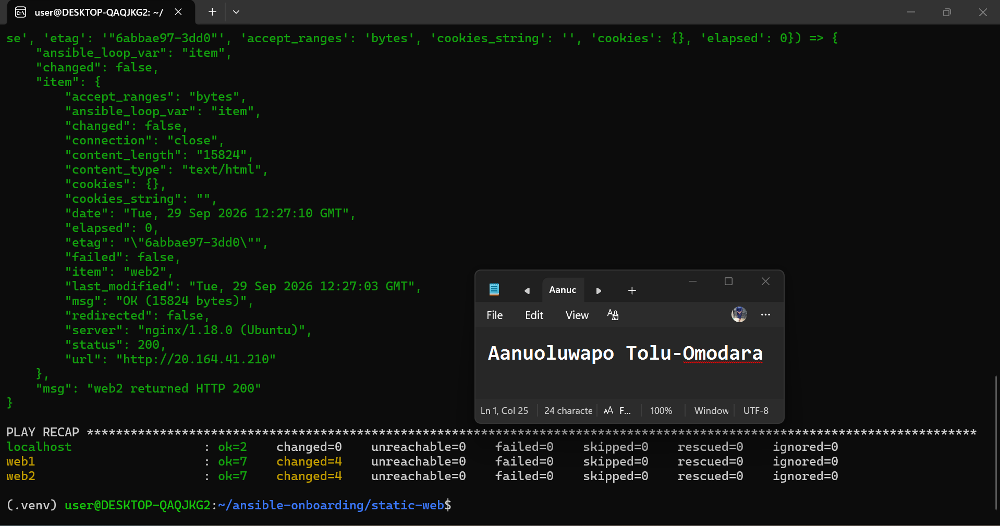

---

# Task 8 — Verify Idempotency

## Goal

Run the playbook again and confirm that it does not make unnecessary changes.

## Evidence

### Screenshot 8 — Second playbook run showing the play recap with `changed=0`, `unreachable=0`, and `failed=0` for both web servers

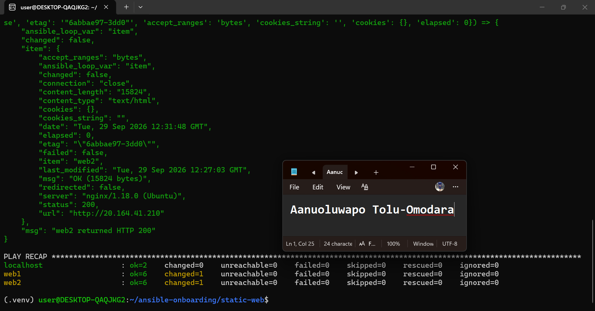

---

# Task 9 — Test Both Websites Manually

## Goal

Confirm that the static website is accessible from both public IP addresses.

## Evidence

### Screenshot 9 — `curl -I` output showing HTTP `200 OK` from both servers

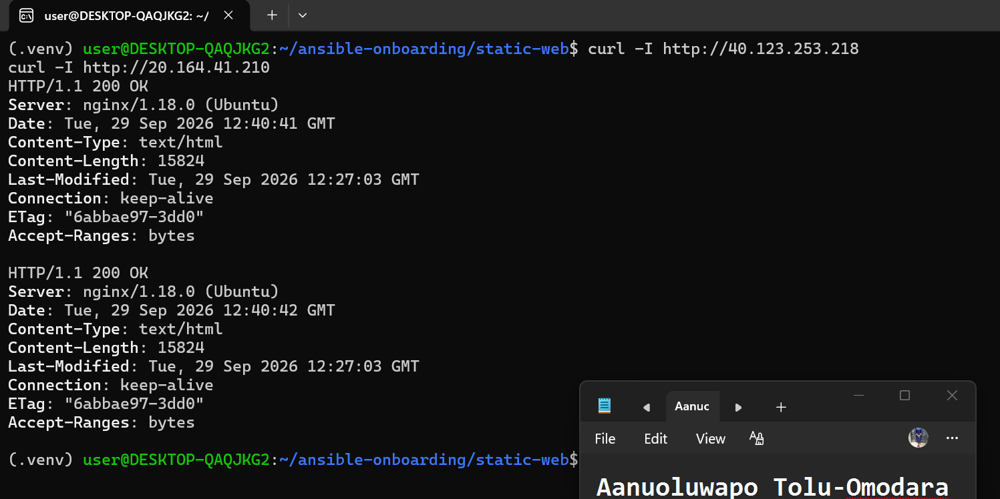

---

### Screenshot 10 — Browser showing the website from Server 1 with the public IP and your full name visible

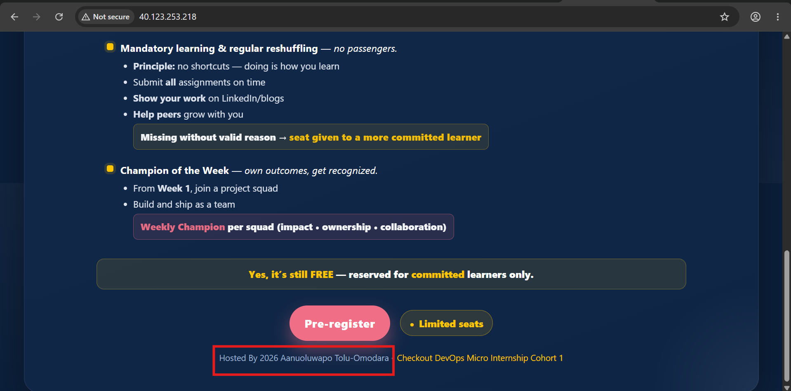

---

### Screenshot 11 — Browser showing the website from Server 2 with the public IP and your full name visible

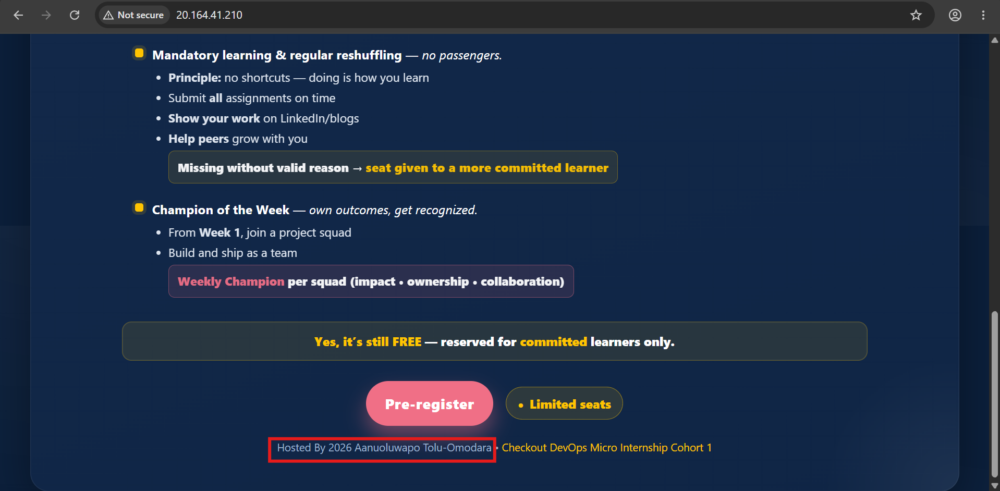

---

## Website URLs

Add both deployed website URLs below:

```text
Server 1: http://40.123.253.218
Server 2: http://20.164.41.210
```

---

# Task 10 — Complete the Project README

## Goal

Document how the project works and record what you learned.

## README Content

Copy and paste the complete contents of your `README.md` file below:

```markdown
# Multi-Play Ansible Static Website Deployment

## Project Overview

This project deploys a static marketing website to two Ubuntu servers using a single multi-play Ansible playbook. The playbook is split into three plays — installing and configuring Nginx, deploying the website content, and verifying that both servers respond correctly — each with a distinct responsibility.

## Environment

- Cloud platform: Azure
- Operating system: Ubuntu 22.04 LTS
- Number of managed servers: 2 (web1, web2)
- Web server: Nginx

## How to Run the Playbook

ansible-playbook -i inventory.ini site.yml

## Issue Faced and Solution

Azure only accepts RSA SSH keys for the admin_ssh_key block on a Linux VM — my existing ed25519 key was rejected during terraform apply. I generated a dedicated RSA keypair (ssh-keygen -t rsa -b 4096) and pointed both Terraform and the Ansible inventory at it, which resolved the issue.

## What I Learned

I learned how to structure a single Ansible playbook into multiple plays with different responsibilities, how handlers avoid unnecessary service reloads, and how to verify a deployment's idempotency by running the same playbook twice and confirming the second run makes no unexpected changes.

## Why Installation and Deployment Are Separate

Separating installation from deployment means the two concerns can change independently. Nginx installation rarely changes once it's set up, while website content can change frequently. Keeping them in separate plays makes the playbook easier to read, test, and reuse — for example, the deployment play could be run on its own to push a content update without re-running the installation steps.

## Benefit of the Ansible Copy Module

The copy module lets the controller compare the source and destination files and only copies when a change is detected, avoiding unnecessary writes. It also keeps the deployed content controlled and versioned in one place (the controller) rather than having every managed server independently clone from Git, which would be harder to keep consistent and auditable across servers.
```

---

# LinkedIn Post Required

## Evidence

### LinkedIn Post URL

https://lnkd.in/p/eB8uwcat

`Add your URL here`

---

### Screenshot — Published LinkedIn post

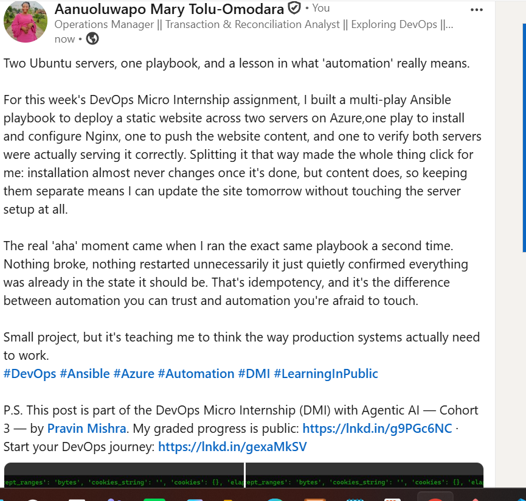

---

# Assignment Questions

Answer the following in your own words:

**1. What issue did you face while completing this assignment, and how did you fix it?**

The main issue was that Azure rejected my existing SSH key when Terraform tried to provision the VMs — it only accepts RSA keys for the admin_ssh_key setting, not the ed25519 key I'd been using in earlier assignments. I generated a dedicated RSA keypair with ssh-keygen and pointed both my Terraform config and Ansible inventory at it, which fixed the connection issue right away.

---

**2. What did you learn from this assignment?**

I learned how to break a single deployment task into multiple plays that each handle one responsibility — installing software, deploying content, and verifying the result — instead of cramming everything into one long list of tasks. I also got a much clearer picture of how handlers work: they only fire when something actually changes, so Nginx isn't reloaded unnecessarily every time the playbook runs.

---

**3. Why is it useful to split installation, deployment, and verification into separate plays?**

Because each of those tasks changes at a different pace. Installing Nginx is something you set up once and rarely touch again, but website content can change often. Keeping them in separate plays means I can update the site without re-running the installation steps, and if something breaks, it's much easier to tell which stage of the process actually failed.

---

**4. What is one benefit of using the Ansible `copy` module instead of cloning the website directly from Git on every managed server?**

The copy module compares the source and destination files and only makes a change when something is actually different, so it avoids unnecessary writes. It also means the content deployed to every server comes from one controlled source — the Ansible controller — rather than each server independently pulling from Git, which would make it harder to guarantee every server is serving exactly the same version of the site.

---

**5. What does idempotency mean in this assignment?**

It means running the playbook more than once produces the same end result without making unnecessary changes each time. I proved this by running the playbook a second time with nothing modified, and almost everything reported "ok" instead of "changed" — Nginx was already installed and running, and the website file was already correct, so nothing needed to happen again.

---

**6. What does the Ansible `uri` module verify in Play 3?**

It sends an actual HTTP GET request to each web server's public IP address and checks that the response comes back with a 200 status code. That's the final proof that the whole pipeline worked — not just that the files were copied, but that Nginx is actually serving the website and it's reachable over the network.

---

# Required Files

Confirm that the following files are included in your assignment folder:

- [ ] `inventory.ini`
- [ ] `site.yml`
- [ ] `files/index.html`
- [ ] `README.md`

---

# Submission Instructions

- Add all required screenshots in the correct order.
- Full Name must be visible in required screenshots.
- Include both deployed website URLs.
- Paste `inventory.ini`, `site.yml`, and `README.md` as editable text.
- Answer all assignment questions clearly in your own words.
- Add your LinkedIn post URL.
- Do not expose SSH private keys, passwords, cloud account IDs, or other sensitive information.

---

# Completion Checklist

- [ ] Task 1: `static-web` folder structure is complete
- [ ] Task 2: Both servers are listed under the `[web]` group in `inventory.ini`
- [ ] Task 2: Inventory graph shows `web1` and `web2`
- [ ] Task 3: Ansible ping returns `SUCCESS` and `pong` for both servers
- [ ] Task 4: `files/index.html` contains your full name
- [ ] Task 5: `site.yml` contains three separate plays
- [ ] Task 5: Play 1 installs, starts, and enables Nginx
- [ ] Task 5: Play 2 deploys `index.html` using the `copy` module
- [ ] Task 5: Nginx reload handler is included
- [ ] Task 5: Play 3 verifies both web servers from the controller
- [ ] Task 6: Playbook syntax check passes
- [ ] Task 7: First playbook run completes with `unreachable=0` and `failed=0`
- [ ] Task 7: URI verification returns HTTP `200` for both servers
- [ ] Task 8: Second playbook run demonstrates idempotency
- [ ] Task 8: Second run shows `changed=0` for both web servers
- [ ] Task 9: Both `curl -I` commands return HTTP `200 OK`
- [ ] Task 9: Website loads from Server 1
- [ ] Task 9: Website loads from Server 2
- [ ] Task 9: Full name is visible on both deployed websites
- [ ] Task 10: `README.md` contains all required explanations
- [ ] Screenshots 1–11 are included
- [ ] `inventory.ini`, `site.yml`, and `README.md` are pasted as editable text
- [ ] Both website URLs are included
- [ ] Assignment questions are answered
- [ ] LinkedIn post published
- [ ] LinkedIn post URL added
- [ ] No sensitive information is exposed

---

## About DMI & CloudAdvisory

DevOps Micro Internship (DMI) is a project-based DevOps program run by Pravin Mishra and The CloudAdvisory, focused on real-world execution, systems thinking, and career readiness.

It helps learners build strong DevOps foundations with hands-on experience.

---

## Resources

- DMI Official Website: [https://dmi.pravinmishra.com?utm_source=github&utm_medium=readme](https://dmi.pravinmishra.com?utm_source=github&utm_medium=readme)
- University: [https://university.pravinmishra.com?utm_source=github&utm_medium=readme](https://university.pravinmishra.com?utm_source=github&utm_medium=readme)
- Discord Community: [https://discord.pravinmishra.com?utm_source=github&utm_medium=readme](https://discord.pravinmishra.com?utm_source=github&utm_medium=readme)
- Blog: [https://dmi.pravinmishra.com/blog?utm_source=github&utm_medium=readme](https://dmi.pravinmishra.com/blog?utm_source=github&utm_medium=readme)
- YouTube Playlist: [https://www.youtube.com/playlist?list=PLFeSNDtI4Cho](https://www.youtube.com/playlist?list=PLFeSNDtI4Cho)
- Pravin Mishra LinkedIn: [https://www.linkedin.com/in/pravin-mishra-aws-trainer/](https://www.linkedin.com/in/pravin-mishra-aws-trainer/)
- CloudAdvisory LinkedIn: [https://www.linkedin.com/company/thecloudadvisory/](https://www.linkedin.com/company/thecloudadvisory/)

---

*This submission is part of DevOps Micro Internship (DMI) — Agentic AI Track.*