# Assignment 04 — Deploy Mini Finance on Azure Using Terraform and Ansible

Part of the DevOps Micro Internship (DMI) with Agentic AI

---

## Purpose

In this assignment, you will provision Azure infrastructure using Terraform and deploy the Mini Finance website using an Ansible multi-play playbook.

Terraform will create the Azure Virtual Machine and networking resources. Ansible will install Nginx, clone the Mini Finance repository, deploy the website, and verify the deployment.

---

# Task 1 — Create the Project Structure

## Goal

Create separate directories and files for the Terraform infrastructure and Ansible configuration.

### Evidence

#### Screenshot 1 — Terminal or VS Code showing the complete `mini-finance` project structure

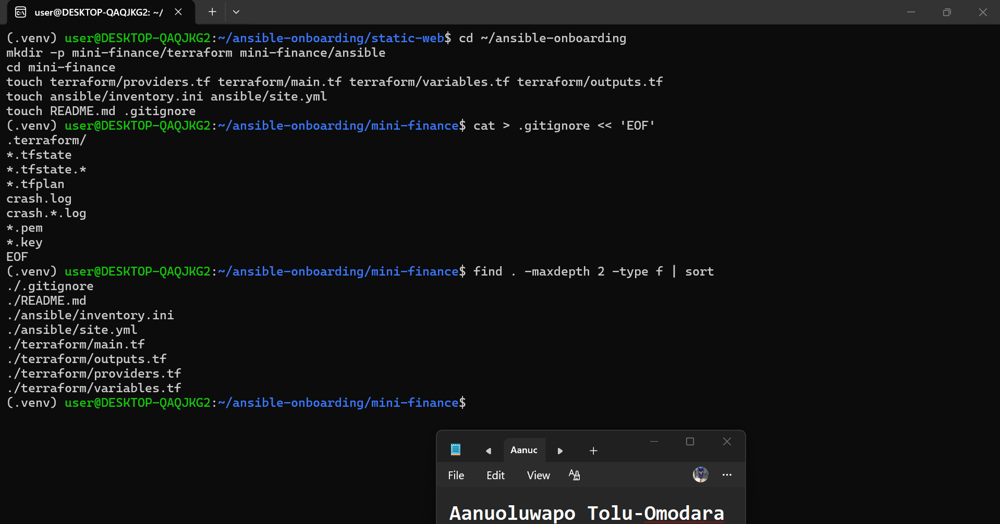

---

### Notes

I Created the mini-finance project inside ~/ansible-onboarding with terraform/ and ansible/ subfolders, plus README.md and .gitignore. Verified structure matched exactly what the rubric expects.

---

# Task 2 — Create the Azure Infrastructure Using Terraform

## Goal

Use Terraform to provision an Ubuntu Virtual Machine with the required Azure networking and security resources.

### Evidence

#### Screenshot 2 — Terraform code showing the `Allow-SSH` rule for port `22` and the `Allow-HTTP` rule for port `80`

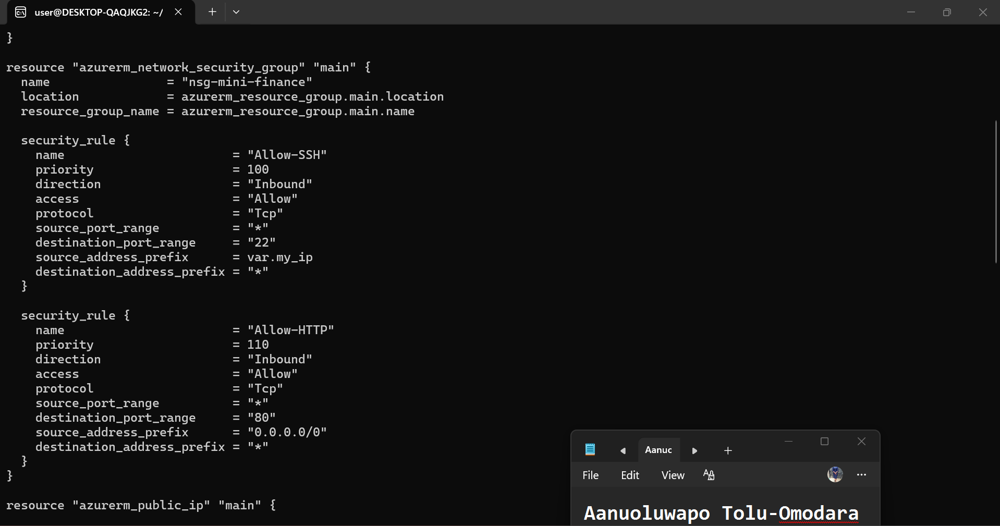

---

#### Screenshot 3 — Terraform code showing the association between `nsg-mini-finance` and `nic-mini-finance`

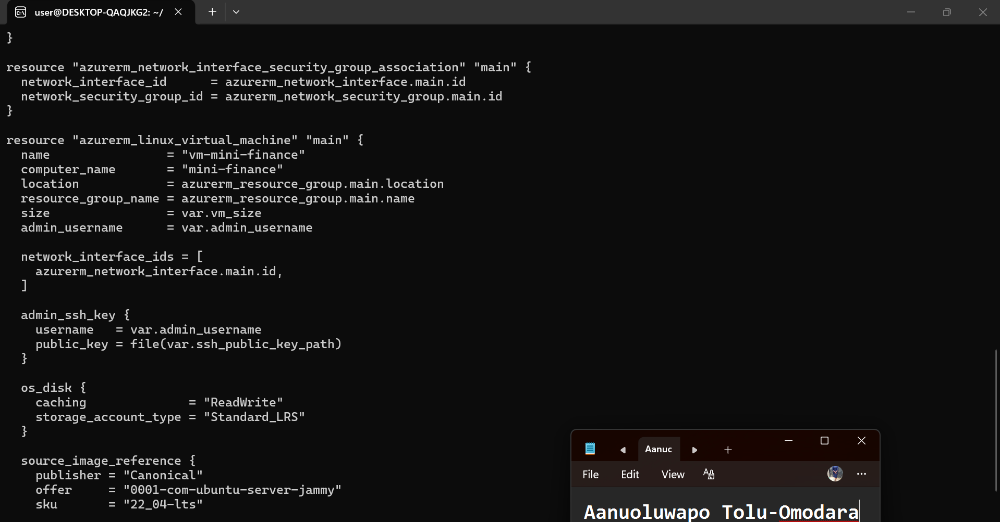

---

### Notes

I Wrote Terraform config for the Azure infra using the fixed resource names from the rubric: rg-mini-finance, vnet-mini-finance (10.0.0.0/16), subnet-mini-finance (10.0.1.0/24), nsg-mini-finance with Allow-SSH (port 22, restricted to my IP 102.89.47.119/32) and Allow-HTTP (port 80, open to 0.0.0.0/0), pip-mini-finance (Standard, Static), nic-mini-finance, and vm-mini-finance (Ubuntu 22.04, Standard_D1_v2, SSH-key-only auth via id_rsa_azure). Hit one snag: providers.tf came out empty after the first heredoc, which silently let Terraform install AzureRM v5.7.0 instead of the pinned ~> 3.0 — caught it via terraform init output, recreated the file, confirmed with ls -la (not just cat, which wasn't displaying reliably), and re-ran terraform init -upgrade to correctly resolve v3.117.1.

---

# Task 3 — Initialize and Apply the Terraform Configuration

## Goal

Format and validate the Terraform configuration, review the execution plan, and provision the Azure infrastructure.

### Evidence

#### Screenshot 4 — End of the `terraform apply` output showing `Apply complete!` with no errors

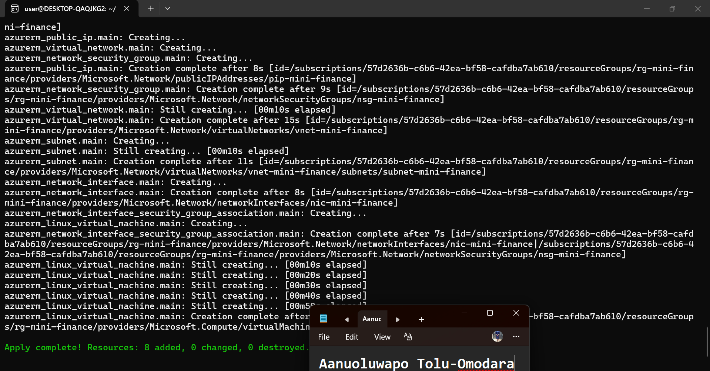

---

#### Screenshot 5 — Output of `terraform output public_ip` showing the VM’s public IP address

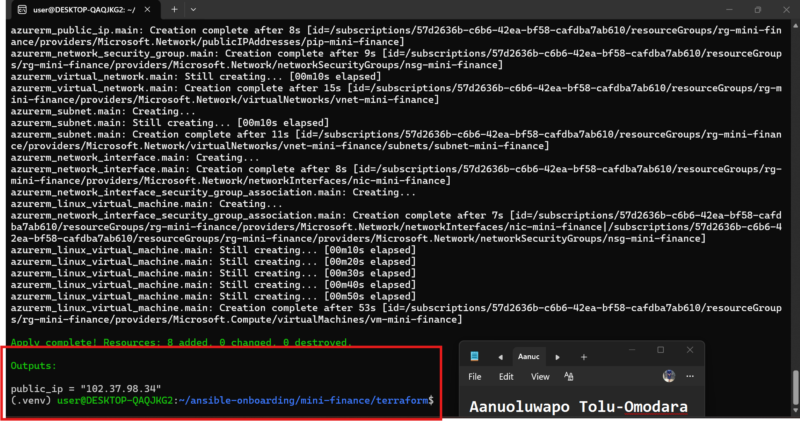

---

### Notes

terraform fmt, init, and validate all passed cleanly, and terraform plan showed a clean 8-to-add/0-to-change/0-to-destroy. terraform apply initially failed with populating Resource Provider cache: listing Resource Providers: loading results: unexpected end of JSON input — traced to the fact that the borrowed tenant's credentials are a service principal (not a full az login user), which likely lacks permission to list all subscription-level resource providers, so Terraform's provider-cache call returned a truncated response. Fixed by adding skip_provider_registration = true to the provider "azurerm" block (the correct v3.x argument — first tried resource_provider_registrations = "none", which is v4.x-only and got rejected). After that, terraform apply completed successfully in 53s, provisioning all 8 resources and outputting public_ip = "102.37.98.34".

---

# Task 4 — Verify Passwordless SSH Access

## Goal

Confirm that the Ansible controller can connect to the Terraform-provisioned Azure VM using SSH key authentication.

### Evidence

#### Screenshot 6 — Passwordless SSH command and the returned `mini-finance` hostname

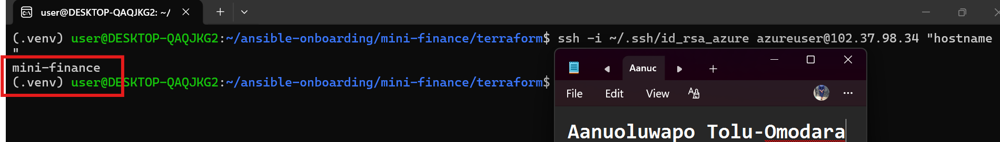

---

### Notes

I tested passwordless SSH using the RSA key (~/.ssh/id_rsa_azure) against the VM's public IP. Hit a Connection timed out on the first two attempts — traced to my public IP changing between sessions (home → work → office, across different days) while the Allow-SSH NSG rule was still scoped to a stale IP. Fixed by re-checking curl ifconfig.me, updating variables.tf's my_ip default, and re-running terraform apply (which cleanly updated just the NSG rule — 0 added, 2 changed, 0 destroyed). After that, SSH connected on the first try: accepted the host fingerprint, and the VM returned its hostname mini-finance with no password requested — confirming the SSH key pair, NSG rule, and VM boot were all working correctly together.

---

# Task 5 — Create the Ansible Inventory and Verify Connectivity

## Goal

Add the Terraform-provisioned Azure VM to the Ansible inventory and confirm that Ansible can connect to it.

### Evidence

#### Screenshot 7 — Ansible ping output showing `SUCCESS` and `pong` from the Azure VM

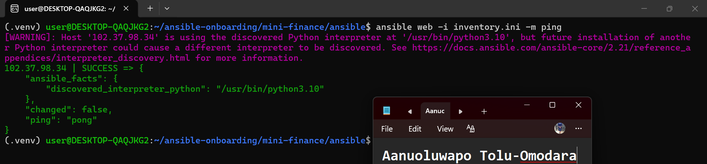

---

### Configuration File

Copy and paste the complete contents of your `ansible/inventory.ini` file below:

```ini
[web]
102.37.98.34

[web:vars]
ansible_user=azureuser
ansible_ssh_private_key_file=~/.ssh/id_rsa_azure
```

---

# Task 6 — Create the Multi-Play Ansible Playbook

## Goal

Create one Ansible playbook containing separate plays to install Nginx, deploy the Mini Finance website, and verify the deployment.

### Evidence

#### Screenshot 8 — `site.yml` showing Play 1 and the beginning of Play 2

Screenshot must show:

- Play 1 targeting the `web` group
- Installation of `nginx`, `git`, and `rsync`
- Nginx service configured as started and enabled
- Beginning of Play 2 with the Git repository URL and synchronization task

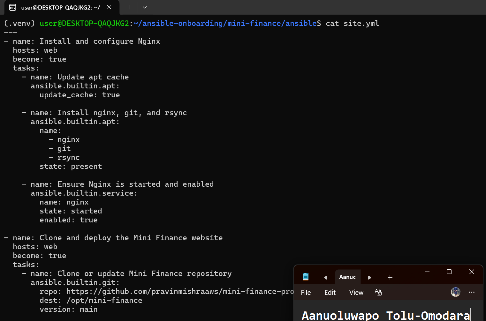

---

#### Screenshot 9 — `site.yml` showing the deployment destination, handler, and Play 3 verification

Screenshot must show:

- Website destination `/var/www/html/`
- Ownership set to `www-data:www-data`
- Nginx reload handler
- Play 3 targeting `localhost`
- The `uri` verification and `assert` condition

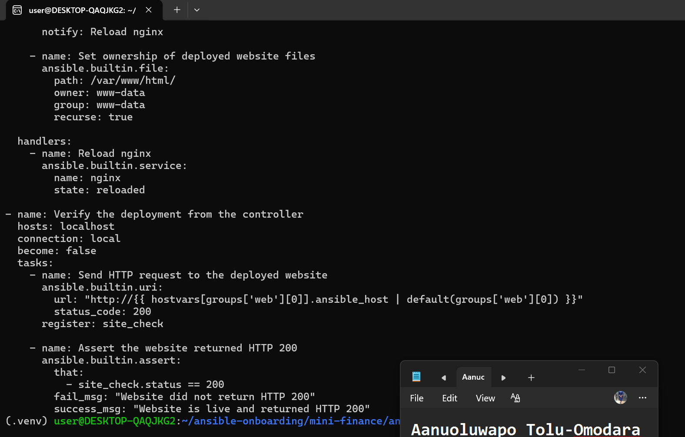

---

### Configuration File

Copy and paste the complete contents of your `ansible/site.yml` file below:

```yaml
---
- name: Install and configure Nginx
  hosts: web
  become: true
  tasks:
    - name: Update apt cache
      ansible.builtin.apt:
        update_cache: true

    - name: Install nginx, git, and rsync
      ansible.builtin.apt:
        name:
          - nginx
          - git
          - rsync
        state: present

    - name: Ensure Nginx is started and enabled
      ansible.builtin.service:
        name: nginx
        state: started
        enabled: true

- name: Clone and deploy the Mini Finance website
  hosts: web
  become: true
  tasks:
    - name: Clone or update Mini Finance repository
      ansible.builtin.git:
        repo: https://github.com/pravinmishraaws/mini-finance-project
        dest: /opt/mini-finance
        version: main

    - name: Synchronize website files to /var/www/html
      ansible.posix.synchronize:
        src: /opt/mini-finance/
        dest: /var/www/html/
        delete: true
        rsync_opts:
          - "--exclude=.git"
      delegate_to: "{{ inventory_hostname }}"
      notify: Reload nginx

    - name: Set ownership of deployed website files
      ansible.builtin.file:
        path: /var/www/html/
        owner: www-data
        group: www-data
        recurse: true

  handlers:
    - name: Reload nginx
      ansible.builtin.service:
        name: nginx
        state: reloaded

- name: Verify the deployment from the controller
  hosts: localhost
  connection: local
  become: false
  tasks:
    - name: Send HTTP request to the deployed website
      ansible.builtin.uri:
        url: "http://{{ hostvars[groups['web'][0]].ansible_host | default(groups['web'][0]) }}"
        status_code: 200
      register: site_check

    - name: Assert the website returned HTTP 200
      ansible.builtin.assert:
        that:
          - site_check.status == 200
        fail_msg: "Website did not return HTTP 200"
        success_msg: "Website is live and returned HTTP 200"
```

---

# Task 7 — Validate and Run the Ansible Playbook

## Goal

Validate the syntax of the multi-play Ansible playbook and run it to install Nginx, deploy the Mini Finance website, and verify the deployment.

### Evidence

#### Screenshot 10 — Successful playbook syntax check showing `playbook: site.yml`

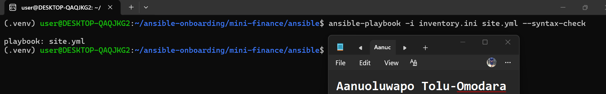

---

#### Screenshot 11 — Play 3 output showing the successful HTTP verification and assertion

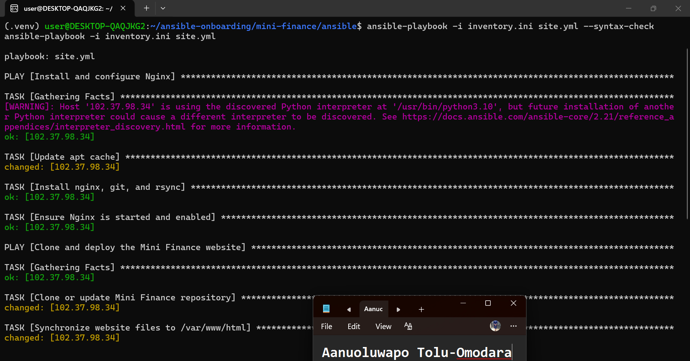

---

#### Screenshot 12 — Final `PLAY RECAP` showing `failed=0` and `unreachable=0`

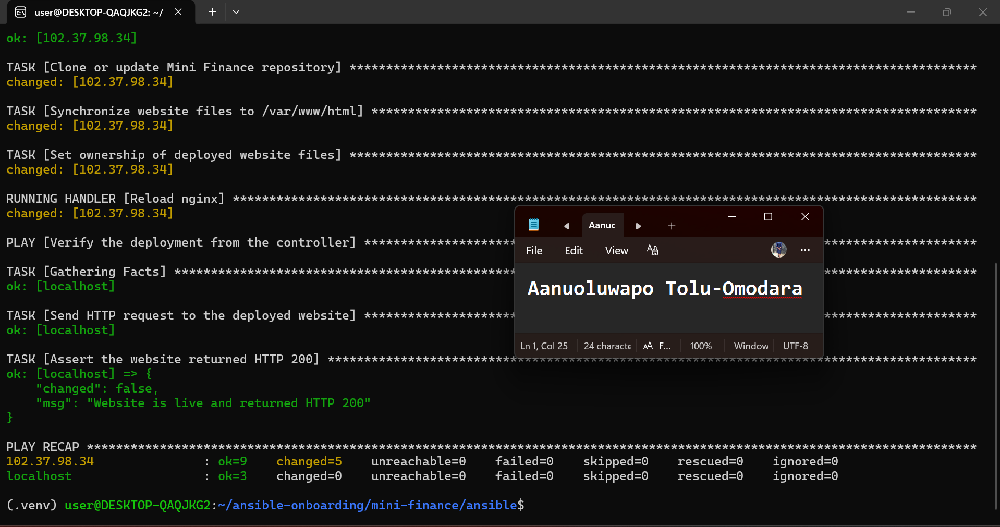

---

### Notes

I ran the full site.yml playbook after fixing the repo URL mismatch (see Task 6 note below). All three plays completed successfully: Play 1 installed and started/enabled nginx; Play 2 cloned the repo, synced files to /var/www/html/, set www-data ownership, and correctly triggered the nginx reload handler only because the sync reported a real change; Play 3's uri + assert tasks confirmed the site returned HTTP 200 from the controller's perspective. Final play recap showed failed=0 and unreachable=0 across both the web host and localhost.

---

# Task 8 — Test the Mini Finance Website in a Browser

## Goal

Confirm that the Mini Finance website is publicly accessible through the Azure VM’s public IP address.

### Evidence

#### Screenshot 13 — Mini Finance website successfully loading in the browser, with the Azure VM’s public IP address visible in the address bar

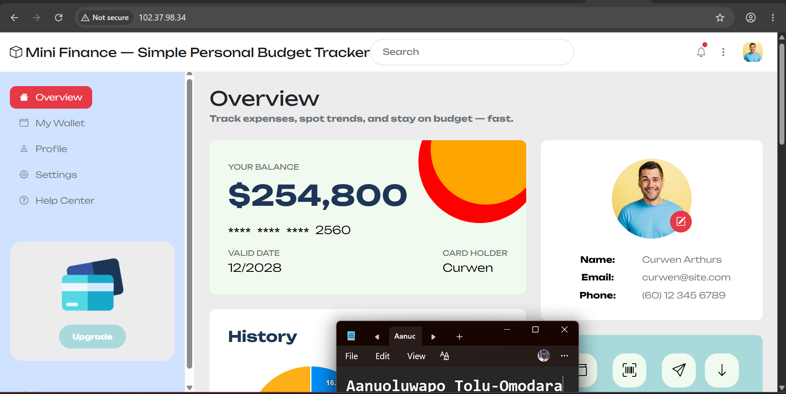

---

### Website URL

Add your deployed website URL below:

```text
http://102.37.98.34
```

---

# Task 9 — Create the Project README

## Goal

Create a `README.md` file to document the Mini Finance infrastructure and deployment project.

### Evidence

#### Screenshot 14 — Completed `README.md` displayed in the VS Code Markdown preview or terminal

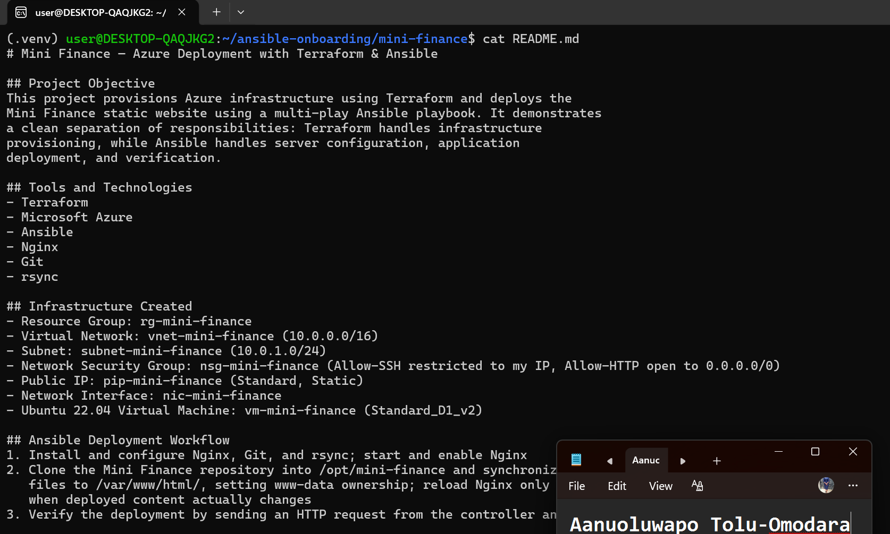

---

### README Content

Copy and paste the complete contents of your `README.md` file below:

```markdown
# Mini Finance — Azure Deployment with Terraform & Ansible

## Project Objective
This project provisions Azure infrastructure using Terraform and deploys the
Mini Finance static website using a multi-play Ansible playbook. It demonstrates
a clean separation of responsibilities: Terraform handles infrastructure
provisioning, while Ansible handles server configuration, application
deployment, and verification.

## Tools and Technologies
- Terraform
- Microsoft Azure
- Ansible
- Nginx
- Git
- rsync

## Infrastructure Created
- Resource Group: rg-mini-finance
- Virtual Network: vnet-mini-finance (10.0.0.0/16)
- Subnet: subnet-mini-finance (10.0.1.0/24)
- Network Security Group: nsg-mini-finance (Allow-SSH restricted to my IP, Allow-HTTP open to 0.0.0.0/0)
- Public IP: pip-mini-finance (Standard, Static)
- Network Interface: nic-mini-finance
- Ubuntu 22.04 Virtual Machine: vm-mini-finance (Standard_D1_v2)

## Ansible Deployment Workflow
1. Install and configure Nginx, Git, and rsync; start and enable Nginx
2. Clone the Mini Finance repository into /opt/mini-finance and synchronize
   files to /var/www/html/, setting www-data ownership; reload Nginx only
   when deployed content actually changes
3. Verify the deployment by sending an HTTP request from the controller and
   asserting a 200 OK response

## Verification
Verified the deployment two ways: through Ansible's own uri + assert tasks
in Play 3 (confirming HTTP 200 from the controller's perspective), and by
manually loading http://<public_ip> in a browser to confirm the site
rendered correctly with the public IP visible in the address bar.

## Challenge and Solution
The assignment's reference materials pointed to a repository named
`mini-finance-project`, which returned a 404 when cloned. I diagnosed it by
running `curl -I` against the URL directly on the VM to confirm it wasn't a
network/DNS issue, then searched for the correct repository and found it was
actually named `mini_finance` (underscore, no "-project" suffix) under the
same GitHub account. Updated the playbook's git task with the correct URL
and re-ran the deployment successfully.

I also had to adjust my public IP in the NSG's Allow-SSH rule multiple times
across the assignment, since I worked on it from different networks (home,
office) and the rule is intentionally scoped to a single IP for security.

## What I Learned
Terraform and Ansible complement each other well when each is scoped to what
it does best — Terraform for declarative, idempotent infrastructure, and
Ansible for procedural configuration and deployment steps. I also learned
the value of verifying assumptions independently (like testing a git clone
manually before assuming a playbook bug) rather than guessing at fixes.
```

---

# LinkedIn Post Required

## Evidence

#### Screenshot 15 — Published LinkedIn post showing the text and at least one deployment screenshot

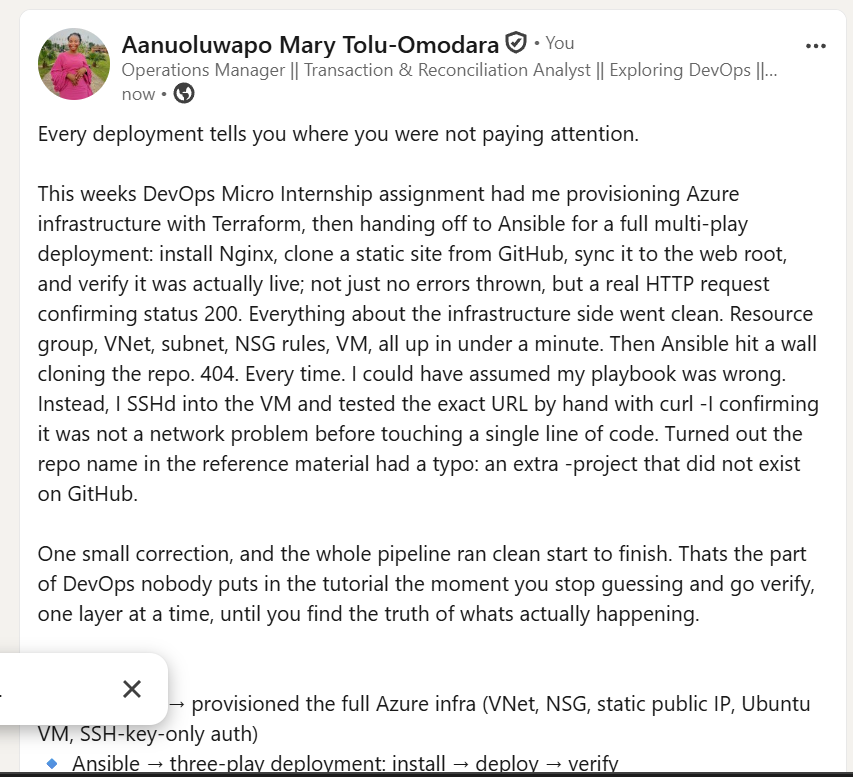

---

#### LinkedIn Post URL

Paste your LinkedIn post URL here:

https://lnkd.in/p/eF226wm6

---

### LinkedIn Submission Notes

**One challenge you faced and how you fixed it:**

The reference materials pointed me to a GitHub repo (mini-finance-project) that simply didn't exist — every clone attempt failed. Instead of assuming my playbook was broken, I tested the URL directly on the VM with curl -I to rule out a network issue, confirmed it was a genuine 404, then tracked down the correct repo name (mini_finance, underscore, no "-project" suffix) and updated the playbook. Small detail, but a good reminder to verify assumptions at the source before debugging around them.

---

**One real-world example where you can use this learning:**

At Famous Capital, we're moving toward a full MFB license and a new core banking application; this Terraform + Ansible workflow is exactly the kind of repeatable, auditable process I'd want for standing up any internal tooling or reporting dashboard around that transition, rather than manually configuring servers each time and hoping I remember every step correctly.

---

# Assignment Questions

Answer the following in your own words:

**1. What did you provision using Terraform in this assignment?**

I used Terraform to provision the full Azure infrastructure for the Mini Finance VM — a resource group, virtual network with a subnet, a network security group with SSH and HTTP rules, a static public IP, a network interface, and the Ubuntu 22.04 VM itself with SSH-key-only authentication. Basically everything the app needed to exist on Azure before a single line of application config touched it.

---

**2. What did Ansible configure and deploy in this assignment?**

Once the VM existed, Ansible took over — installing Nginx, Git, and rsync; starting and enabling Nginx; cloning the Mini Finance site from GitHub; syncing the files into the Nginx web root with the correct ownership; and reloading Nginx only when the deployed content actually changed. It also ran the final verification step to confirm the site was actually live.

---

**3. Why is SSH access on port `22` restricted to your public IP address?**

Because leaving SSH open to the whole internet (0.0.0.0/0) is one of the most common ways servers get brute-forced. Locking it to my own IP means only I can even attempt to connect — anyone else scanning for open port 22s gets nothing. I actually felt this rule firsthand: every time I worked from a different network (home, then office), SSH just timed out until I updated the rule with my new IP and re-applied — which made the "why" of this rule very real, not just theoretical.

---

**4. Why is HTTP port `80` open to the internet?**

Because the whole point of deploying this site is for the public to be able to see it. Unlike SSH, which is an administrative access point I want to guard closely, HTTP is the actual product — it needs to be reachable by anyone, anywhere, which is why it's intentionally left open to 0.0.0.0/0.

---

**5. What is the purpose of the Ansible inventory file?**

It tells Ansible which servers to manage and how to connect to them. In this case, inventory.ini grouped my VM under [web] and defined the SSH username and private key path to use for that group — so every playbook run automatically knows who to talk to and how to authenticate, without me having to specify it manually each time.

---

**6. Why does the playbook use separate plays for install, deploy, and verify?**

Separation of concerns, mainly. Each play has one clear job, which makes the playbook easier to read, debug, and re-run. If something breaks, I know exactly which play to look at — install issues won't get tangled up with deployment issues, and verification runs completely independently (even from a different host — localhost) so it's proof the site works from the outside, not just Ansible reporting "success" internally.

---

**7. Why is `rsync` useful when deploying website files?**

Rsync only copies what's actually changed, rather than re-copying everything every time — which makes deployments faster and more efficient, especially on repeat runs. It's also why the Ansible synchronize module was the right tool here instead of something like a plain file copy: it gave us proper sync behavior, including the ability to exclude the .git folder from what actually lands in the web root.

---

**8. What does the Ansible `uri` module verify in this assignment?**

It sends a real HTTP request to the deployed site's public IP and checks the response status code, which I then asserted equals 200. That's a genuine external check — it's not Ansible assuming the deployment worked because no task threw an error, it's Ansible actually confirming the site responds correctly, the same way a browser or a user would experience it.

---

**9. What issue did you face during this assignment, and how did you fix it?**

The trickiest one was that the repo URL in the assignment materials (mini-finance-project) simply didn't exist — cloning it kept failing. Instead of assuming my playbook was wrong, I tested the URL directly on the VM with curl -I, confirmed it was a genuine 404 and not a network issue, then tracked down the actual repo name (mini_finance, with an underscore, no "-project"). Small naming detail, but it taught me to verify assumptions at the source rather than debugging around them. I also had to keep updating my NSG's SSH rule as I moved between networks throughout the assignment — a good reminder of how "restrict to my IP" plays out in real, everyday use.

---

**10. What did you learn from using Terraform and Ansible together?**

That they're genuinely complementary, not overlapping — Terraform is declarative and idempotent, built for "this is the infrastructure I want to exist," while Ansible is procedural, built for "here are the steps to configure and deploy onto what already exists." Keeping that separation clean made the whole project easier to reason about, debug, and re-run confidently.

---

# Required Files

Confirm that the following files are included in your assignment folder:

- [ ] `.gitignore`
- [ ] `README.md`
- [ ] `terraform/providers.tf`
- [ ] `terraform/main.tf`
- [ ] `terraform/variables.tf`
- [ ] `terraform/outputs.tf`
- [ ] `ansible/inventory.ini`
- [ ] `ansible/site.yml`

---

# Submission Instructions

- Add all required screenshots in the correct order.
- Full Name must be visible in required screenshots.
- Add the Azure VM public IP address.
- Add the final Mini Finance website URL.
- Paste `inventory.ini`, `site.yml`, and `README.md` as editable text.
- Answer all assignment questions clearly in your own words.
- Add your LinkedIn post URL.
- Do not expose SSH private keys, passwords, Azure credentials, subscription IDs, Terraform state contents, or other sensitive information.

---

# Completion Checklist

- [ ] Task 1: `mini-finance` project structure created
- [ ] Task 1: `.gitignore` created
- [ ] Task 2: Terraform Azure infrastructure code created
- [ ] Task 2: `Allow-SSH` rule configured for port `22`
- [ ] Task 2: `Allow-HTTP` rule configured for port `80`
- [ ] Task 2: NSG associated with the Network Interface
- [ ] Task 3: `terraform fmt` completed
- [ ] Task 3: `terraform init` completed
- [ ] Task 3: `terraform validate` completed successfully
- [ ] Task 3: `terraform apply` completed successfully
- [ ] Task 3: `terraform output public_ip` displayed the VM public IP
- [ ] Task 4: Passwordless SSH works from the Ansible controller
- [ ] Task 5: `inventory.ini` created
- [ ] Task 5: Ansible ping returns `SUCCESS` and `pong`
- [ ] Task 6: `site.yml` contains three separate plays
- [ ] Task 6: Play 1 installs Nginx, Git, and rsync
- [ ] Task 6: Play 2 clones and deploys the Mini Finance website
- [ ] Task 6: Play 3 verifies HTTP status code `200`
- [ ] Task 7: Playbook syntax check passes
- [ ] Task 7: Ansible playbook completes successfully
- [ ] Task 7: Final recap shows `failed=0` and `unreachable=0`
- [ ] Task 8: Mini Finance website loads in the browser
- [ ] Task 8: Azure VM public IP is visible in the browser screenshot
- [ ] Task 9: `README.md` completed
- [ ] Screenshots 1–15 are included
- [ ] `inventory.ini`, `site.yml`, and `README.md` are pasted as editable text
- [ ] Assignment questions are answered
- [ ] LinkedIn post published with Anyone visibility
- [ ] LinkedIn post URL added
- [ ] No sensitive information is exposed

---

## About DMI & CloudAdvisory

DevOps Micro Internship (DMI) is a project-based DevOps program run by Pravin Mishra and The CloudAdvisory, focused on real-world execution, systems thinking, and career readiness.

It helps learners build strong DevOps foundations with hands-on experience.

---

## Resources

- DMI Official Website: [https://dmi.pravinmishra.com?utm_source=github&utm_medium=readme](https://dmi.pravinmishra.com?utm_source=github&utm_medium=readme)
- University: [https://university.pravinmishra.com?utm_source=github&utm_medium=readme](https://university.pravinmishra.com?utm_source=github&utm_medium=readme)
- Discord Community: [https://discord.pravinmishra.com?utm_source=github&utm_medium=readme](https://discord.pravinmishra.com?utm_source=github&utm_medium=readme)
- Blog: [https://dmi.pravinmishra.com/blog?utm_source=github&utm_medium=readme](https://dmi.pravinmishra.com/blog?utm_source=github&utm_medium=readme)
- YouTube Playlist: [https://www.youtube.com/playlist?list=PLFeSNDtI4Cho](https://www.youtube.com/playlist?list=PLFeSNDtI4Cho)
- Pravin Mishra LinkedIn: [https://www.linkedin.com/in/pravin-mishra-aws-trainer/](https://www.linkedin.com/in/pravin-mishra-aws-trainer/)
- CloudAdvisory LinkedIn: [https://www.linkedin.com/company/thecloudadvisory/](https://www.linkedin.com/company/thecloudadvisory/)

---

*This submission is part of DevOps Micro Internship (DMI) — Agentic AI Track.*