# Assignment — Deploy EpicBook with Terraform and Ansible Roles

Part of the DevOps Micro Internship (DMI) with Agentic AI

---

## Purpose

In this assignment, you will deploy the EpicBook web application using Terraform and Ansible roles.

Terraform provisions the cloud infrastructure, including one Ubuntu VM and one managed MySQL database. Ansible roles configure the VM, install required software, deploy the EpicBook application, configure Nginx, connect the app to the managed MySQL database, and verify the deployment.

---

# Task 1 — Set Up the Project Folder Layout

## Goal

Create the project folder structure for Terraform and Ansible roles.

Terraform will be used to provision the cloud infrastructure. Ansible roles will be used to configure the VM and deploy the EpicBook application.

### Evidence

#### Screenshot 1 — Terminal showing the completed `epicbook-prod` project structure

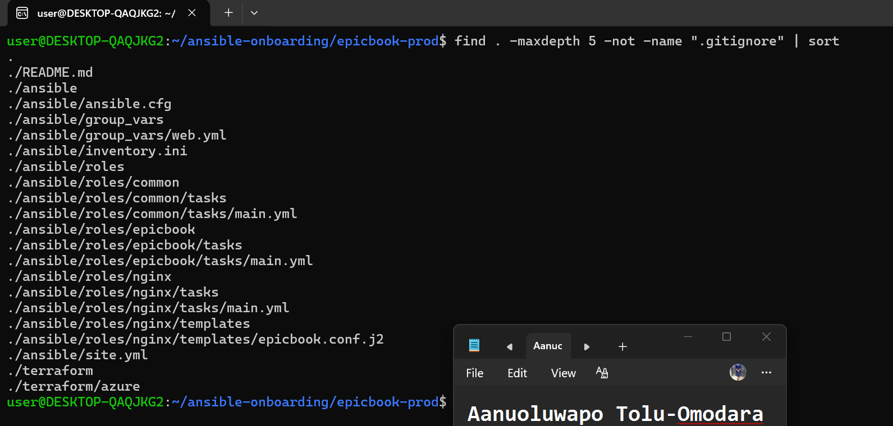

---

### Notes

Answer the following in your own words:

**1. Which cloud provider did you choose for this assignment?**

I chose Microsoft Azure. I used an Azure Linux VM to run the EpicBook application and Azure Database for MySQL Flexible Server as the managed database. I did not use AWS, and all resources were created in a single cloud as the assignment requires.

---

**2. Why is it useful to keep Terraform files and Ansible files in separate folders?**

Terraform and Ansible do different jobs. Terraform creates the infrastructure (the VM, network and database), while Ansible configures the server and deploys the application once it exists. Keeping them in separate folders keeps each tool's code, state files and secrets apart, so I can change, test or rebuild one without touching the other. It also makes the project easier to read and reuse, and it follows how real DevOps teams organise their work.

---

**3. What is the purpose of the `roles` directory in Ansible?**

The roles directory holds reusable, self-contained pieces of configuration, each with one clear responsibility. In this project, common prepares the server, nginx sets up the reverse proxy and epicbook deploys the application. Roles keep site.yml short and clean, make the automation easier to understand and troubleshoot, and let me reuse the same role in other projects.

---

# Task 2 — Provision the Infrastructure with Terraform

## Goal

Run Terraform to provision the cloud infrastructure for the EpicBook deployment.

Terraform will create the VM, managed MySQL database, networking, security rules, and required outputs.

### Evidence

#### Screenshot 2 — `terraform apply` completed successfully

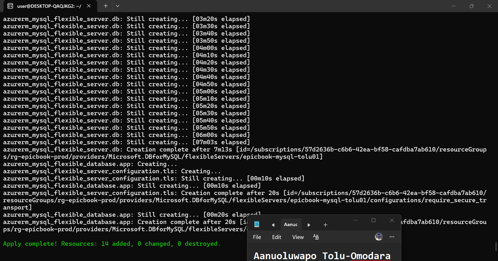

---

#### Screenshot 3 — Output of `terraform output`

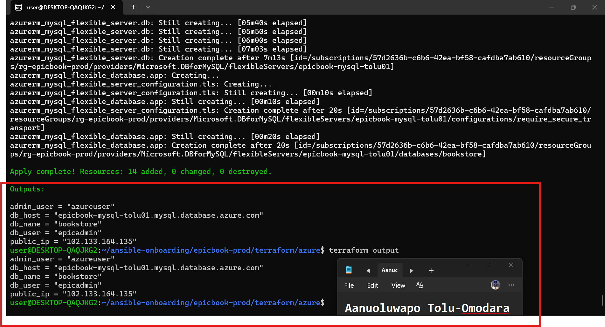

---

#### Screenshot 4 — Azure Portal or AWS Console showing the VM running

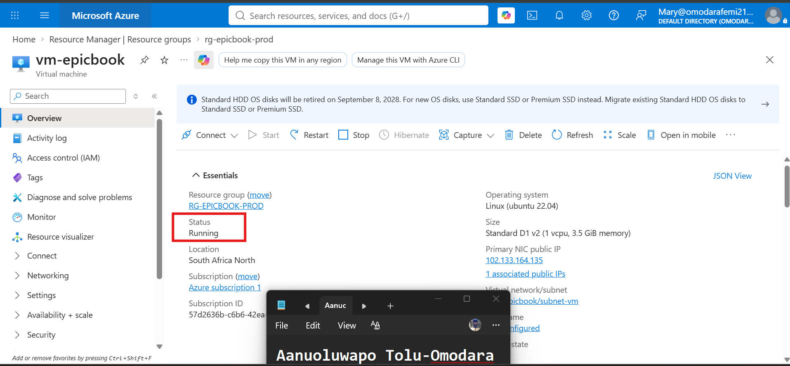

---

#### Screenshot 5 — Azure Portal or AWS Console showing the managed MySQL database created

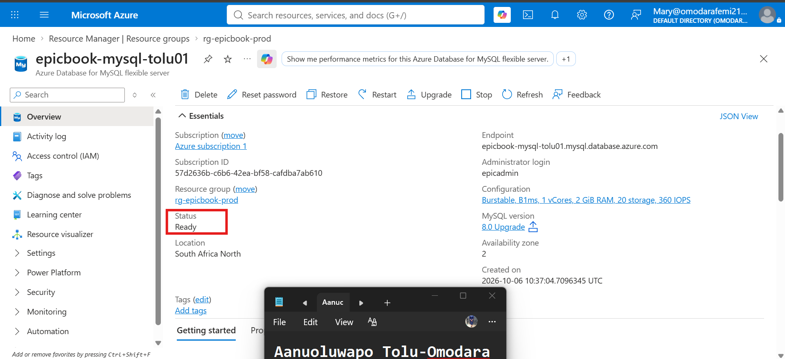

---

### Notes

Answer the following in your own words:

**1. What resources did Terraform create for this assignment?**

Terraform created 14 resources in Azure, in the South Africa North region. These were a resource group (rg-epicbook-prod), a virtual network with two subnets (one for the VM and one delegated to MySQL), a network security group associated with the VM subnet, a static public IP, a network interface, and an Ubuntu 22.04 Linux VM (vm-epicbook). For the database, it created a private DNS zone with a virtual network link, an Azure Database for MySQL Flexible Server (epicbook-mysql-tolu01) using private access, a bookstore database, and a server configuration setting. It also produced the outputs public_ip, admin_user, db_host and db_name.

---

**2. Why should you review `terraform plan` before running `terraform apply`?**

Terraform plan is a dry run that shows exactly what Terraform will create, change or destroy before anything real happens. Reviewing it lets me catch mistakes such as a wrong region, a missing setting or an unexpected deletion before they turn into real, billable cloud resources. In this project the plan showed 14 resources to add and 0 to change or destroy, which matched my design and confirmed it was safe to apply.

---

**3. Why should database passwords not be shown in Terraform output?**

Terraform outputs are printed in the terminal, can appear in screenshots and logs, and are stored in plain text in the state file. If the password were an output, anyone who saw those could read it and connect to the database. I kept the password as a sensitive variable in a git-ignored terraform.tfvars file, so it never prints in the plan or apply output, and the outputs show only non-secret values like the host, database name and username.

---

# Task 3 — Verify SSH Key-Based Access

## Goal

Verify that the cloud VM can be accessed from the Ansible controller using SSH key-based authentication.

### Evidence

#### Screenshot 6 — Successful SSH hostname check from the Ansible controller

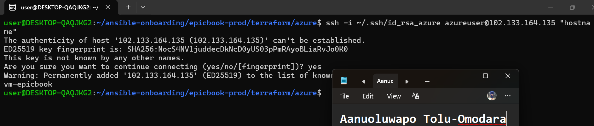

---

### Notes

Answer the following in your own words:

**1. What command did you use to verify SSH access?**

I used ssh -i ~/.ssh/id_rsa_azure azureuser@102.133.164.135 "hostname". It connects to the VM's public IP with my private key and runs the hostname command on the remote machine, so the output proves both the connection and a remote command worked.

---

**2. What proves that SSH key-based access worked successfully?**

The command returned the VM's hostname, vm-epicbook, without ever asking for a remote password. The public key that Terraform placed on the VM matched my private key, so authentication was done by the key pair alone. It also shows the network security group correctly allows SSH from my controller's IP.

---

**3. What would you check if SSH returned `Permission denied (publickey)`?**

I would check that I'm using the private key that matches the public key Terraform added to the VM, that the username matches the VM's admin user (azureuser), and that the private key file permissions are 600. I would also check that my public IP still matches the /32 SSH rule in the NSG, because if my IP had changed the connection would time out instead of being refused.

---

# Task 4 — Create the Ansible Inventory and Configuration

## Goal

Create the Ansible inventory file and local Ansible configuration for the EpicBook VM.

The inventory tells Ansible which VM to manage and which SSH user to use.

### Evidence

#### Screenshot 7 — `inventory.ini` showing the VM under the `web` group

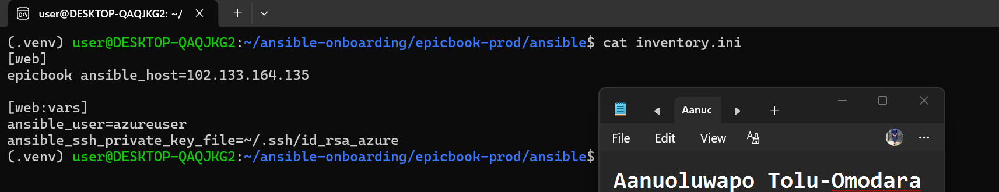

---

#### Screenshot 8 — Output of `ansible-inventory -i inventory.ini --graph`

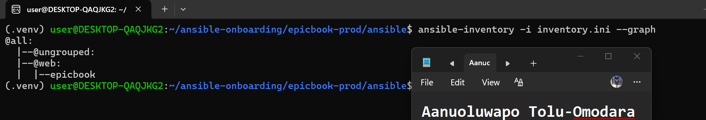

---

#### Screenshot 9 — Output of `ansible web -i inventory.ini -m ping`

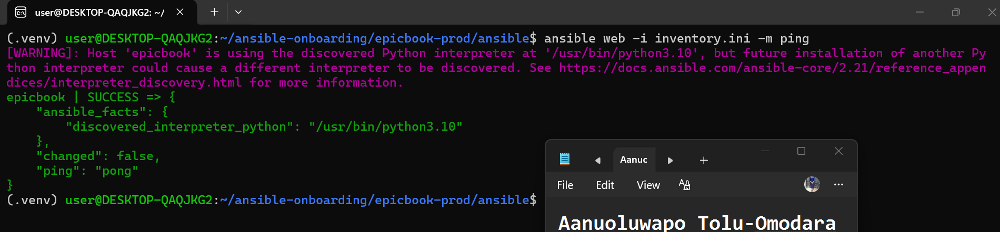

---

### Notes

Answer the following in your own words:

**1. What is the purpose of `inventory.ini`?**

The inventory file tells Ansible which machines it manages and how to reach them. Without it, Ansible has nothing to act on. In this project it defines a web group containing one host, epicbook, along with the connection settings Ansible needs to log in to it.

---

**2. What does `ansible_host` store?**

ansible_host stores the real address Ansible connects to, which here is the VM's public IP, 102.133.164.135. The name epicbook is just a friendly label for the host, so the IP can change later without renaming the host elsewhere in the project.

---

**3. What does `ansible_ssh_private_key_file` tell Ansible?**

It tells Ansible which private key to use for SSH authentication. Here it points to ~/.ssh/id_rsa_azure, which matches the public key Terraform installed on the VM. This lets Ansible log in without a password, in the same way my manual SSH test did.

---

**4. Why is `host_key_checking = False` used only for this temporary lab?**

It stops SSH from asking me to confirm the host fingerprint on the first connection, which Ansible can't answer during a run. Turning it off also removes protection against man-in-the-middle attacks, because Ansible no longer verifies that it's talking to the real server. That's acceptable for a short-lived lab VM, but in production host key checking should stay enabled, and fingerprints should be managed properly through a known_hosts file.

---

# Task 5 — Create the Main Ansible Playbook

## Goal

Create the main Ansible playbook that runs the required roles in the correct order.

The `site.yml` file will call the `common`, `nginx`, and `epicbook` roles.

### Evidence

#### Screenshot 10 — `site.yml` showing the roles in the correct order

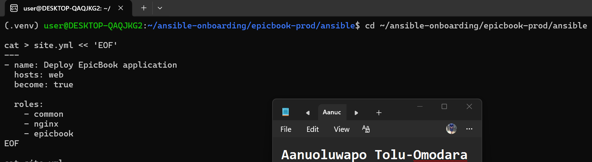

---

#### Screenshot 11 — Output of `ansible-playbook -i inventory.ini site.yml --syntax-check`

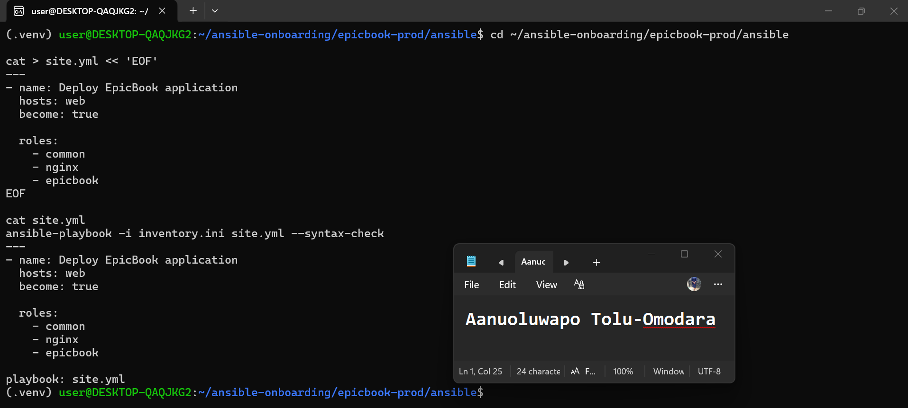

---

### Notes

Answer the following in your own words:

**1. What is the purpose of `site.yml`?**

site.yml is the main playbook, the single entry point that runs the whole deployment. It says which hosts to target (hosts: web), that tasks run with administrative privileges, and which roles to apply. It doesn't contain any configuration tasks itself, because the real work lives inside the roles. That keeps it short and easy to read.

---

**2. Why should the roles run in the order `common`, `nginx`, and `epicbook`?**

Ansible runs roles in the order they are listed, and each one depends on the one before it. common runs first to prepare the server with the baseline tools such as git, curl and the MySQL client. nginx runs second to install the reverse proxy that will receive web traffic. epicbook runs last because deploying and starting the application only makes sense once the server is prepared and Nginx is ready to forward requests to it.

---

**3. What does `become: true` allow Ansible to do?**

It lets Ansible run tasks with elevated (root, via sudo) privileges on the remote VM. This is needed for tasks that install packages, write to system folders like /etc/nginx, and manage services, because a normal user isn't allowed to do those things.

---

# Task 6 — Create the `common` Role

## Goal

Create the `common` role to prepare the Ubuntu VM with the basic packages required for the EpicBook deployment.

This role handles the common server setup before Nginx and the application are configured.

### Evidence

#### Screenshot 12 — `roles/common/tasks/main.yml` showing the common setup tasks

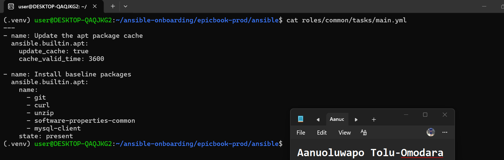

---

### Notes

Answer the following in your own words:

**1. What is the responsibility of the `common` role?**

The common role prepares the Ubuntu VM with the baseline setup every later step depends on. It refreshes the apt package cache and installs git, curl, unzip, software-properties-common and the MySQL client. It handles general server preparation only, and the Nginx and application work belongs to other roles.

---

**2. Why should Nginx installation not be placed inside the `common` role?**

Each role should have a single clear responsibility. Nginx is a specific service with its own configuration, site files and handlers, so it belongs in the nginx role. Keeping it out of common means common can be reused on any server, even one that doesn't run a web server, and it makes problems easier to trace to the right role.

---

**3. Why is `mysql-client` useful in this deployment?**

The MySQL client lets me connect from the VM to the managed Azure MySQL database to test connectivity, check that tables exist, and import the SQL files. The epicbook role also relies on it to check whether the database has already been set up before importing the schema.

---

# Task 7 — Create the `nginx` Role

## Goal

Create the `nginx` role to install Nginx and configure it as a reverse proxy for the EpicBook application.

Nginx will receive browser traffic on port `80` and forward it to the EpicBook Node.js application running on the VM.

### Evidence

#### Screenshot 13 — `roles/nginx/tasks/main.yml` showing Nginx installation and site configuration tasks

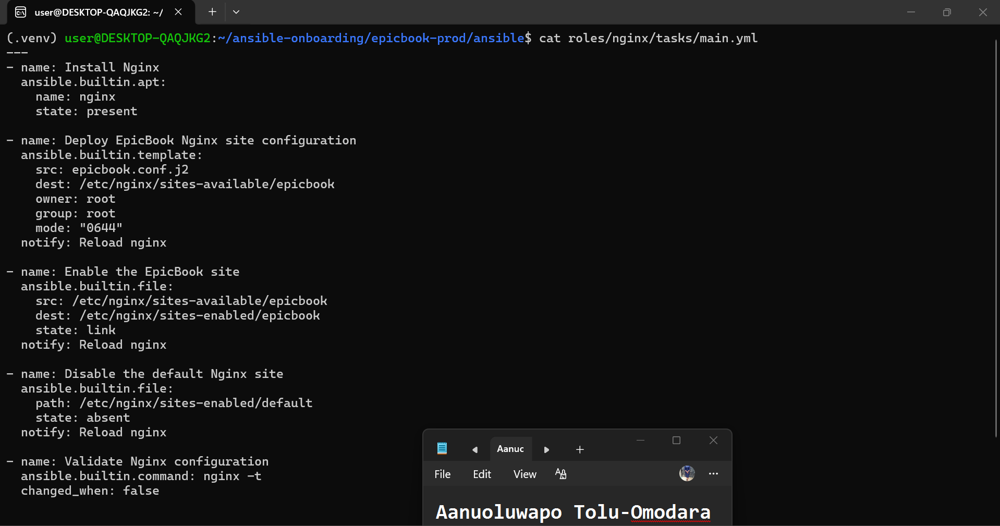

---

#### Screenshot 14 — `roles/nginx/templates/epicbook.conf.j2` showing the reverse proxy configuration

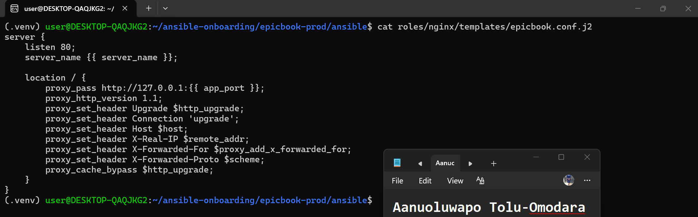

---

### Notes

Answer the following in your own words:

**1. What is the responsibility of the `nginx` role?**

AThe nginx role installs Nginx and configures it as a reverse proxy for EpicBook. It deploys the site configuration from a template, enables that site, removes Ubuntu's default site, validates the configuration, and makes sure Nginx is running and starts on boot. It doesn't run or manage the application itself, because that belongs to the epicbook role.

---

**2. Why is Nginx configured as a reverse proxy in this deployment?**

The Node.js application listens on an internal port (8080), while Nginx listens on port 80, the standard web port. Nginx receives browser requests and forwards them to the application, so users never connect to the app directly. This keeps the application off the public internet, lets it run without root privileges, and gives a single front door where headers, logging and, later, HTTPS can be handled.

---

**3. Why should the application port come from `group_vars/web.yml` instead of being hard-coded?**

Keeping the port in group_vars/web.yml means it's defined in one place and used by every role that needs it. If the port ever changes, I edit one variable instead of hunting through the Nginx template and the PM2 tasks. It also keeps the role reusable, because the role doesn't assume anything about this particular deployment.

---

# Task 8 — Create the `epicbook` Role

## Goal

Create the `epicbook` role to deploy the EpicBook application, connect it to the managed MySQL database, and run the application on port `8080` using PM2.

### Evidence

#### Screenshot 15 — `roles/epicbook/tasks/main.yml` showing application deployment tasks

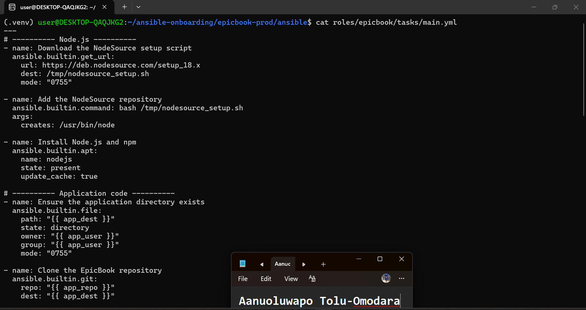

---

#### Screenshot 16 — Task or file showing how the database connection is configured, with secrets hidden

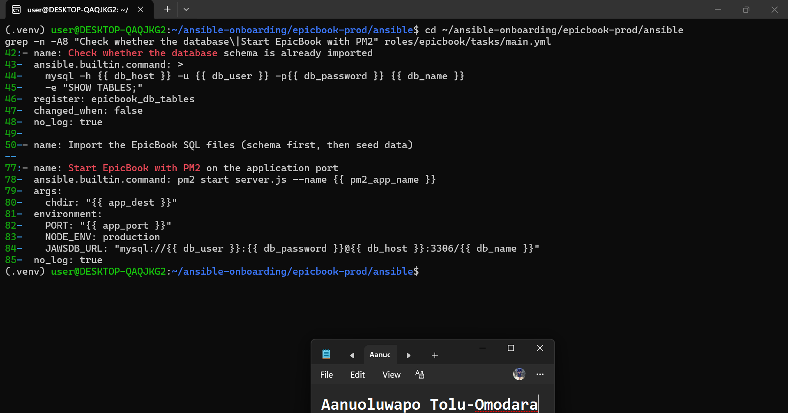

---

#### Screenshot 17 — Task or output showing the EpicBook application managed by PM2

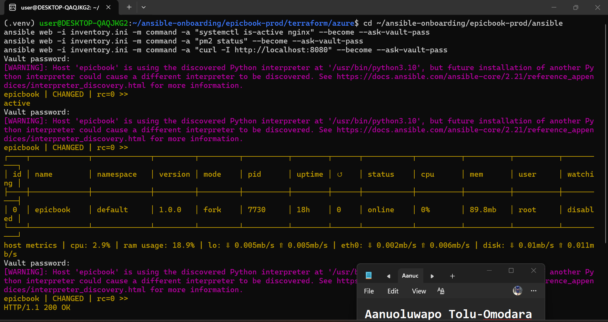

---

### Notes

Answer the following in your own words:

**1. What is the responsibility of the `epicbook` role?**

The epicbook role gets the application running on the VM. It installs Node.js, clones the EpicBook repository, and installs the dependencies with npm. It then imports the database schema and seed data into the managed MySQL database, but only when the database is empty, and starts the app under PM2 on port 8080 with its database connection settings. Everything specific to the application lives in this role, while the Nginx configuration stays in the nginx role.

---

**2. Why is PM2 used for the EpicBook Node.js application?**

If I run node server.js in a terminal, the app stops as soon as the session closes or the app crashes. PM2 is a process manager that runs the app in the background, restarts it automatically if it crashes, and keeps it running after I log out. It can also be registered to start on boot. It gives me simple commands such as pm2 status and pm2 logs to see whether the application is online and what it is doing.

---

**3. Why should database passwords not be hard-coded in public files?**

Anything written in a public file or repository can be read by anyone, and Git keeps its history, so a password stays recoverable even after it is deleted. Someone with the password could connect to the database and read, change or delete the data. In this project the role uses variables, and the real password is stored in an encrypted Ansible Vault file that is excluded from Git.

---

**4. What does it mean for the application to run on port `8080` while Nginx listens on port `80`?**

Nginx is the public front door on port 80, the standard HTTP port. The Node.js application runs privately on port 8080 on the same server. Nginx receives each browser request on port 80 and forwards it to the app on port 8080, which is called a reverse proxy, so users never connect to the application directly. This keeps the app off the public internet and gives one place to manage traffic.

---

# Task 9 — Create Group Variables

## Goal

Create reusable variables for the EpicBook deployment.

The `group_vars/web.yml` file stores values that can be reused across the Ansible roles.

### Evidence

#### Screenshot 18 — `group_vars/web.yml` showing the application, PM2, and database variables, with passwords hidden or masked

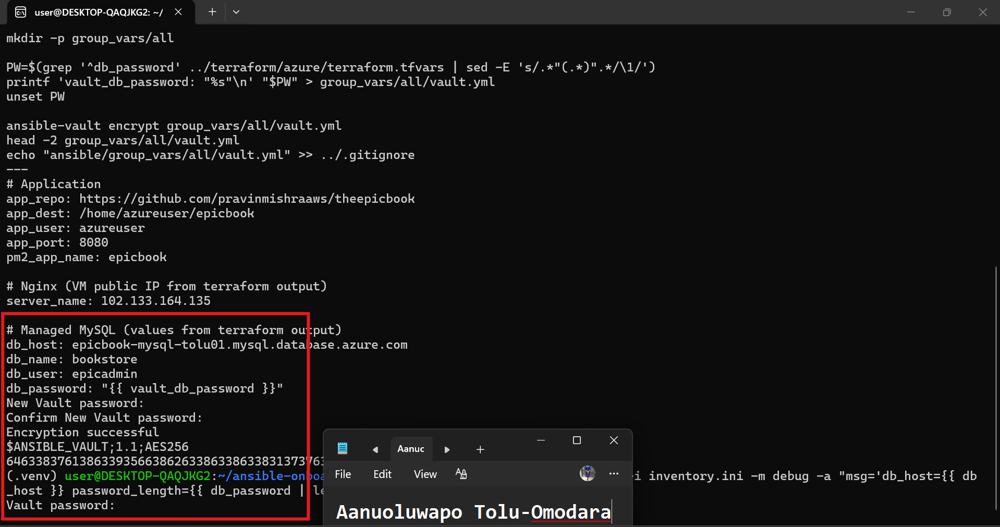

---

### Notes

Answer the following in your own words:

**1. What is the purpose of `group_vars/web.yml`?**

group_vars/web.yml holds the reusable values for every host in the web group, such as the repository URL, the application path, the ports and the database connection details. The roles read these values as variables instead of hard-coding them, so the tasks stay generic and reusable, and the file records what makes this particular deployment different. If a value changes, I edit it in one place and every role picks it up.

---

**2. Which values did you store in `group_vars/web.yml`?**

I stored the application settings: app_repo (the EpicBook GitHub repository), app_dest (where the app lives on the VM), app_user (the VM's admin user, azureuser), app_port (8080) and pm2_app_name (epicbook). I also stored the Nginx server_name, which is the VM's public IP, and the managed MySQL settings taken from Terraform's outputs: db_host, db_name (bookstore) and db_user (epicadmin). The db_password entry holds only a reference to a vault variable, not the real password.

---

**3. How did you handle the database password securely?**

I used Ansible Vault. The real password is stored in an encrypted file, group_vars/all/vault.yml, as the variable vault_db_password, and web.yml only contains db_password: "{{ vault_db_password }}". The vault file is encrypted with AES256, excluded from Git through .gitignore, and decrypted only at run time. I supply the vault password with --ask-vault-pass when I run the playbook, so the plain-text database password is never stored in the project or shown in my screenshots.

---

# Task 10 — Run the Ansible Playbook

## Goal

Run the Ansible playbook to configure the VM and deploy the EpicBook application.

The playbook should run the roles in this order:

1. `common`
2. `nginx`
3. `epicbook`

### Evidence

#### Screenshot 19 — Ansible playbook output showing the roles running

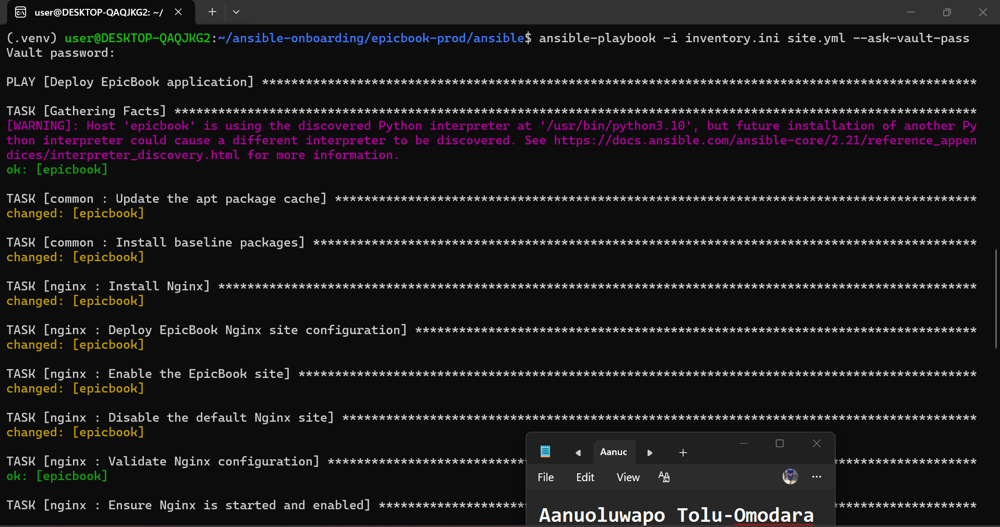

---

#### Screenshot 20 — Final Ansible recap showing `failed=0`

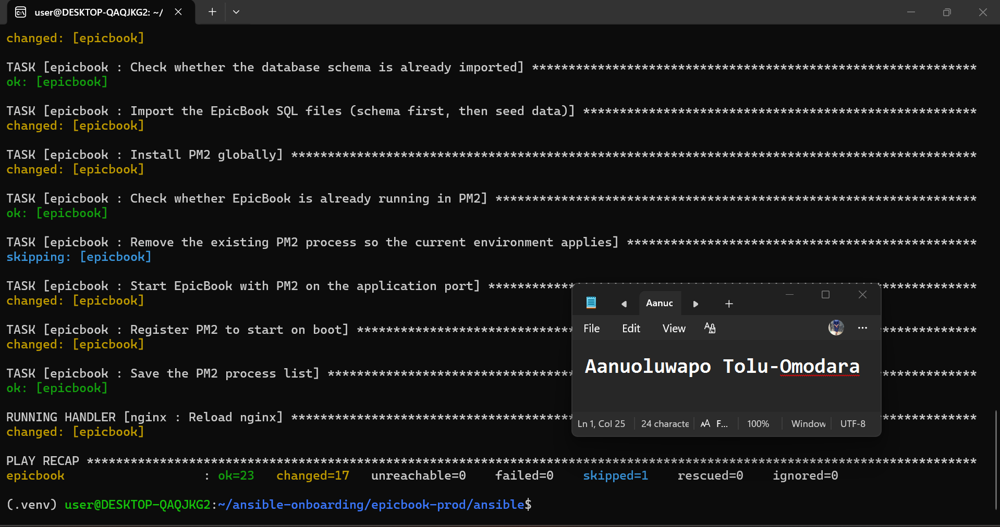

---

#### Screenshot 21 — Output of `ansible web -i inventory.ini -m command -a "systemctl is-active nginx" --become`

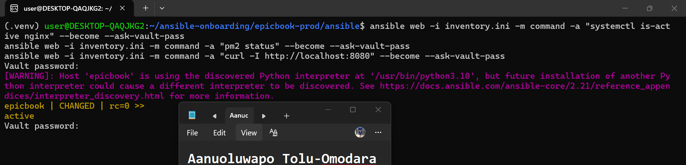

---

#### Screenshot 22 — Output of `ansible web -i inventory.ini -m command -a "pm2 status"`

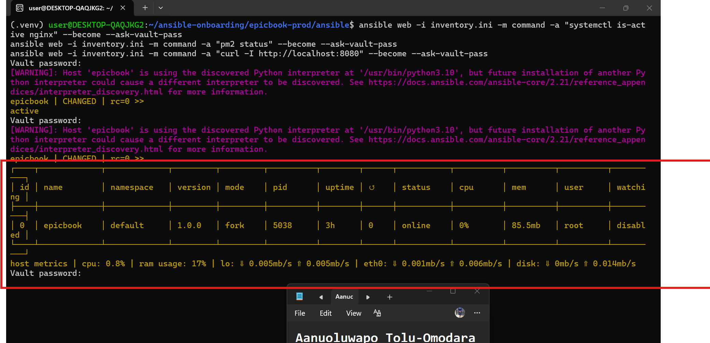

---

#### Screenshot 23 — Output of `ansible web -i inventory.ini -m command -a "curl -I http://localhost:8080"`

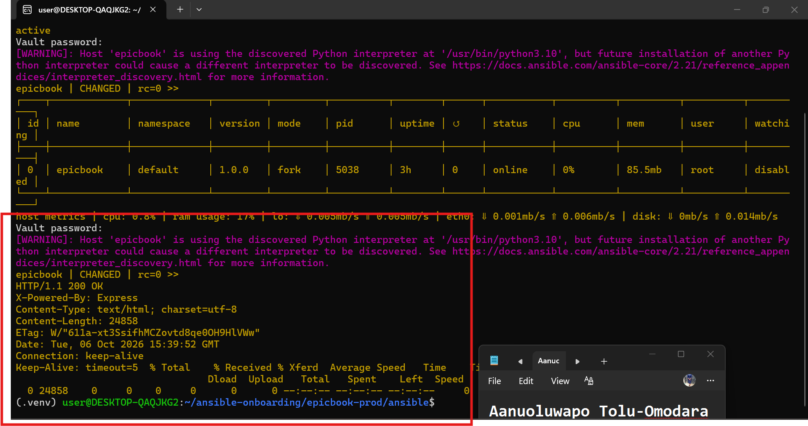

---

### Notes

Answer the following in your own words:

**1. What command did you run to execute the Ansible playbook?**

I ran ansible-playbook -i inventory.ini site.yml --ask-vault-pass. The -i option points to my inventory, and --ask-vault-pass prompts for the Vault password so Ansible can decrypt the database password.

---

**2. How do you know all roles completed successfully?**

The output listed tasks from the common, nginx and epicbook roles in order, and the final PLAY RECAP showed failed=0 and unreachable=0. The first run reported ok=23 changed=17 failed=0, which means every task finished without an error and made the expected changes.

---

**3. What proves that Nginx is active?**

The command systemctl is-active nginx returned active, which confirms the Nginx service is running on the VM.

---

**4. What proves that PM2 is managing the EpicBook application?**

pm2 status listed a process named epicbook with the status online. The PM2 logs also showed the application running and executing database queries.

---

**5. What proves that the EpicBook application responds on port `8080`?**

curl -I http://localhost:8080 returned HTTP/1.1 200 OK directly from the Node.js application. The PM2 logs show real queries against the Book, Author and Cart tables, which proves it's connected to the managed MySQL database.

---

# Task 11 — Verify the EpicBook Deployment

## Goal

Verify that the EpicBook application is running, accessible in the browser, and connected to the managed MySQL database.

### Evidence

#### Screenshot 24 — Output of `curl -I http://<public_ip>`

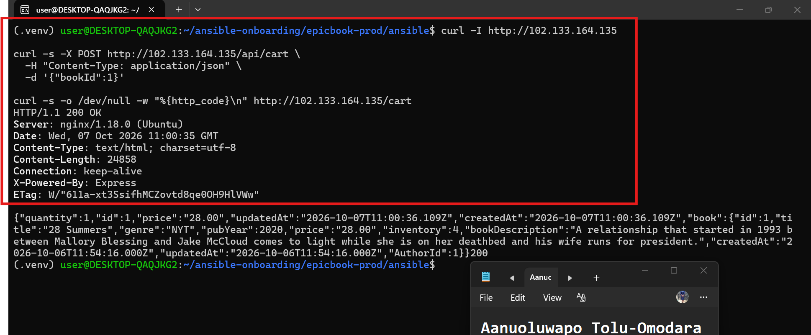

---

#### Screenshot 25 — Output of the cart API test command

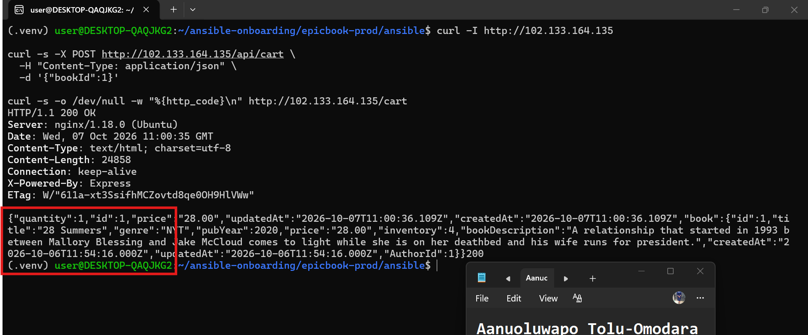

---

#### Screenshot 26 — Output of the `/cart` HTTP status check

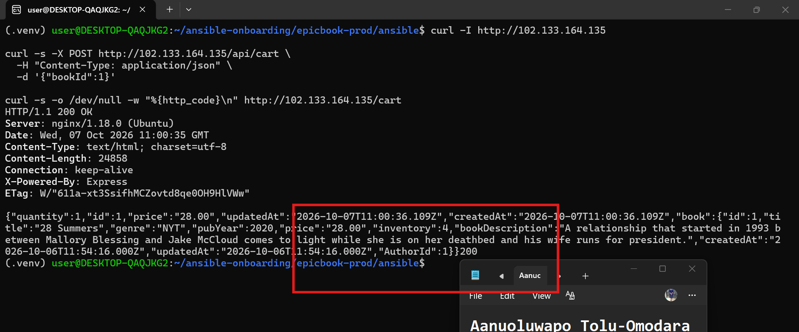

---

#### Screenshot 27 — Browser showing the EpicBook application loaded from `http://<public_ip>`

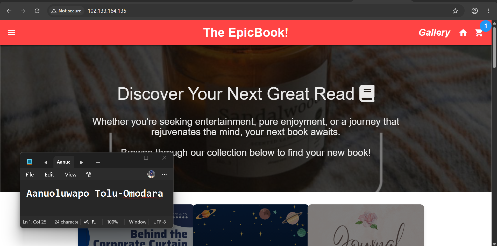

---

### Notes

Answer the following in your own words:

**1. What HTTP response did you receive from the public application URL?**

I received HTTP/1.1 200 OK from http://102.133.164.135. The headers showed Server: nginx/1.18.0 and X-Powered-By: Express, which confirms the request was received by Nginx on port 80 and passed on to the Express application.

---

**2. What did the cart API test prove?**

The POST request to /api/cart with bookId: 1 returned JSON containing the cart item and the book "28 Summers". That proves the whole path works end to end: the request passed through the public network rules and Nginx, reached the Node.js app on port 8080, and the app read and wrote data in the managed MySQL database.

---

**3. What did the `/cart` status check return?**

It returned 200, which shows the cart page loads successfully through Nginx and not an error such as a 502 Bad Gateway or a 404.

---

**4. What issue did you face during verification, and how did you fix it?**

My Ansible checks suddenly failed with Connection timed out on port 22. The deployment was fine. My internet provider had changed my public IP, and the network security group only allowed SSH from my old address. I fixed it by updating the SSH rule's source to my new IP with the Azure CLI, which kept SSH restricted to one /32 address instead of opening it to the internet.

---

# LinkedIn Post Required

## Evidence

#### LinkedIn Post URL

Paste your LinkedIn post URL here:

https://lnkd.in/p/gqA25N4D

---

#### Screenshot — Published LinkedIn post

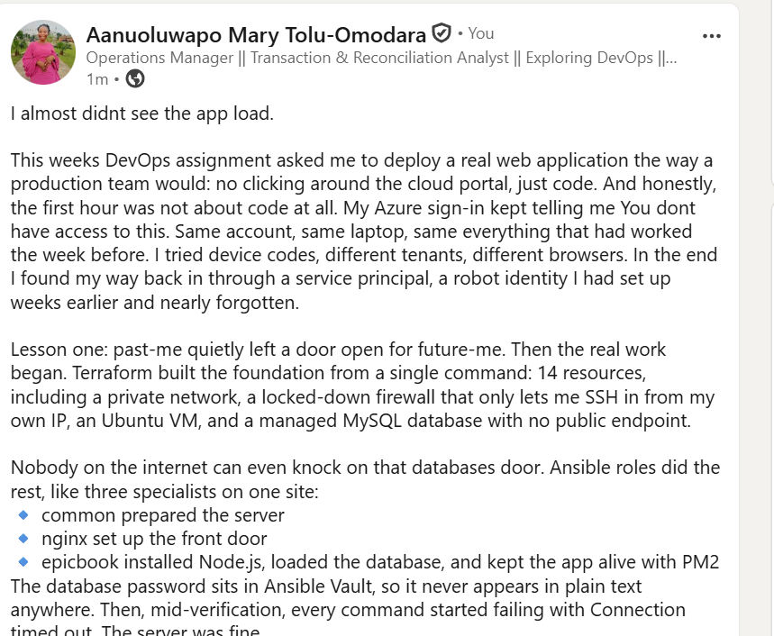

---

# Assignment Questions

Answer the following in your own words:

**1. Why is Terraform used for infrastructure provisioning?**

Terraform lets me describe cloud infrastructure as code, and then it creates it for me. Because the VM, network, security rules and database are defined in files, the same environment can be built again and again in the same way, reviewed with terraform plan before anything happens, and tracked in version control. That's much faster and less error-prone than clicking through the portal, and it removes the guesswork of rebuilding by hand.

---

**2. Why are Ansible roles useful for production-style deployments?**

Roles split a deployment into small, reusable pieces that each do one job. Here common prepares the server, nginx sets up the reverse proxy and epicbook deploys the app. This keeps site.yml short, makes each part easier to test and troubleshoot, and lets the same role be reused on other servers or projects. Teams can also work on different roles without getting in each other's way.

---

**3. What is the purpose of `group_vars/web.yml`?**

It stores the shared values for every host in the web group, such as the repository URL, ports, paths and database connection details. The roles use these as variables, so the tasks stay generic and I can change a value in one place. It also keeps secrets out of the tasks, because the password is only a reference to an encrypted vault variable.

---

**4. Why should database passwords not be committed to GitHub?**

Anything pushed to GitHub can be read by others, and Git keeps its full history, so a password stays recoverable even after it is deleted. Anyone with it could connect to the database and read, change or destroy the data. I kept the password in an encrypted Ansible Vault file and in a git-ignored terraform.tfvars, so it never reaches the repository.

---

**5. What is the purpose of Nginx in this deployment?**

Nginx is a reverse proxy. It listens on the public port 80, receives each browser request, and forwards it to the Node.js application running privately on port 8080. Users never connect to the application directly, so the app stays off the public internet, and Nginx also gives me a single place to manage headers, logging and, later, HTTPS.

---

**6. Why should the managed MySQL database not be publicly accessible?**

A database holds the application's data, so exposing it to the internet invites password guessing, scans and attacks on a service that only the app needs to reach. In this project the MySQL server uses private access inside the virtual network, with no public endpoint, and only the VM can connect to it on port 3306. That keeps the attack surface small.

---

**7. Why is PM2 used for the EpicBook Node.js application?**

PM2 runs the app as a managed background process. It keeps it running after I log out, restarts it automatically if it crashes, can bring it back on boot, and gives me pm2 status and pm2 logs to monitor it. Running node server.js by hand would stop whenever the session ended.

---

**8. What does idempotency mean in Ansible?**

Idempotency means I can run the same playbook many times and get the same final state, with changes made only where something is actually different. My first run reported changed=17, and the second reported only changed=3: the SQL import was skipped because the tables already existed, the packages and files were already correct, and only the apt cache refresh and the PM2 restart changed. That shows Ansible checks the current state first and doesn't repeat work.

---

**9. What issue did you face during the deployment, and how did you fix it?**

During verification, my Ansible commands suddenly failed with Connection timed out on port 22, even though the deployment was working. My internet provider had changed my public IP address, and the network security group only allowed SSH from my old one. I fixed it by updating the SSH rule's source to my new IP with the Azure CLI, which kept SSH limited to a single /32 address rather than opening it to the internet. I also had to log in to Azure with a service principal, because browser sign-in was blocked for my account.

---

**10. What security improvement would you make before using this setup in production?**

The first thing I would do is turn TLS back on for the MySQL connection. I set require_secure_transport to OFF for this lab because the app's database configuration has no SSL options, which means traffic between the VM and the database isn't encrypted. In production I would enable it and configure the app to connect over SSL. I would also serve the site over HTTPS with a certificate on Nginx, run the app as a non-root user instead of root, keep secrets in Azure Key Vault, and replace the fixed-IP SSH rule with a bastion host or just-in-time access.

---

# Required Files

Confirm that the following files are included in your GitHub repository or assignment folder:

- [ ] `README.md`
- [ ] Terraform files under either `terraform/azure/` or `terraform/aws/`
- [ ] `ansible/ansible.cfg`
- [ ] `ansible/inventory.ini`
- [ ] `ansible/site.yml`
- [ ] `ansible/group_vars/web.yml`
- [ ] `ansible/roles/common/tasks/main.yml`
- [ ] `ansible/roles/nginx/tasks/main.yml`
- [ ] `ansible/roles/nginx/templates/epicbook.conf.j2`
- [ ] `ansible/roles/epicbook/tasks/main.yml`

---

# Submission Instructions

- Add all required screenshots in your submission.
- Full Name must be visible in required screenshots.
- Mention the cloud provider used: Azure or AWS.
- Add the VM public IP address.
- Add the final application URL.
- Add Terraform output proof.
- Add Ansible role tree proof.
- Add all required notes and assignment question answers.
- Add your LinkedIn post URL.
- Do not expose SSH private keys, passwords, cloud credentials, database credentials, Terraform state files, subscription IDs, or account IDs.

---

# Completion Checklist

- [ ] Task 1: Project folder layout created
- [ ] Task 2: Terraform infrastructure provisioned
- [ ] Task 3: SSH key-based access verified
- [ ] Task 4: Ansible inventory and configuration created
- [ ] Task 5: Main Ansible playbook created
- [ ] Task 6: `common` role created
- [ ] Task 7: `nginx` role created
- [ ] Task 8: `epicbook` role created
- [ ] Task 9: Group variables created
- [ ] Task 10: Ansible playbook run completed
- [ ] Task 11: EpicBook deployment verified
- [ ] Terraform files created under only one cloud provider folder
- [ ] One Ubuntu VM was created
- [ ] One managed MySQL database was created
- [ ] SSH port `22` is restricted to the controller public IP
- [ ] HTTP port `80` is accessible
- [ ] MySQL port `3306` is not publicly open
- [ ] `ansible web -i inventory.ini -m ping` returns `SUCCESS`
- [ ] `site.yml` calls the roles in the correct order
- [ ] Database secrets are hidden or handled securely
- [ ] Nginx is active
- [ ] PM2 shows the EpicBook application running
- [ ] EpicBook responds on port `8080`
- [ ] Public URL loads in the browser
- [ ] Cart API verification works
- [ ] Playbook completes with `failed=0`
- [ ] Screenshots 1–27 are included
- [ ] Assignment questions are answered
- [ ] LinkedIn post published
- [ ] LinkedIn post URL added
- [ ] No sensitive information is exposed

---

## About DMI & CloudAdvisory

DevOps Micro Internship (DMI) is a project-based DevOps program run by Pravin Mishra and The CloudAdvisory, focused on real-world execution, systems thinking, and career readiness.

It helps learners build strong DevOps foundations with hands-on experience.

---

## Resources

- DMI Official Website: [https://dmi.pravinmishra.com?utm_source=github&utm_medium=readme](https://dmi.pravinmishra.com?utm_source=github&utm_medium=readme)
- University: [https://university.pravinmishra.com?utm_source=github&utm_medium=readme](https://university.pravinmishra.com?utm_source=github&utm_medium=readme)
- Discord Community: [https://discord.pravinmishra.com?utm_source=github&utm_medium=readme](https://discord.pravinmishra.com?utm_source=github&utm_medium=readme)
- Blog: [https://dmi.pravinmishra.com/blog?utm_source=github&utm_medium=readme](https://dmi.pravinmishra.com/blog?utm_source=github&utm_medium=readme)
- YouTube Playlist: [https://www.youtube.com/playlist?list=PLFeSNDtI4Cho](https://www.youtube.com/playlist?list=PLFeSNDtI4Cho)
- Pravin Mishra LinkedIn: [https://www.linkedin.com/in/pravin-mishra-aws-trainer/](https://www.linkedin.com/in/pravin-mishra-aws-trainer/)
- CloudAdvisory LinkedIn: [https://www.linkedin.com/company/thecloudadvisory/](https://www.linkedin.com/company/thecloudadvisory/)

---

*This submission is part of DevOps Micro Internship (DMI) — Agentic AI Track.*