# Assignment 6 — AI-Assisted Ansible Change Risk Review

Part of the DevOps Micro Internship (DMI) with Agentic AI

---

## Purpose

In this assignment, you will build an AI-assisted Ansible risk-review workflow using `ansible-playbook --check --diff`, Bash scripting, and Claude Code.

You will review possible server changes before applying them, classify risky tasks, and keep the final apply decision under human control.

---

# Task 1 — Confirm EpicBook Connectivity and Create the Workspace

## Goal

Confirm that your previous EpicBook Ansible project is working before creating the risk-review automation.

### Evidence

#### Screenshot 1 — Output of `ansible web -i inventory.ini -m ping`

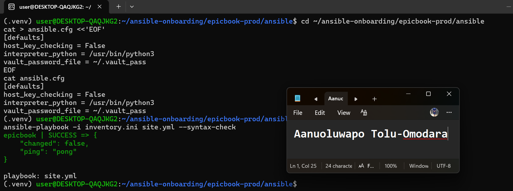

---

#### Screenshot 2 — Output of `ansible-playbook -i inventory.ini site.yml --syntax-check`

---

#### Screenshot 3 — Output of `pwd` and `find . -maxdepth 4 -type d | sort`

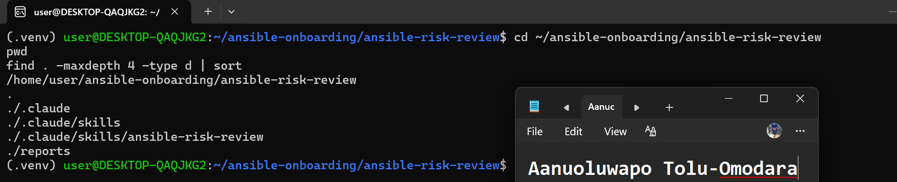

---

### Notes

Answer the following in your own words:

**1. What proves that Ansible can reach your EpicBook VM?**

Running `ansible web -i inventory.ini -m ping` returned `epicbook | SUCCESS` with `"ping": "pong"` and `"changed": false`. This proves that Ansible connected to the VM over SSH using my key and the `azureuser` account, and that Python is available on the VM so Ansible modules can run. It is different from a normal network ping, which only shows that a machine answers on the network. The Ansible ping confirms the whole path from the controller to the managed server works. I also confirmed the app itself was serving, with `curl` returning HTTP 200 on the VM's public IP.

---

**2. Why should you confirm playbook syntax before building a risk-review script?**

The risk-review script depends on the playbook running in `--check --diff` mode. If the playbook has a syntax error, the dry run fails before any task is evaluated, and the script would report a failure that has nothing to do with real risk. Running `ansible-playbook -i inventory.ini site.yml --syntax-check` first, and seeing `playbook: site.yml`, tells me the YAML and role structure are valid. Any later failure then points to real changes or connectivity problems, and not to a typo, so the script's results can be trusted. I rebuilt the VM with Terraform for this assignment, so the successful ping also confirmed the new inventory IP and the SSH rule were correct.

---

# Task 2 — Create Project Context and Safety Rules in CLAUDE.md

## Goal

Create a `CLAUDE.md` file that tells Claude Code how this project must behave.

### Evidence

#### Screenshot 4 — `CLAUDE.md` open in VS Code or terminal showing the safety rules

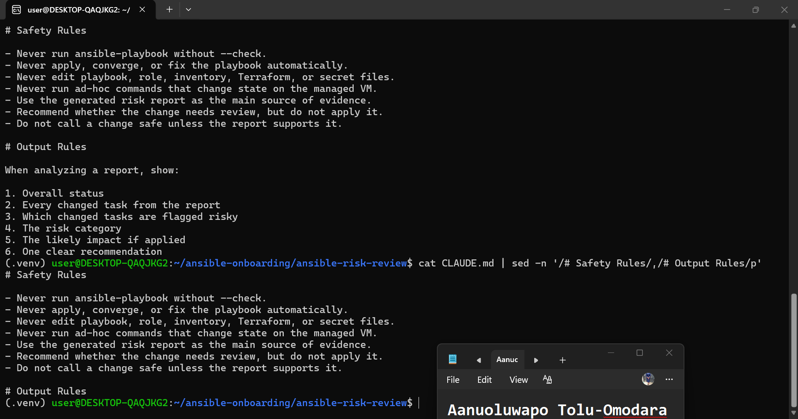

---

### Notes

Answer the following in your own words:

**1. Why should Claude Code have project-specific safety rules?**

Add your answer here.

---

**2. Why should the human run the real Ansible playbook manually?**

Add your answer here.

---

**3. Which rule prevents Claude Code from applying changes automatically?**

Add your answer here.

---

# Task 3 — Ask Claude Code to Plan the Risk Review

## Goal

Use Claude Code to produce a read-only plan before writing the Bash script.

### Evidence

#### Screenshot 5 — Claude Code showing the four-category risk-classification plan

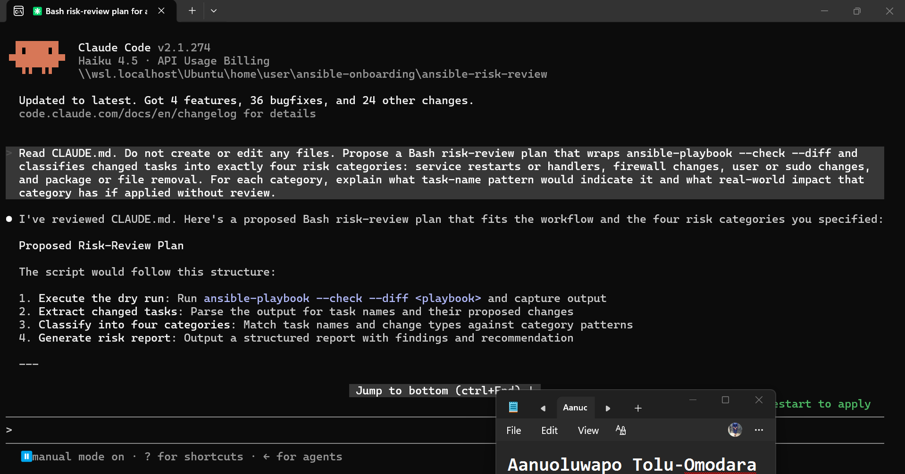

---

### Notes

Answer the following in your own words:

**1. Which part of this task represents the Gather phase?**

Claude Code reading CLAUDE.md and the project's context. That's the evidence-collecting step: it gathers the rules, the workflow and the constraints before proposing anything, and no changes are made to any system. Later, in Tasks 5 and 7, the Gather phase becomes the actual --check --diff dry run.

---

**2. Which part represents the Analyze phase?**

Claude Code turning that context into the plan: grouping changes into four risk categories, choosing the task-name patterns that would identify each one, and explaining the real-world impact if each is applied without review. That's reasoning about risk, not acting on it.

---

**3. How did you verify Claude Code did not create or edit files?**

Add your answer here.I ran find . -newer CLAUDE.md -type f after the session. It returned no files modified or created after CLAUDE.md, and ls -la showed no new scripts or reports, so Claude Code followed both the safety rules and the explicit "do not create or edit any files" instruction.
---

# Task 4 — Build the Ansible Risk Review Script

## Goal

Create a Bash script that runs an Ansible dry run and classifies risky changes.

### Evidence

#### Screenshot 6 — Top section of `ansible-check-review.sh` showing `full_name`, `playbook_path`, `inventory_path`, and the `checks` array

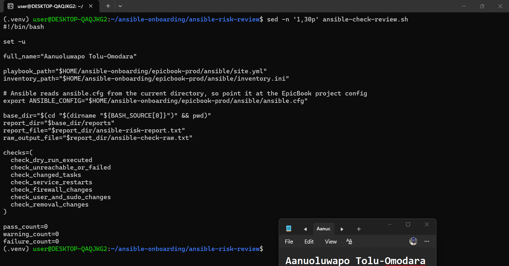

---

#### Screenshot 7 — Middle section showing `extract_changed_tasks` and `check_tasks_matching_pattern`

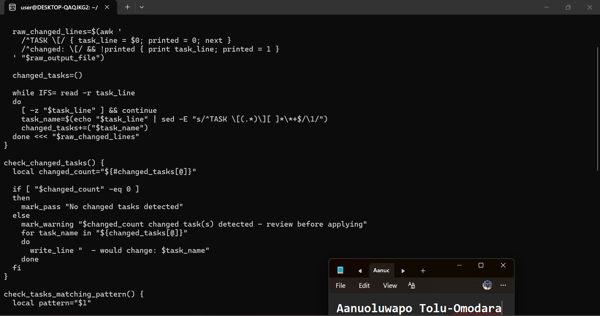

---

#### Screenshot 8 — Bottom section showing the loop, summary, and exit behavior

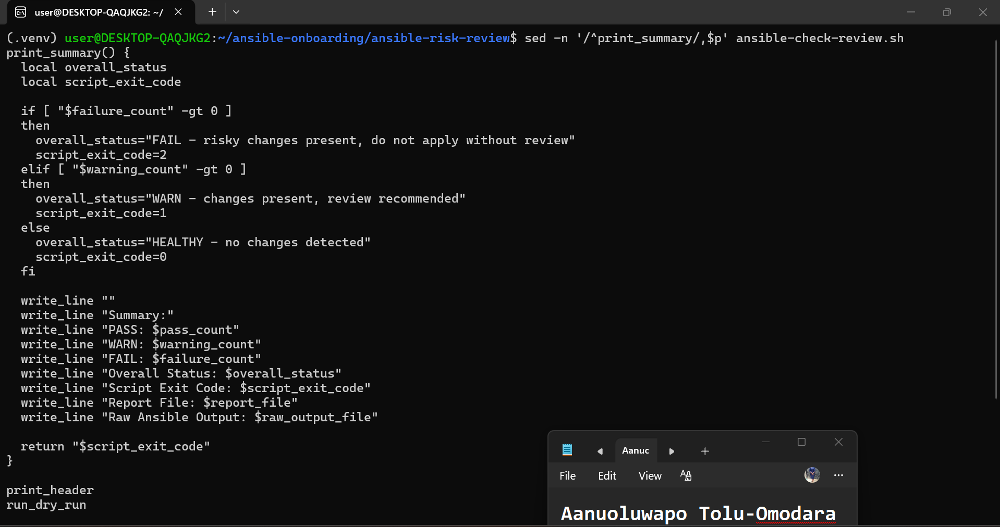

---

#### Screenshot 9 — Output of `bash -n ansible-check-review.sh` and `ls -l ansible-check-review.sh`

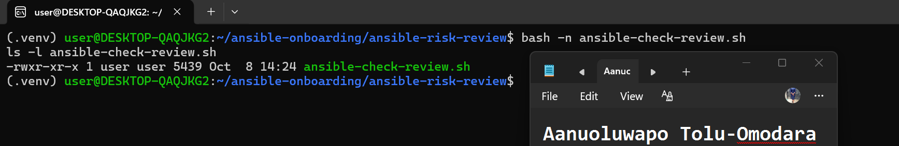

---

### Notes

Answer the following in your own words:

**1. What is stored in the `changed_tasks` array?**

The names of the tasks that Ansible's dry run reported as changed, for example common : Update the apt package cache. The task name is pulled out of the TASK [...] line, and the risk checks then match these names against their patterns.

---

**2. Which function finds changed tasks from the Ansible output?**

extract_changed_tasks. It uses awk to remember the last TASK [...] line and print it when the next changed: [...] line appears, and sed to strip the TASK [ and ] wrapper before each name is added to the array.

---

**3. Why does the script use `--check --diff`?**

--check makes Ansible simulate the run without changing the server, and --diff shows what file content would be added or removed. Together they preview the changes, like terraform plan does for infrastructure, so the risk can be reviewed before anything is applied.

---

**4. Why does the script use different exit codes for healthy, warning, and failed results?**

So other tools can act on the result without reading the text. 0 means nothing would change, 1 means changes were found and need review, and 2 means a risky change or a failure was found. The Claude Code skill and any CI job can then check $? and decide what to do.

---

# Task 5 — Run the Baseline Dry-Run Review

## Goal

Run the script against your current EpicBook playbook and confirm the baseline risk status.

### Evidence

#### Screenshot 10 — Output of `./ansible-check-review.sh`

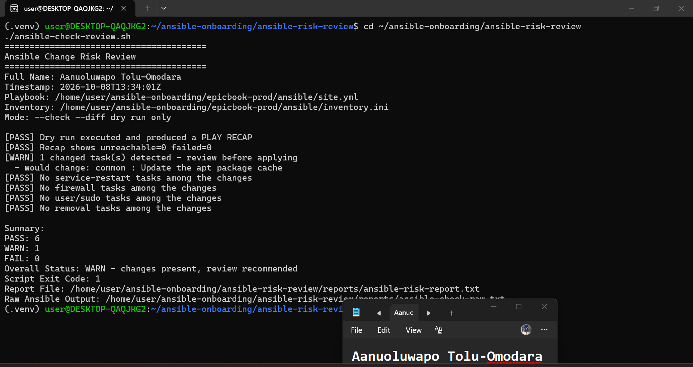

---

#### Screenshot 11 — Output of `echo "Captured Exit Code: $script_exit_code"` and `cat reports/ansible-risk-report.txt`

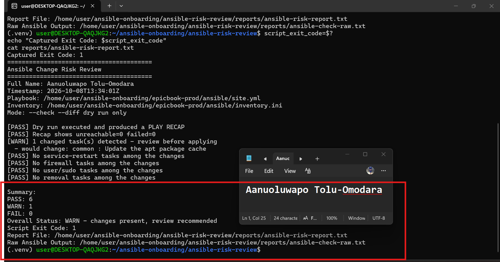

---

### Notes

Answer the following in your own words:

**1. What was the overall status of your baseline run?**

WARN: "changes present, review recommended". The dry run completed with unreachable=0 and failed=0. Six checks passed, one raised a warning, and none failed.

---

**2. Did any tasks report `changed`?**

Yes, one: common : Update the apt package cache. Ansible's dry run said it would refresh the package index on the VM.

---

**3. Were any changed tasks flagged as risky?**

No. The apt cache refresh doesn't match any of the four risk categories (service restarts, firewall, user or sudo, removal), so all four category checks passed. It only triggered the general "changes present" warning.

---

**4. What does the script exit code mean?**

It's a machine-readable summary of the result. 0 means HEALTHY, so nothing would change. 1 means WARN, so changes were found and need review. 2 means FAIL, so a risky change or a failed or unreachable host was found. My baseline returned 1.

---

# Task 6 — Create and Run the Claude Code Skill

## Goal

Turn the Bash script into a reusable Claude Code skill called `/ansible-risk-review`.

### Evidence

#### Screenshot 12 — `SKILL.md` showing the frontmatter, allowed tools, and safety rules

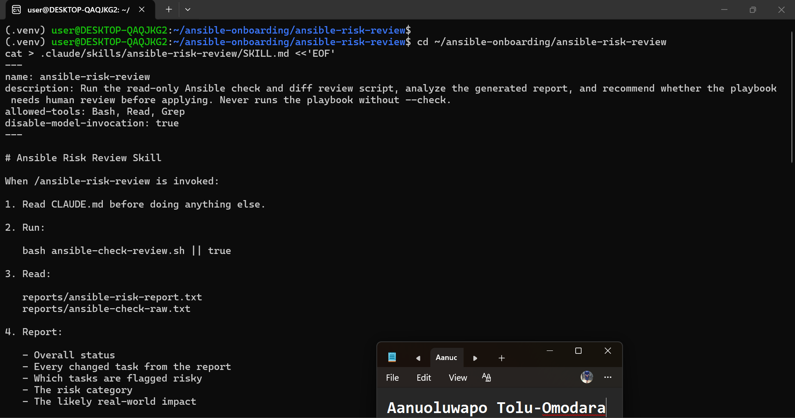

---

#### Screenshot 13 — Claude Code output after running `/ansible-risk-review`

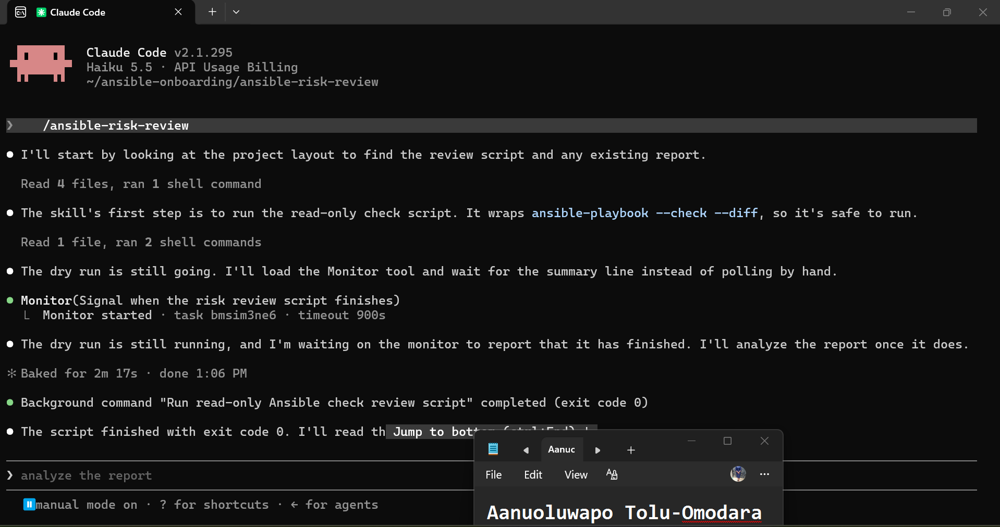

---

### Notes

Answer the following in your own words:

**1. Why does this skill allow `Bash`, `Read`, and `Grep`?**

Each of the three has a specific job in the review. `Bash` is needed to run `ansible-check-review.sh`, which performs the `--check --diff` dry run. `Read` lets Claude Code open `CLAUDE.md` and the two report files, `ansible-risk-report.txt` and `ansible-check-raw.txt`. `Grep` lets it search the raw Ansible output for specific tasks, recap lines or skipped tasks. Together they are enough to gather and analyze evidence, and nothing more.

---

**2. Why does this skill not allow file editing?**

The skill's job is to review and explain, not to fix. If editing were allowed, Claude Code could change the playbook, roles or inventory to make a warning disappear, which would hide the risk instead of showing it to the human. Leaving `Edit` and `Write` out means the safety rules in `CLAUDE.md` are backed by real tool limits, and not only by instructions. After running the skill I checked the folder and found no new or modified files.

---

**3. What part is handled by Bash?**

Bash handles everything that must be fixed and repeatable. It runs the playbook in `--check --diff` mode, saves the raw output, extracts the changed tasks with `awk` and `sed`, matches them against the four risk patterns, counts passes, warnings and failures, writes the report, and sets the exit code (0, 1 or 2). The same input gives the same result every time.

---

**4. What part is handled by Claude Code?**

Claude Code handles the explanation. It reads the report and the raw output, then reports the overall status, every changed task, which ones are flagged risky and why, the likely real-world impact, and one recommendation. In my run it listed `common : Update the apt package cache` as the only changed task, rated it low risk, and said the skipped tasks (PM2, the database schema import and the Nginx validation) are not evidence of safety, because the report doesn't show why they were skipped. It also reminded me to review the report and run the real playbook myself.

---

**5. Why is this better than asking Claude Code if the playbook is safe without giving it evidence?**

Without evidence, Claude Code could only guess from the playbook text and could not know the current state of the server. With the skill, every statement is based on a real dry run against the real VM, and I can check each claim in `ansible-risk-report.txt` and `ansible-check-raw.txt`. This was proven in practice. Twice, when the dry run could not complete (once because Ansible was not found in the environment Claude Code was running in, and once because my VM was unreachable after my IP address changed), Claude Code refused to call the playbook a no-op or safe. It told me to fix connectivity first, and it did not install anything, use `sudo` or run the playbook. The result is also repeatable and leaves an audit trail in the report files.

---

# Task 7 — Introduce a Controlled Risky Change and Let the Skill Catch It

## Goal

Add a small controlled risky change in your lab playbook and confirm the script and Claude Code catch it before applying.

### Evidence

#### Screenshot 14 — The added risky task inside the role file

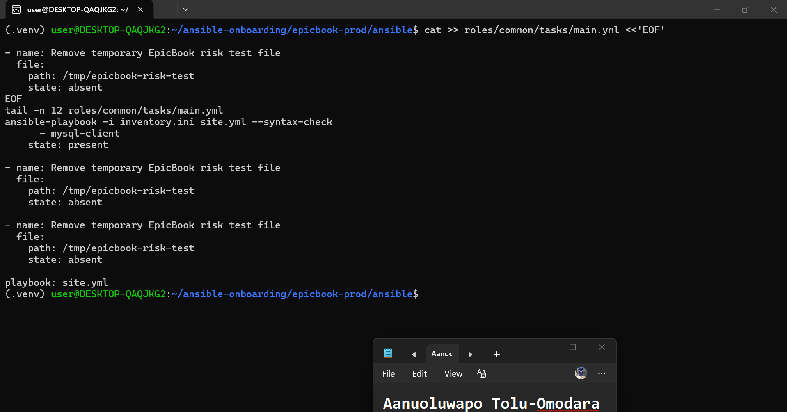

---

#### Screenshot 15 — Output of `./ansible-check-review.sh`

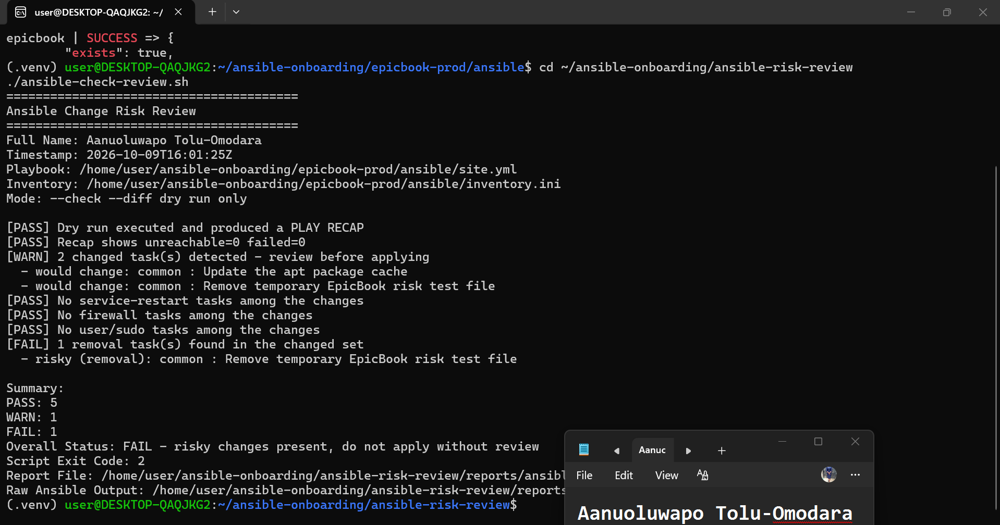

---

#### Screenshot 16 — Claude Code `/ansible-risk-review` output showing the risky finding

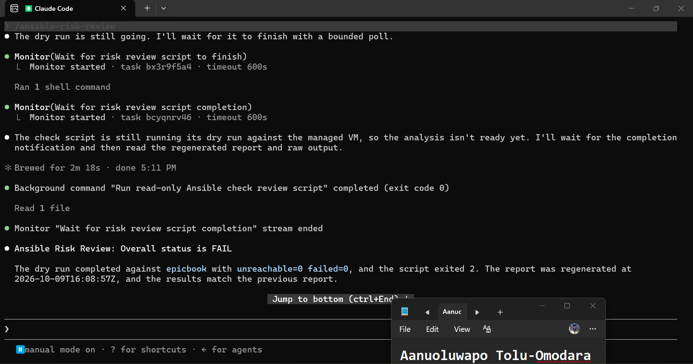

---

#### Screenshot 17 — Output of `cat reports/risky-change-report.txt`

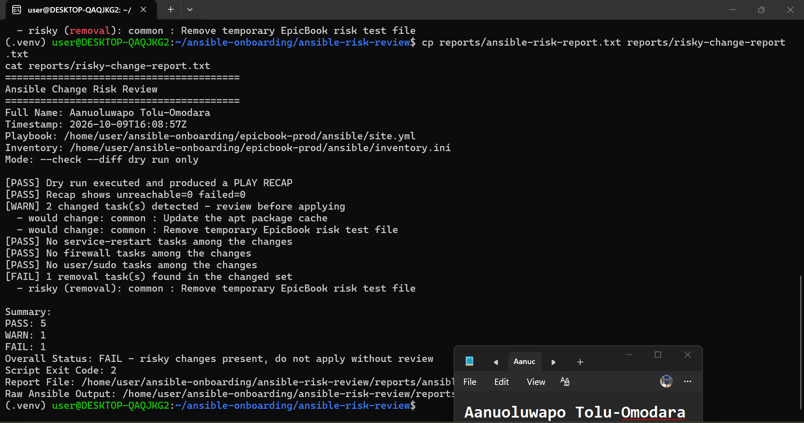

---

### Notes

Answer the following in your own words:

**1. Which risk category did the added task fall into?**

The removal category. The task name "Remove temporary EpicBook risk test file" matches the `remove` pattern in `check_removal_changes`. The service restart, firewall and user/sudo checks all passed.

---

**2. What evidence proves the task would change something?**

The dry run listed `common : Remove temporary EpicBook risk test file` as a changed task, and the report shows `[FAIL] 1 removal task(s) found in the changed set` with `risky (removal): common : Remove temporary EpicBook risk test file`. The Ansible recap showed `unreachable=0 failed=0`, so the FAIL is the script's risk verdict and not an Ansible error. The dry run completed fine and reported that the task would remove `/tmp/epicbook-risk-test` from the VM.

---

**3. Did Claude Code apply the playbook?**

No. It ran only the review script, which uses `--check --diff`, and read the two report files. Afterwards the project folder had no new or edited files, and `/tmp/epicbook-risk-test` still existed on the VM (`"exists": true`).

---

**4. Why is it important that Claude Code only analyzed the risk?**

Removal can be irreversible. In this lab the target is a test file, but the same task pattern could delete a config or data file in a real environment. Claude Code also said the report doesn't show what depends on the file, so a human has to confirm it is safe before anything runs. Keeping Claude Code to analysis means a person sees the evidence and takes responsibility for the apply decision.

---

**5. Which phase of the Agentic Loop is represented by the Bash report?**

Gather. The report is the evidence of what Ansible says it would change. Claude Code's explanation is the Analyze phase, and the real run in Task 8 is Human Act.

---

# Task 8 — Apply as the Human, Verify, and Write the Change Summary

## Goal

Review the risky-change report, apply the playbook manually as the human operator, and verify the result.

### Evidence

#### Screenshot 18 — Output of the real playbook run showing the final recap with `failed=0`

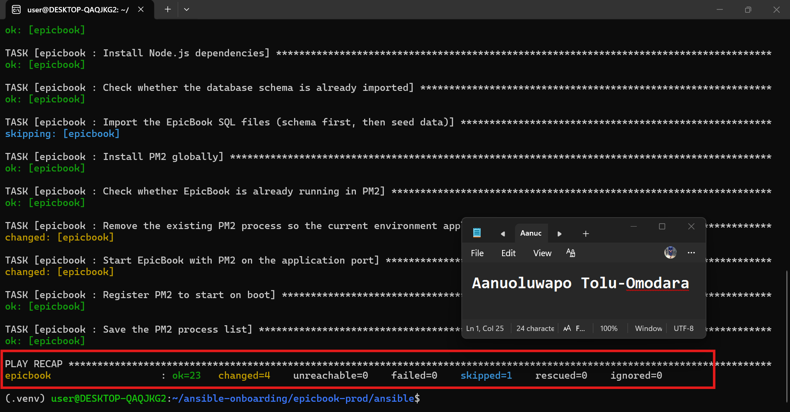

---

#### Screenshot 19 — Output of `ansible web -i inventory.ini -m ping`

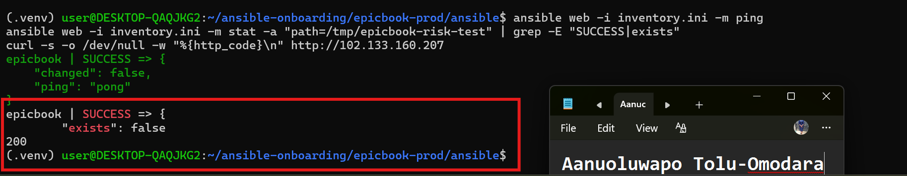

---

#### Screenshot 20 — Second `/ansible-risk-review` output after applying the change

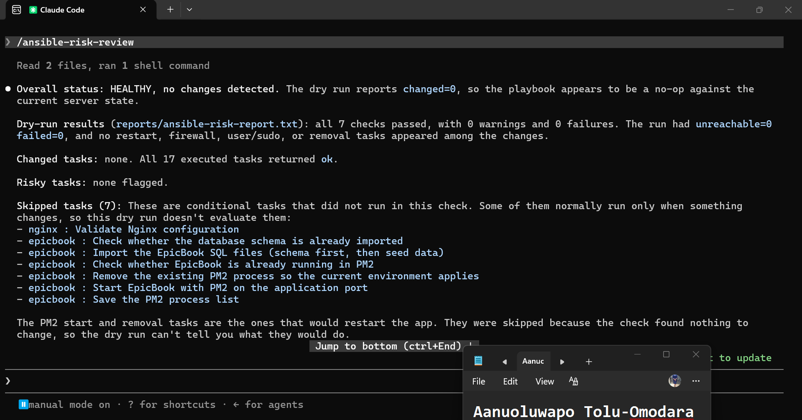

---

#### Screenshot 21 — Output of `ls -lah reports`

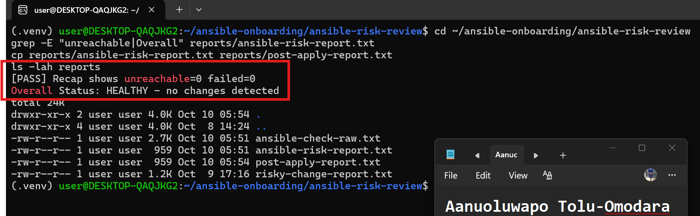

---

#### Screenshot 22 — `change-summary.md` showing all required sections and your Full Name

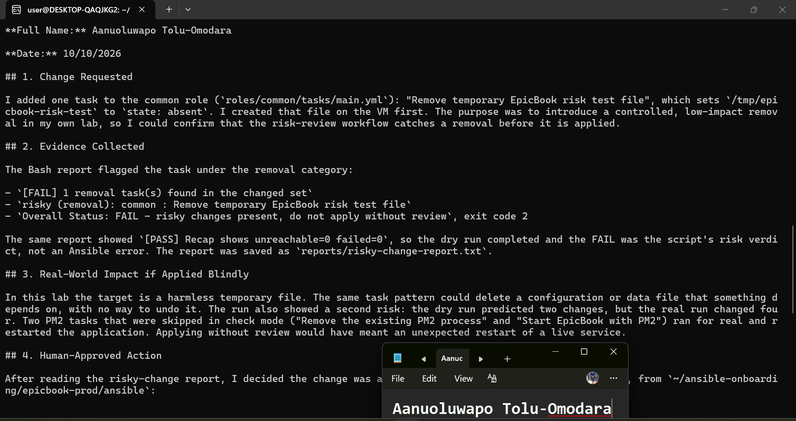

---

### Notes

Answer the following in your own words:

**1. What command did you run to apply the change for real?**

I ran `ansible-playbook -i inventory.ini site.yml` from `~/ansible-onboarding/epicbook-prod/ansible`, without `--check`, so the changes were really applied to the VM.

---

**2. Who made the final decision to apply the playbook?**

I did. The Bash script and Claude Code only gathered and explained the evidence. After reading the risky-change report, I decided the change was acceptable, because the only risky task deletes a temporary test file in my own lab, and I ran the real command myself. Claude Code never ran the playbook and could not edit any files.

---

**3. What evidence proves the VM is still reachable?**

After the real run, `ansible web -i inventory.ini -m ping` returned `SUCCESS` with `"ping": "pong"`, and the playbook recap showed `unreachable=0 failed=0`. I also checked the result in two other ways: the `stat` module on `/tmp/epicbook-risk-test` returned `"exists": false`, which proves the removal happened, and `curl` against the VM's public IP returned HTTP 200, so the application is still serving.

---

**4. Why should the risk review be run again after applying?**

To verify the result, which is the last step of the loop (Gather → Analyze → Human Act → Verify). The second dry run shows whether the server now matches the playbook. In my case the removal task no longer appeared as changed and the report came back HEALTHY with `unreachable=0 failed=0`, which proves the change took effect and nothing else drifted. It also leaves a post-apply report as an audit trail.

---

**5. What could go wrong if an AI agent applied Ansible changes automatically?**

My own run shows it. The dry run predicted two changes, but the real run changed four. Two PM2 tasks ("Remove the existing PM2 process" and "Start EpicBook with PM2") were skipped in check mode and then ran for real, restarting the application. An agent that applied the playbook on the strength of the dry run would have restarted a live service without anyone expecting it. More generally, an agent could misread a report, act on a wrong assumption, delete a file something depends on, change firewall or sudo access, or "fix" a warning by editing the playbook, and nobody would be accountable for the decision. A human review step keeps a person responsible before anything touches a live server.

---

# LinkedIn Post Required

## Evidence

#### LinkedIn Post URL

Paste your LinkedIn post URL here:

https://lnkd.in/p/eyvthyJ7

---

#### Screenshot — Published LinkedIn post

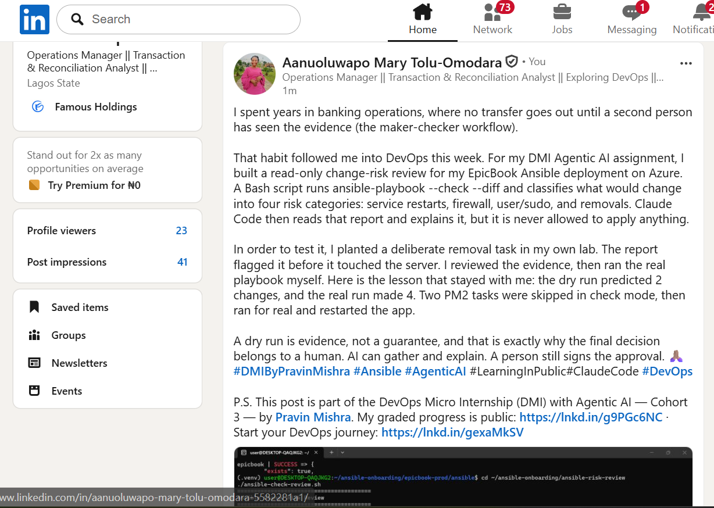

---

# Required Files

Confirm that the following files are included in your GitHub repository or assignment folder:

- [ ] `CLAUDE.md`
- [ ] `ansible-check-review.sh`
- [ ] `.claude/skills/ansible-risk-review/SKILL.md`
- [ ] `reports/risky-change-report.txt`
- [ ] `reports/post-apply-report.txt`
- [ ] `change-summary.md`

---

# Submission Instructions

- Add all required screenshots in your submission.
- Full Name must be visible in required screenshots and reports.
- All required notes must be answered clearly.
- Do not expose SSH private keys, passwords, cloud credentials, database credentials, or secret environment variables.
- Add your GitHub repository or folder URL inside this document.

---

# Completion Checklist

- [ ] Task 1: EpicBook connectivity confirmed and workspace created
- [ ] Task 2: `CLAUDE.md` created with safety rules
- [ ] Task 3: Claude Code produced a read-only risk-review plan
- [ ] Task 4: `ansible-check-review.sh` created and syntax checked
- [ ] Task 5: Baseline dry-run review completed
- [ ] Task 6: Claude Code `/ansible-risk-review` skill created and tested
- [ ] Task 7: Controlled risky change introduced and detected
- [ ] Task 8: Human applied the change and verified the result
- [ ] Risky-change report saved
- [ ] Post-apply report saved
- [ ] Change summary completed
- [ ] All screenshots added
- [ ] All notes answered
- [ ] LinkedIn post published
- [ ] LinkedIn post URL added
- [ ] No sensitive information exposed

---

## About DMI & CloudAdvisory

DevOps Micro Internship (DMI) is a project-based DevOps program run by Pravin Mishra and The CloudAdvisory, focused on real-world execution, systems thinking, and career readiness.

It helps learners build strong DevOps foundations with hands-on experience.

---

## Resources

- DMI Official Website: [https://dmi.pravinmishra.com?utm_source=github&utm_medium=readme](https://dmi.pravinmishra.com?utm_source=github&utm_medium=readme)
- University: [https://university.pravinmishra.com?utm_source=github&utm_medium=readme](https://university.pravinmishra.com?utm_source=github&utm_medium=readme)
- Discord Community: [https://discord.pravinmishra.com?utm_source=github&utm_medium=readme](https://discord.pravinmishra.com?utm_source=github&utm_medium=readme)
- Blog: [https://dmi.pravinmishra.com/blog?utm_source=github&utm_medium=readme](https://dmi.pravinmishra.com/blog?utm_source=github&utm_medium=readme)
- YouTube Playlist: [https://www.youtube.com/playlist?list=PLFeSNDtI4Cho](https://www.youtube.com/playlist?list=PLFeSNDtI4Cho)
- Pravin Mishra LinkedIn: [https://www.linkedin.com/in/pravin-mishra-aws-trainer/](https://www.linkedin.com/in/pravin-mishra-aws-trainer/)
- CloudAdvisory LinkedIn: [https://www.linkedin.com/company/thecloudadvisory/](https://www.linkedin.com/company/thecloudadvisory/)

---

*This submission is part of DevOps Micro Internship (DMI) — Agentic AI Track.*